<style>
img[alt~="center"] {
  display: block;
  margin: 0 auto;
}
h1 {
  font-size: 46px;
  color: darkred;
}
h2 {
  font-size: 38px;
  color: darkred;
}
</style>

Cours _Distant Reading_ : Visualisation


# 1. Des chiffres et des lettres

Simon Gabay

<a style="float:right; width: 20%;" rel="license" href="http://creativecommons.org/licenses/by-sa/4.0/"></a>

---

```r
setwd("~/GitHub/UNIGE/32M7129/Cours_01")
if (!require("ggplot2")) install.packages("ggplot2")
if (!require("rmarkdown")) install.packages("rmarkdown")
```

---

# Préalable

---

## Le Code

Avez-vous bien installé:
* Le langage R
* Le logiciel Rstudio
* Le logiciel Gephi

Les cours se trouvent en ligne à l'adresse suivante: https://github.com/gabays/32M7129
* Github permet de partager du code
* Chaque est donc du code transformé en slides
* Vous trouverez y trouverez donc le code, et les slides

---

## L'objectif

L'objectif de ce cours est

1.  de penser et d'organiser au mieux la transformation de données textuelles en chiffres (un mot a un nombre d'occurrences, un lieu des coordonnées…)
2. pour rendre lisibles ces chiffres, au moyen de visualisations (des cartes, des graphiques…)

Pour chacune de ces deux étapes, les données subissent une transformation
1.Elle passent à travers un filtre mathématique (calcul de distance, algorithme…)
2. Elles subissent une déformation graphique (passage de n-dimensions à deux, perspective…)

---

# 1 Sémantique

---
Trois exemples de visualisation:
* La carte de Snow
* Le diagramme de Minard
* Le Mémorial de Maya Lin

---

## La carte de Snow

* John Snow (1813-1858)
* Épidémie de choléra de _Broad Street_ en 1854
* Les trois jours suivants, 127 personnes habitant Broad Street ou les environs meurent. Les semaines qui suivent, les trois quarts des habitants ont fui le quartier. Le 10 septembre, 500 personnes étaient mortes. En tout, l'épidémie a fait 616 morts.
* À l'époque, la théorie des miasmes attribue au « mauvais air » le choléra: Snow va permettre de localiser l'origine de l'épidémie, une pompe publique, sur la base d'une répartition géographique des cas.

---


Source: [wikipedia](https://en.wikipedia.org/wiki/File:Snow-cholera-map-1.jpg)

---
## La campagne de Russie par Minard

* Charles Joseph Minard (1781-1870)
* Ingénieur célèbre pour ses inventions dans le domaine de la traduction graphique et cartographique appliquée au génie civil et aux statistiques.
* Carte figurative des pertes successives en hommes de l'armée française dans la campagne de Russie 1812-1813
* Cette carte est un diagramme de Sankey (avant l'heure), c'est-à-dire un diagramme de flux.

---


Source: [wikipedia](https://en.wikipedia.org/wiki/File:Minard.png)

---


Source: [wikipedia](https://commons.wikimedia.org/wiki/File:Sankeysteam.png)

---

## Le Mémorial des anciens combattants du Viêt Nam

* Washington, D.C.
* Oeuvre de Maya Lin en 1982
* Statues de trois soldats
* Mur de granit noir de Bangalore long de 150 m sur lequel sont gravés les noms des 58 156 Américains tués ou portés disparus pendant cette guerre, **dans l'ordre chronologique de leur disparition**, entre 1959 et 1975.

---


Source: [wikipedia](https://en.wikipedia.org/wiki/File:US_Navy_061117-N-5307M-113_John_Nugent,_Vietnam_veteran,_plays_the_bagpipes_as_a_part_of_the_opening_ceremony_at_the_Dignity_Memorial_Vietnam_Wall_at_Mt._Trashmore_Park.jpg)

---
## J. Bertin

* Jacques Bertin (1967), _Sémiologie graphique. Les diagrammes. Les réseaux. Les cartes_, Paris/La Haye, Mouton ; Paris, Gauthier-Villars.

* "La graphique": un système dont les éléments, ou signes, ont une signification fixée à l’avance et unique, ce qu’exprime par exemple la légende d’une carte (1973, 6).

* "Efficacité graphique": "si pour obtenir une réponse correcte et complète à une question donnée, et, toutes choses égales, une construction requiert un temps d’observation plus court qu’une autre construction, on dira qu’elle est plus efficace pour cette question". (1967, 139)

---
### Loi du moindre effort

Il y a un glissement de la représentation qui se doit d'être exhautive, précise et complète, à la représentation qui se doit d'être effiface.

* George Kingsley Zipf, _Human Behaviour and the Principle of Least Effort: An Introduction to Human Ecology_ 1949

* Une observation : Plus un mot est fréquent, plus il est court.

* Cela implique que la variété, la probabilité et la distribution des mots est presque la même pour beaucoup de langues.

* L'homme qui parle tend à réduire le vocabulaire en rassemblant derrière un simple mot une multitude de significations.

* Corollaire de la loi du moindre effort: "coût mental de la perception" (Palsky 2017), selon laquelle le temps de perception entre une construction efficace et une inefficace est extrêmement nette.

<!-- https://www.persee.fr/doc/colan_0336-1500_1969_num_2_1_3726#colan_0336-1500_1969_num_2_1_T1_0025_0000 -->

---
### Grammaire graphique

J. Bertin propose une grammaire graphique afin d'améliorer l'efficacité des rendus

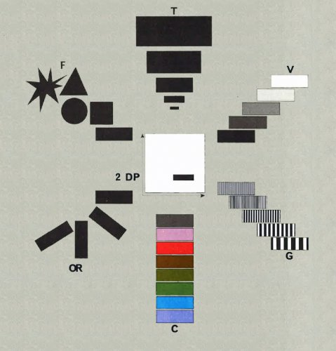

Source: [Palsky 2017/Bertin 1967](https://visionscarto.net/la-semiologie-graphique-a-50-ans)

---
## Tufte

Les exemples précédemment présentés proviennent des travaux d'Edward Tufte (1942-),

* Spécialiste de graphisme d'information ( _Infographic_, _informational graphics_, _Information design_)
* Auteur de _The Visual Display of Quantitative Information_, 1983

Quelques concepts importants:

* _lie factor_
* _Data-ink ratio_
* _Data density_
* _Chartjunk_
* _Small multiples_
* _Sparkline_

---
## _Lie factor_

Surreprésentation ou sous-représentation ce qui se trouve dans les données


---
## _Data-ink ratio_

Proportion d'encre utilisée pour la représentation des données par rapport à l'encre utilisé pour l'ensemble du graphique


Source: [info-vis wiki](https://infovis-wiki.net/wiki/File:DIR.jpg)

---
## _Data-ink ratio_


Source: [info-vis wiki](https://infovis-wiki.net/wiki/File:Dir1.png)


Source: [info-vis wiki](https://infovis-wiki.net/wiki/File:Dir2.png)

---
## _Data density_

Il s'agit de la proportion du graph dédiée à la représentation des données.

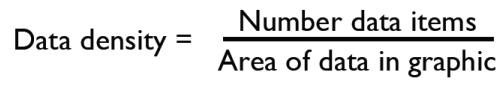


Source: [pparacch](https://pparacch.github.io/2017/07/18/plotting_in_R_ggplot2_part_3.html)


---
## _Chart junk_

Se traduit en français par "bruit graphique" (littéralement "tableau déchet").

> « Les **décorations intérieures aux graphiques sont autant d'encre qui ne dit rien de nouveau au lecteur**. La raison d'être de la décoration varie — faire apparaitre le graphique comme plus scientifique et précis [expert], vivifier le style, donner la possibilité à l'illustrateur de faire la preuve de ses talents artistiques. Quelle qu'en soit la raison, c'est autant d'encre-sans-information ou d'encre-répétant l'information, et donc souvent du _chartjunk_ [bruit graphique inutile]. »

---
## _Chart junk_

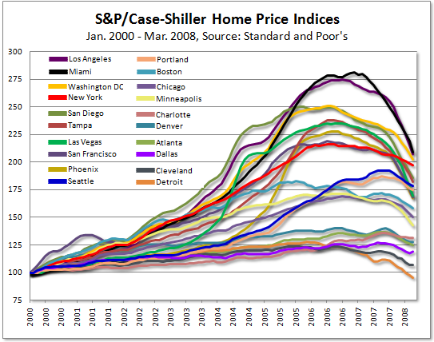

Source: [https://junkcharts.typepad.com](https://junkcharts.typepad.com/junk_charts/2008/06/rise-and-fall.html)

---
## Small multiples


Source: [Pew research center](https://medium.com/pew-research-center-decoded/how-pew-research-center-uses-small-multiple-charts-2531bfc06419)

---
## Sparkline


Elle permet de commenter une courbe  dans la phrase, sans ajouter aucun chiffre, pour expliquer une tendance (ici un léger regain).

Source: [Pew research center](https://en.wikipedia.org/wiki/Sparkline#/media/File:Sparkline_sp500.svg)

---
## Franco Moretti

* Prof à Stanford
* _Atlas of the European novel, 1800-1900_, 1998
* _Graphs, Maps, Trees: Abstract Models for a Literary History (2005)_, 2005
* _Distant Reading_, 2013

Moretti tente d'analyser un "système mondial de la littérature" sur des principes similaires à ceux de l'économiste Immanuel Wallerstein (et de l'historien Fernand Braudel), qui analyse le "système-monde" sur la base de rapports qu'entretiennent le "centre", la "semi-périphérie" et la "périphérie".

Une telle approche requiert un très grand nombre de documents: il devient impossible de  pratiquer ce que les anglo-saxons appellent le  _close reading_ (commentaire de texte): il faut prendre de la hauteur et essayer un _distant reading_.

---

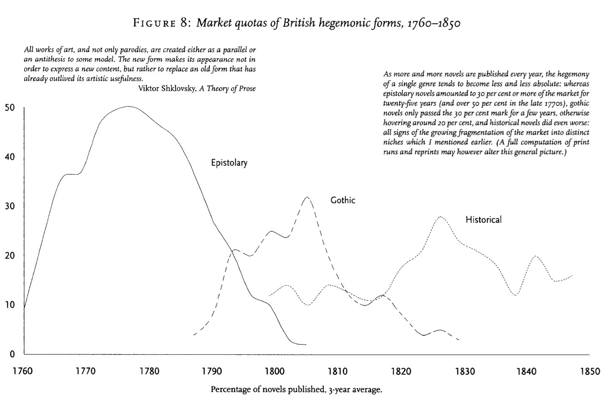

Source: [Moretti 2005](https://en.wikipedia.org/wiki/Sparkline#/media/File:Sparkline_sp500.svg)

---
## Johanna Drucker

Prof. à UCLA

* « tournant design des humanités numériques »
* Regret du logocentrisme ( _the text-based approach typical of traditional humanities_ ): il faut  «surmonter l'ancienne résistance des humanists aux formes visuelles de la production de connaissance»
* L'objectif est d'«empêcher les humanités numériques de tomber dans la pure application technique de pratiques standardisées» (calcul statistique, calcul d'ingénieur, gestion technicienne d'information...) et de chercher au contraire à «créer des capacités inventives et ouvertes susceptibles de changer les paramètres»

---

« La posture qui domine dans le champ du design d'information repose presque entièrement sur **l'idée que les données pré-existent à leur affichage et que la tâche qui consiste à leur donner une forme visuelle consiste purement à transformer un exercice cognitif en un exercice perceptif**. Si la valeur d'un design d'information intelligent dans l'interprétation de données statistiques ne saurait être surestimée, et ne pas prendre cela en compte serait ridicule, les limites de cette approche doivent aussi être soulignées. Pourquoi? Parce qu'elle restreint les conditions de la connaissance en suggérant que **l'information existe indépendamment de sa présentation visuelle et attend simplement de recevoir la «meilleure» forme dans laquelle elle pourra être représentée.**» (Drucker 2004)

<!--https://hal.archives-ouvertes.fr/hal-01294693 -->

---
## Au delà du _design_

La "simple" question du design a désormais débouché sur des interrogations plus larges qui relèvent de l'interaction homme-machine (IHM, _Human–computer interaction_).

* VRE pour _Virtual research environment_
* UX pour _User experience_

---
# 2 Des chiffres et des lettres

---
## _Data types_ dans R (et partout ailleurs)

On peut additionner des chiffres (_int_ pour _integer_, "entier")

```r
1+2
```

Il est en revanche impossible d'additionner un chiffre avec une lettre (_str_, pour _string_, "chaîne (de caractères"): _Error in 1 + "b" : non-numeric argument to binary operator_

```r
#1+"b"
```

On remarque que les _str_ sont notés entre guillemets. On peut ainsi spécifier qu'un chiffre est utilisé comme caractère et non comme un chiffre en utilisant les guillemets: il est alors impossible de s'en servir pour un calcul

```r
#"1"+2
```

---

Cette distinction entre _str_ et _int_ est fondamentale dès lors que l'on veut visualiser des données. Dans de nombreux cas, la visualisation nécessite de manipulation les données, or celles-ci peuvent être réalisées parfois sur des  _str_ ou _int_, mais dans certains cas uniquement sur des _int_. Un exemple tout simple serait l'addition: on ne peut effectuer l'addition "4+voiture" dans la vraie vie comme dans un ordinateur.

On va parler de données "catégorielles" et de données "métriques". La différence entre ces types de données est majeure, car elle va limiter les visualisations possibles: s'il est possible de faire une AFC ou de construire avec des données catégorielles, il est impossible de faire un ACP sans des données métriques. Il en va de même pour construire un arbre de décision (données catégorielles et métriques) et une régression linéaire (données métriques uniquement).

---
## Notre mini-corpus

Texte 1
> « **Rome**, l'unique objet de mon ressentiment !
> **Rome**, à _qui_ vient ton bras d'immoler mon amant !
> **Rome** _qui_ t'a vu naître, et que ton cœur adore !
> **Rome** enfin que je hais parce qu'elle t'honore ! »

Corneille, Camille dans _Horace_, acte IV, scène 5

Texte 2
> « **Rome**, par une loi, _qui_ ne se peut changer,
> N'admet avec son sang aucun sang étranger,
> Et ne reconnaît point les fruits illégitimes,
> _Qui_ naissent d'un hymen contraire à ses maximes. »

Racine, _Bérénice_, acte II, scène 2

---

Prenons la fréquence de deux mots uniquement: "Rome" et "qui"

| Token | Corneille | Racine |
|-------|-----------|--------|
| Rome  | 4         | 2      |
| qui   | 2         | 1      |

On crée deux vecteurs qui contiennent ces informations:

```r
x <- c(4,2) #Rome
y <- c(2,1) #Qui
x #j'affiche le contenu de x
y #j'affiche le contenu de y
```

---

On les replace sur un plan:

```{r, results='hide'}
png(file="images/plot1.png")
plot(x,y)
dev.off()
```

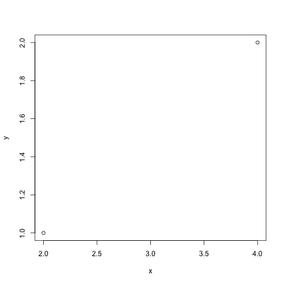

---

On rajoute quelques informations pour faciliter la lecture du graphique

```r
png(file="images/plot2.png")
plot(x,y, xlab="abscisse", ylab="ordonnée",
     main="mon plan", pch=16, col="green")
dev.off()
```

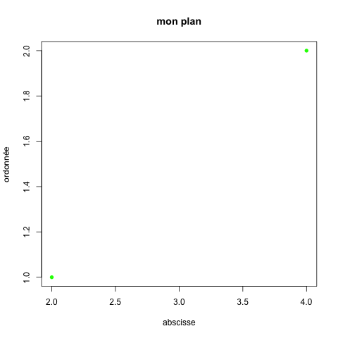

---

Ces points représentent des faits linguistiques calculés à partir des fréquences dans notre corpus. L'écart qui sépare ces points représente l'écart entre deux pratiques stylistiques:

```r
png(file="images/plot3.png")
plot(x,y, xlab="abscisse", ylab="ordonnée",
     main="mon plan (2)", pch=16, col="green")
s <- seq(length(x)-1)  # one shorter than data
segments(x[s], y[s], x[s+1], y[s+1], col= 1:3)
dev.off()
```

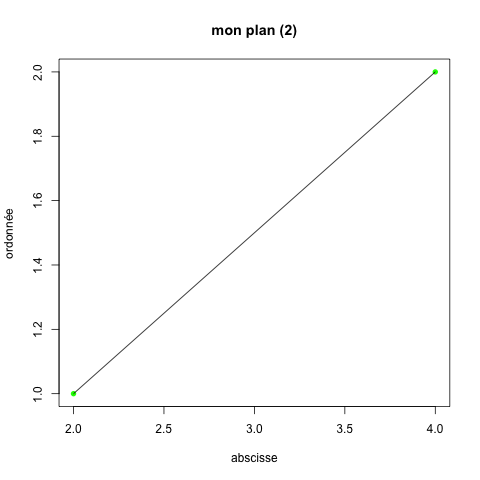

---

Il faut donc calculer comment aller du point A au point B

```r
png(file="images/plot4.png")
plot(x,y, xlab="abscisse", ylab="ordonnée",
     main="mon plan (3)", pch=16, col="green")
s <- seq(length(x)-1)  # one shorter than data
arrows(x[s], y[s], x[s+1], y[s+1], col= 'pink')
dev.off()
```

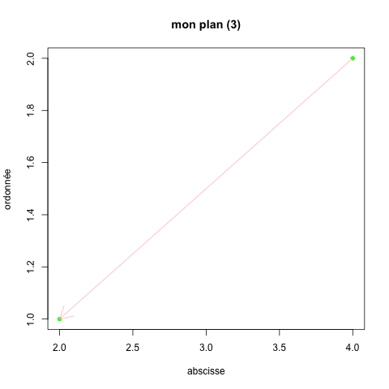

---

On peut complexifier le problème en ajoutant un troisième auteur:
> C'est Rome _qui_ demande nos larmes : **Rome** ! La Maîtresse de l'univers ; **Rome** ! Mère féconde des héros, et les délices des Dieux ; **Rome** ! Qui humiliait l'orgueil des tyrans de la Terre, et _qui_ brillait les fers des Nations hélas !

Boyer, _Caton_, Acte IV, scène XII

 Cela nous donne le tableau suivant:

| Token  | Corneille | Racine | Boyer |
|--------|-----------|--------|-------|
| "Rome" | 4         | 2      | 3     |
| "qui"  | 2         | 1      | 2     |

---

Nous obtenons donc un nouveau graph:

```r
x <- c(4,2,3)
y <- c(2,1,2)
png(file="images/plot5.png")
plot(x,y, xlab="abscisse", ylab="ordonnée",
     main="mon plan (4)", pch=16, col="green")
s <- seq(length(x)-1)  # one shorter than data
segments(x[s], y[s], x[s+1], y[s+1], col= 1:3)
segments(x[s], y[s], x[s+2], y[s+2])
text(x=3.95, y=1.9, labels="Corneille")
text(x=3.1, y=1.95, labels="Boyer")
text(x=2.2, y=1, labels="Racine")
dev.off()
```

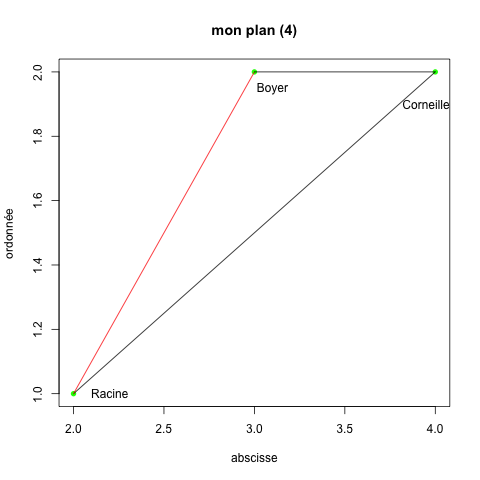

---

## De l'importance des mathématiques (pour les nuls)

Il est donc possible de calculer la distance entre ces trois textes pour voir lesquels sont potentiellement les plus similaires, par exemple avec une distance euclidienne.

(Pour rappel, la distance entre deux points A et B est la racine carrée de la somme des carrés des différences de coordonnées en X et en Y.)

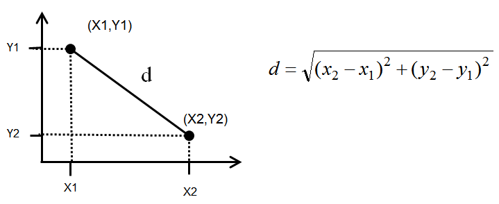

---

En faisant un rapide calcul, on peut donc confirmer notre validation par nos calculs de distance:

```r
# sqrt((x1-x2)**2+(y1-y2)**2)
CoRa <- sqrt((4-2)**2+(2-1)**2)
cat("Distance Corneille/Racine = ", CoRa, "\n")
CoBo <- sqrt((4-3)**2+(2-2)**2)
cat("Distance Corneille/Boyer = ", CoBo, "\n")
RaBo <- sqrt((2-3)**2+(1-2)**2)
cat("Distance Racine/Boyer = ", RaBo)
```

---

On intègre les distances dans le plan

```r
x <- c(4,2,3)
y <- c(2,1,2)
png(file="images/plot6.png")
plot(x,y, xlab="abscisse", ylab="ordonnée",
     main="mon plan (5)", pch=16, col="green")
s <- seq(length(x)-1)  # one shorter than data
segments(x[s], y[s], x[s+1], y[s+1], col="red")
segments(x[s], y[s], x[s+2], y[s+2], col="red")
text(x=3.95, y=1.9, labels="Corneille", col="black")
text(x=3.1, y=1.95, labels="Boyer", col="black")
text(x=2.2, y=1, labels="Racine", col="black")
text(x=3, y=1.4, labels="2.2", col="blue") #CoRa
text(x=2.5, y=1.6, labels="1.4", col="blue") # RaBo
text(x=3.4, y=1.95, labels="1", col="blue") # CoBo
legend("topleft", legend=c("Auteur", "Dist. euclidienne"),
        text.col = c("black", "blue"), cex=0.8)
dev.off()
```

---

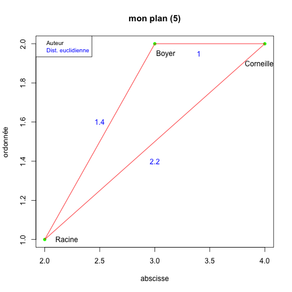

---
# 2 Des chiffres et des images
---
## RGB

Exactement comme pour le texte, on doit passer par des chiffres pour travailler avec des images. Une image se compose de trois couleurs: rouge, vert et bleu. C'est le mélange de ces trois couleurs qui permet d'obtenir le résultat souhaité. Ainsi:

| Couleur |  R  |  G  |  B  |
|---------|-----|-----|-----|
| Noir    | 255 | 215 |  0  |
| Rouge   | 255 |  0  |  0  |
| Jaune   | 255 | 255 | 255 |

---
## Hexadécimal

Ces couleurs RGB sont souvent converties en triplet hexadécimal, soit un nombre hexadécimal à 6 chiffres mémorisé sur trois octets, pour simplifier le travail

| Couleur |  R  |  G  |  B  | Hexadécimal |
|---------|-----|-----|-----|-------------|
| Noir    | 255 | 215 |  0  |   #000000   |
| Rouge   | 255 |  0  |  0  |   #ff0000   |
| Jaune   | 255 | 255 | 255 |   #ffff00   |

---
## Une image très simple

Si nous prenons une couleur en RGB, il est utile en R de la transformer en triplet hexadécimal. Pour cela nous créons une fonction

```r
rgb2hex <- function(r,g,b)
                    rgb(r, g, b, maxColorValue = 255)
```

Et nous transformons la couleur rouge en triplet, que l'on stocke dans une variable appelée "rouge"
```r
red<- rgb2hex(255,0,0) #ff0000
```

---

On peut ensuite afficher une image simple: un carré rouge.

```r
png(file="images/image1.png")
plot(c(100, 200), c(100, 100), type= "n", xlab = "", ylab = "")
rect(210, 150, 1, 1, col = red)
dev.off()
```
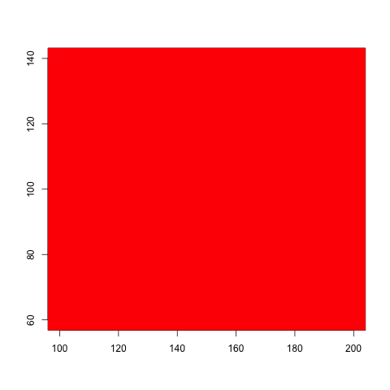

---
## Une image moins simple

Notre image précédente étant une simple case vide, nous pouvons multiplier les cases à colorier. Pour cela, il faut créer une matrice (un tableau) à remplir: on assigne une couleur à chaque cellule, et nous obtiendrons une image

```r
x=1:3
matrix(x, nrow=1, ncol=length(x))
```

On crée deux autres codes hexadécimaux à partir des codes RGB des couleurs et l'on remplit le tableau:

```r
png(file="images/image2.png")
yellow<-rgb2hex(255,215,0) #ffff00"
black<-rgb2hex(0,0,0) #000000
png(file="images/image2.png")
image(1,1:length(x), matrix(x, nrow=1, ncol=length(x)),
      col=c(yellow,red,black))
dev.off()
```

---

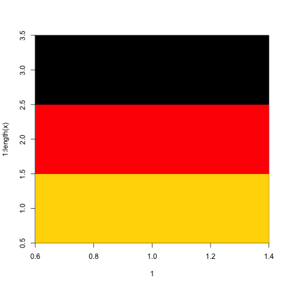
