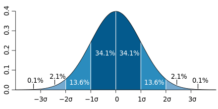
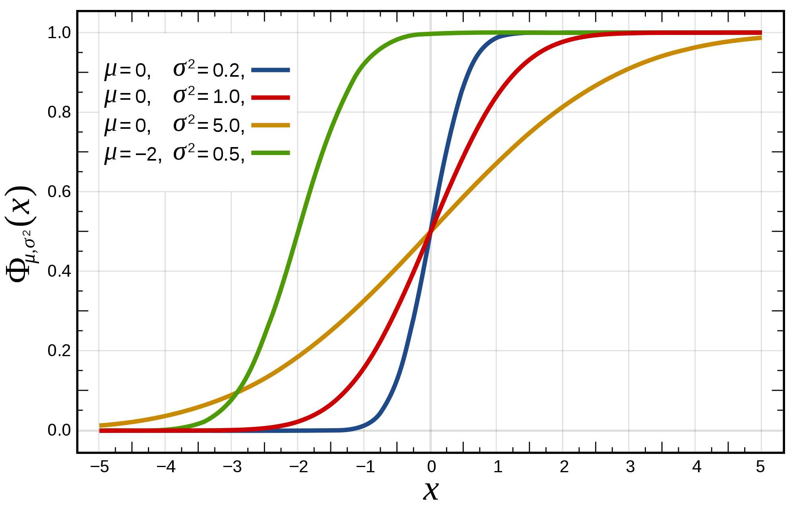
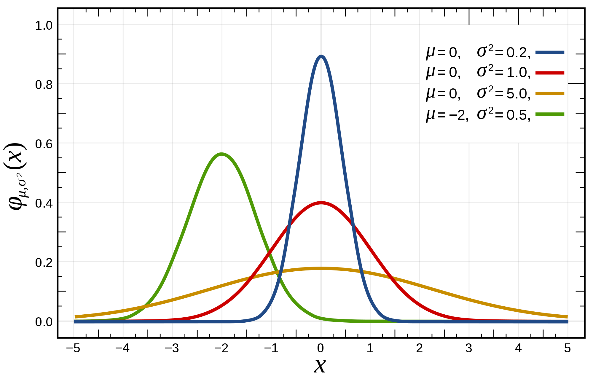

<a style="float:right; width: 20%;" rel="license" href="http://creativecommons.org/licenses/by-sa/4.0/"></a>


```{r setup, include=FALSE}
knitr::opts_chunk$set(echo = TRUE)
```

# `R` et les statistiques

## 1 `R`, `R GUI`, `RStudio`, `Rstudio cloud`

Attention

* `R` est un langage destiné aux statistiques et à la science des données
* `R GUI`  est une interface ("GUI" pour _Graphical User Interface_)
* `RStudio` est une interface de programmation `open source`
* `Rstudio cloud` est une version en ligne de `RStudio`

Il est donc possible de programmer en `R` en dehors de `RStudio` (et de `Rstudio cloud`)

Pour vous aider (mais aussi pour m'aider dans mon cours), vous lisez actuellement un notebook. Il s'agit d'un mélange de code et de commentaires qui permet de simplifier l'apprentissage, mais aussi de documenter son travail. En cliquant sur le petit bouton "play" à droite des morceaux de code (en gris), vous exécutez ces derniers et obtenez les résultats.

### Préparer la session de travail

Nous devons préparer la session de travail, en désignant à `R` le dossier de notre ordinateur à partir duquel nous allons travailler pour qu'il trouve nos fichiers et qu'il y sauvegarde nos résultats.

Pour indiquer où se trouve le fichier de travail, deux solutions sont possibles:

* ou bien *via* le menu avec `Session>Set Working Directory>Choose Directory`
* ou bien directement dans `R` avec la commande `setwd` (pour *Set working directory*), qui s'utilise de cette manière.

```{r}
setwd("~/Documents/github/UNIGE/32M7129/Cours_02")
```

**Attention!** Il convient de donner le chemin qui corredpond à votre configuration locale. Une fois la chose faite, cliquez sur `Run` (le bouton qui ressemble à *play*, à droite de la commande *supra*).

On peut vérifier que le chemin vers le dossier de travail a bien été pris en compte avec une autre commande: `getwd` (pour *Get working directory*):

```{r}
getwd()
```

Tout est en ordre? Avançons!

## 2 Les fondamentaux

### 2.1 Premiers pas

Il faut faire la différence entre des chiffres et une chaine de caractère (entre guillemets).

On peut faire une opération avec des chiffres, mais pas avec du texte. Essayons la multiplication:

```{r,error=TRUE}
1+1
1+"chose"
```

Si on met un chiffre entre guillemets, il devient une chaîne de caractère, et perd ses propriétés mathématiques:

```{r,error=TRUE}
"1"+1
```

Je vais pouvoir manipuler des variables, auxquelles j'assigne une valeur avec `<-`. Je peux ensuite lui demander d'afficher le contenu de la variable en l'appelant (par son nom):

```{r}
a<-10
a
a+1
```

Il est possible de vérifier le type d'une variable (parce qu'on ne sait pas toujours ce qu'il y a dedaans après quelques centaines de lignes de code…) avec la fonction `class()` 

```{r}
a<-1
b<-"12"
class(a)
class(b)
```

L'utilisation d'une variable est une manière simple de centraliser l'information à endroit, ce qui est le principe de base du développement informatique:

```{r}
a<-1
b<-2
c<-3
a+b+c
a^b+c # R respecte la priorité des opérations
```

### 2.2 Les opérateurs

#### 2.2.1 opérateurs mathématiques

* `+` addition
* `-` soustraction
* `/` division
* `*` multiplication
* `ˆ` puissance

```{r}
a+b
a-b
a/b
a^b
a*b
```

#### 2.2.2 opérateurs de comparaison

* `==` égal à
* `!=` est différent de

```{r}
1 == 1
1 == 2
1 != 1 
2 != 2 
a != b
```

* `<` strictement inférieur à
* `>` strictement supérieur à
* `<=` inférieur ou égal à
* `>=` supérieur ou égal à

```{r}
1 > 2
1 < 2
1 <= 2
1 >= 2
```

#### 2.2.3 opérateurs logiques

* `!` négation logique
* `&` et logique
* `|` ou logique

```{r}
a <- (1 < 2)
a
!a
b <- (2 > 3)
b
!b
a & b
a | b
```

### 2.3 Les classes

#### 2.3.1 Vecteurs

On peut vérifier la longueur d'une variable:

```{r}
a<-1
b<-12
c<-12000
d<-"une voiture"
length(a)
length(b)
length(c)
length(d)
```

Remarquons que nous obtenons toujours "1", peu importe la longueur de la donnée stockée. C'est parce qu'il ne s'agit que d'un seul élément. Il est en effet possible qu'il y en ait plusieurs: il s'agit d'un vecteur:

```{r}
a<-c(1, 2, 3, 4, 5)
a
b<-c("a","b","c","d","e" )
b
length(a)
length(b)
```

Il existe une notation alternative, pour écrire le même vecteur plus rapidement, seulement avec les chiffres

```{r}
a <- 1:5
a
length(a)
```

On peut afficher certains éléments du vecteur seulement

```{r}
a
a[2]
b[c(2,4)]
b[c(-2)]
```

On peut remplacer le contenu du vecteur:

```{r}
b[2] = "zzzz"
b
a[c(2,3)] = 200
a
a[c(2,3)] = c(300,400)
a
```

On peu manipuler mathématiquement le contenu du vecteur

```{r}
c(1,2,3) + c(3,5,6)
4 * c(1,2,3)
```

Il faut évidemment faire attention à la taille des vecteurs:

```{r}
c(1,2) + c(3,4,5)
c(1,2) + c(3,4,5,6)
```

#### 2.3.2 Les listes

Une liste est un vecteur permettant de stocker des objets hétérogènes. 

```{r}
uneListe<-list("toto",10,TRUE,c(14,15,7),c("truc","chose"))
uneListe
```

On peut récupérer une élément dans une liste

```{r}
uneListe[[3]] #savoir s'il existe
uneListe[[4]][[2]] #récupérer la valeur
```

#### 2.3.3 Data frames

```{r}
df <- data.frame(taille=c(173,175,168,172,173,170,175,172,180),
                 poids=c( 69, 81, 55, 64, 66, 70, 75, 71, 77),
                 genre=c( "M","M","F","F","F","M","M","F","F"),
                 row.names=c("Patrick","Jacques","Pauline","Marie","Eva","Eric", "Paul", "Christine","Madeleine")
                 )
df
```

On peut récupérer les informations dans le data frame

```{r}
df["Patrick","poids"]
```

Sélectionner le premier rang:

```{r}
df[1,]
```

Sélectionner la première colonne:

```{r}
df[,1]
```

Il est possible de "découper" des morceaux du tableau:

```{r}
df[1:3,c(2,3)]
```

Je peux appeler les vecteurs par leur nom:

```{r}
df[1:3,c("poids","genre")]
```

On peut accéder à des colonnes en ajoutant `$` suivi du nom de la colonne

```{r}
df$taille
```

Pour récupérer des rangs en les choisissant:

```{r}
subset_df <- rbind(df[1:2, ], df[5, ])
subset_df
```


## 3 Des premières statistiques

### 3.1 Définitions: médiane, moyenne, écart type

On peut obtenir des informations statistiques simples sur notre échantillon comme (nous reprenons (presque) les définitions de l'INSEE):
* La médiane: la valeur qui partage les données en deux parties égales. [def. INSEE](https://www.insee.fr/fr/metadonnees/definition/c1376)

```{r}
md<-median(df$poids)
md
```

* La moyenne: la somme des données divisée par leur nombre [def. INSEE](https://www.insee.fr/fr/metadonnees/definition/c1970)

```{r}
#moyenne
mn<-mean(df$poids)
mn
```

* L'écart-type: il sert à mesurer la dispersion, ou l'étalement, d'un ensemble de valeurs autour de leur moyenne. Plus l'écart-type est faible, plus la population est homogène. [def. INSEE](https://www.insee.fr/fr/metadonnees/definition/c1913)

Dans cette image, la moyenne à une abscisse de 0, l'e premier est écart-type est noté avec le _σ_ (_sigma_).




```{r}
std<-sd(df$poids)
std
```

Il existe une fonction simple `summary()` qui nous donne quelques informations:

```{r}
summary(df$poids)
```

### 3.2 Des statistiques aux courbes

Ces informations nous permettent de décrire notre échantillon

```{r}
# avec un histogramme
hist(df$poids,main="Poids",col="red",xlab="Poids",ylab="Fréquence")
```

On peut vérifier si la distribution est normale avec `qqnorm`. Pour qu'elle le soit, il faut que les points (qui dessinent une fonction de répartition _Φ_, _phi_) montent constamment, comme dans ces exemples:



```{r}
qqnorm(df$poids,main="Poids (distribution)")
```

Si la répartition de nos données suivent une loi normale, nous devons obtenir une densité de probabilité en forme de cloche, comme ici:



Comme la distribution est normale, on peut superposer à notre un histogramme la courbe de densité qui lui est associée, mais aussi la moyenne et les _σ_. La fonction `dnorm()` qui calcule la densité de probabilité à _x_ d'une distribution normale avec une moyenne _μ_ et un écart-type _σ_. `abline()` permet de déssiner une ligne verticale et `curve()` une courbe. Rappelons ici que nous avons défini `mn` (la moyenne), `std` (l'écart type) quelques lignes plus haut: je peux donc les passer valeur des différents paramètres des fonctions que j'utilise. 

```{r}
#on affiche la densité plutôt que la fréquence en ordonnée avec l'argument `freq=F`
hist(df$poids,main="Poids",freq=F,col="red",xlab="Poids",ylab="Densité")
# On ajoute la fonction gaussienne. La valeur de x, celle des abcisses, n'a pas besoin d'être définie car c'est celle de l'histogramme. lwd (line width) définit l'épaisseur de la ligne.
curve(dnorm(x, mean=mn, sd=std), add=T, col="darkblue", lwd=4)
# On ajoute la moyenne
abline(v = mn, col = "black", lwd = 4)
#On ajoute les σ/quantiles. l'argument lty définit le type de trait: “blank” (0), “solid” (1), “dashed” (2), “dotted” (3), “dotdash” (4), “longdash” (5), “twodash” (6)
abline(v = mn-std, col = "grey", lwd = 2,lty=2)
abline(v = mn+std, col = "grey", lwd = 2,lty=2)
```

On peut aussi proposer d'autres visualisation, sous forme de "boîte à moustache" par exemple:

```{r}
boxplot(df$poids,main="Poids")
#une boîte à moustache de la taille et du poids (assez inutile d'un point de vue graphique…)
boxplot(df[-3],main="Poids")
```

## 4 Automatisation des tâches (quelques principes d'algorithmie)

### 4.1 La boucle

Nous avons déjà vu une notion fondamentale d'informatique: **la variable**. Nous allons en voir une seconde, aussi importante et auss simple: **la boucle**. Il est possible de "boucler" pour répéter une tâche simple avec la fonction `for()`


```{r}
for (i in 1:5){
  print(i)
}
```


### 4.2 Le test

Il est possible d'ajouter des tests avec la fonction `if()`: si le test est validé, la fonction est appliquée.


```{r}
for (i in df$genre){
  if(i=="M"){
    print("c'est un garçon")
  }
}
```

### 4.3 Le test II

Il est possible de prévoir des cas où le test n'est pas validé avec la fonction `else()`:


```{r}
for (i in df$genre){
  if(i=="M"){
    print("c'est un garçon")
  }else
  {print("c'est une fille")}
}
```

### 4.4 Définir ses propres fonctions

Tout cela commence à faire beaucoup de code… Pourquoi ne pas se simplifier la tâche en enregistrant des fonctions dans un coin de notre ordinateur, et y faire appel ponctuellement? Cela permet d'alléger le script, et de centraliser des tâches que je vais beaucoup effectuer pour me simplifier la vie. Je vais donc créer une fonction à laquelle je vais donner un nom assez descriptif, et la remplir de ce que je veux.

```{r}
afficher_le_genre<-function(nom_de_variable){
                              for (i in nom_de_variable){
                                print(i)
                              }
}
```

Je peux désormais exécuter cette fonction simplement:

```{r}
afficher_le_genre(df$genre)
```

Si je commence à faire beaucoup de fonctions complexes et utile à d'autres personnes, je peux les transformer en `package` et les distribuer sous cette forme à l'ensemble de la communauté.

## Intermède

Ca fait beaucoup ? Je vous comprends… Heureusement `R` vous aide 7j/7, 24h/24 avec la fonction `help()`

```{r}
help(hist)
```

## 5 Les packages

**Pour cet exemple, nous allsons utiliser le pacakage rtweet, qui permet de télécharger des tweets, mais pour cela vous devez avoir un compte twitte**

### 5.1 Principe et installation

Nous avons vu jusqu'à présent une série de fonctions: `summary()`, `mean()`… Elles sont fournies avec `R`, mais il est possible d'en inventer soit même, et donc de les mettre à disposition des autres. Pour cela on les met dans un package, disponible en ligne, et que l'on peut télécharger avec la fonction `install.packages()` et on l'active avec `library()`.

(pensez à retirer le `#` qui est un commentaire, et désactive la ligne)

```{r}
#install.packages("rtweet")
library(rtweet)
```

Pour savoir si un package est installé, je peux explorer la liste `installed.packages()` ou bien directement demander si un package se trouve dans cette liste:

```{r}
View(installed.packages())
"rtweet" %in% rownames(installed.packages())
```

On peut aussi effacer une librairie:

```{r}
remove.packages("rtweet")
```

Il est possible de conditionner l'installation d'une bibliothèque à son absence sur la machine:

```{r}
if(!require("rtweet")){
  install.packages("rtweet")
  library(rtweet)
}
```

Nous pouvons désormais moissonner tweeter. Nous cherchons ceux qui mentionnent "Sciences_UNIGE":

```{r}
tweets_UniGE <- search_tweets("Sciences_UNIGE", n = 1000)
```

Et nous pouvons voir le résultat (pour afficher le résultat dans un tableau séparé avec la fonction `View()`):

```{r}
#View(tweets_UniGE)
tweets_UniGE
```

### 5.2 L'exemple R tweet

```{r}
head(tweets_UniGE$text)
plot(tweets_UniGE$created_at)
```

On peut faire mieux avec d'autres plackages, comme `ggplot2`

```{r}
#install.packages("ggplot2")
library(ggplot2)
nouv_graph<-ggplot(tweets_UniGE, aes(x = created_at)) + geom_histogram()
nouv_graph
```

Les dates sont des choses très standardisées: "YYYY-MM-DD Hh:Mm:Ss"

```{r}
head(tweets_UniGE$created_at)
```

Il est donc facile de les manipuler, et il existe des fonctions déjà existantes que l'on peut réutiliser. Utilisées comme argument, elles permettent d'améliorer le rendu.

```{r}
#binwidth permet de paramétrer la largeur des barres
meilleur_graph<-ggplot(tweets_UniGE, aes(x = created_at)) + geom_histogram(binwidth = 5000) +
  # nous utilisons la fonction `scale_x_datetime` pour manipuler les données horaires
                scale_x_datetime(date_breaks = "24 hours", 
                                 date_minor_breaks = "12 hours", 
                                 date_labels = "%d-%m, %Hh",
                                 name = "Date et heure du tweet") +
                scale_y_continuous(name = "Nombre de tweets")
meilleur_graph
```

### Remerciements

Ce script s'inspire d'un cours de Y. Rochat (UniL)