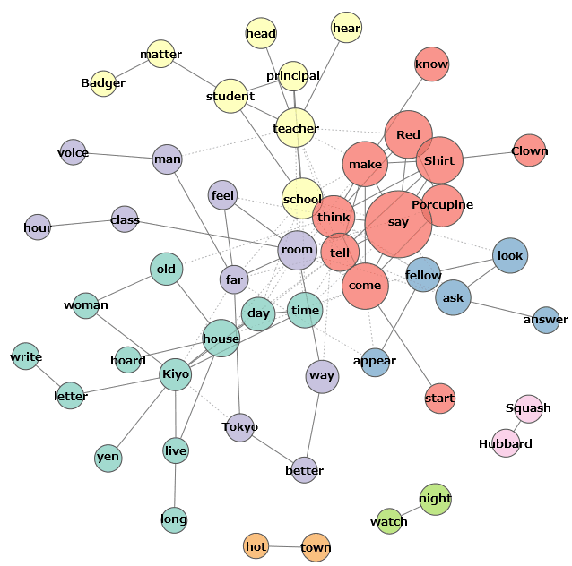

<a style="float:right; width: 20%;" rel="license" href="http://creativecommons.org/licenses/by-sa/4.0/"></a>


```{r setup, include=FALSE}
knitr::opts_chunk$set(echo = TRUE)
```

# 1. Préparatifs

J'installe ma session de travail

```{r}
setwd("~/Documents/github/UNIGE/32M7129/Cours_03")
monDossier="~/Documents/github/UNIGE/32M7129/Cours_03"
#je charge les données que l'enseignant a préparé pour éviter les problèmes
#load("Cours_Geneve_3.RData")
```

Première chose à faire: importer le corpus qui se trouve dans le dossier `cours 3`. Comme il s'agit d'un csv, nous utilisons la fonction `read.csv()` Le corpus que nous importons est une collection de blocs d'environ 1000 mots lemmatisés.
(notez la présence de lignes commençant par un dièse. Il s'agit d'un commentaire: quand il est utilisé, la ligne n'est pas interprétée par R)

```{r}
theatre = "moliere_racine.tsv"
# le paramètre `header` permet de signaler que la première ligne contient le nom des colonnes
# le paramètre `sep` permet d'indiquer comment sont marquées les colonnes. La regex `\t` indique que nous utilisons des tabulations (notre fichier est donc en fait un `tsv` et non un vrai `csv`).
# le paramètre fileEncoding permet d'avoir des charactères encodés en UTF8 (si vous avez windows, sans cette option le résultat de l'import peut être problématique)
theatre <- read.csv(theatre, header=TRUE, sep = "\t", quote = '', fill = TRUE, fileEncoding="UTF-8")
```

Je peux jeter un coup d'œil aux données brutes (on ne m'affiche que les première entrées de chaque colonne par commodité)

```{r}
str(theatre)
```

Je peux aussi les regarder dans un tableau directement dans RStudio. On remarque que les colonnes ont des noms: "auteur", "titre"…

```{r}
View(theatre)
```

Je peux sélectionner juste une colonne (ici "auteur"). Afin de ne pas tout afficher j'utilise la fonction `head()` pour ne montrer que les premières entrées:

```{r}
head(theatre$auteur)
# Je peux augmenter le nombre de résultat affiché en indiquant le chiffre souhaité de la manière suivante:
#head(theatre$auteur,10)
#Pour les dernières entrées, il existe une fonction `tail`
#tail(theatre$auteur)
```

Toutes les colonnes sont des métadonnées, sauf `theatre$texteLemmat` qui contient des "morceaux" de pièces de 1000 mots afin de simplifier le travail (nous allons y revenir). Il va falloir transformer le contenu de cette colonne en matrice terme-document (_Document Term Matrix_), c'est-à-dire créer un tableau avec une colonne pour chaque mot de mon corpus, et un rang par texte de mon corpus.

|        | mot1 | mot2 | mot3 |
|--------|------|------|------|
| Texte1 |  1   |  12  |  9   |
| Texte2 |  1   | 154  |  4   |

C'est le principe d'une approche _bag of words_, c'est à dire par "sac de mots": les mots ne sont pas pris dans leur contexte, uniquement par leur fréquence. Cela peut paraître un peu rustre, mais c'est très efficace.

```{r}
#Je charge deux nouvelles librairies pour le _text mining_ qui me permettent de créer ma matrice
if(!require("tm")){
  install.packages("tm")
  library("tm")
}
if(!require("tidytext")){
  install.packages("tidytext")
  library("tidytext")
}
# Je transforme mes textes en corpus avec la fonction `corpus()`, un objet de classe `corpus` manipulable dans `R` contenant des données et des métadonnées
#La fonction `VectorSource` transforme chaque document en vecteur
corpus <- Corpus(VectorSource(theatre$texteLemmat), readerControl = list(language = "fr"))
# J'affiche les informations à propos de ce corpus
corpus
```

Je peux désormais "utiliser" cet objet:

```{r}
#je compte le nombre de colonne dans ma matrice
ncol(as.matrix(DocumentTermMatrix(corpus)))
#J'affiche le premier vecteur de mon objet `corpus`:
corpus[[1]][[1]]
```

# 2. Je nettoie mon corpus

Il est absolument fondamental de nettoyer mon corpus de travail. En effet: _pas_ et _Pas_ ne sont pas les mêmes chaînes de caractères (il y a une majuscule dans le second), et peut-être même pas les mêmes mots (adverbe ou substantif?). Je dois donc au moins retirer les majuscules (avec la fonction `tolower()`), ou même lemmatiser (de préférence avec un outil spécifique, qui n'existe pas dans `R`).Pour rappel,nous fournissons ici le texte préalablement lemmatisé pour simplifier le travail.

## 2.1 Les _stopwords_

Comme notre objectif est d'avoir une approche thématique et conserver des mots potentiellement porteurs de sens: il faut donc retirer tous les mots les plus fréquents qui n'apportent, comme les les pronoms, les pronoms adverbiaux, les prépositions…  Ces mots sont appelés des _stopwords_ et une liste est fournie dans la fonction `stopwords()`

```{r}
stopwords("french")
```

Il existe des listes alternatives en ligne, plus complètes:

```{r}
#Donner un nom au fichier que je télécharge
mesStops="stopwords-fr.csv"
#indiquer l'URL où se trouve le document à télécharger
stopword_enLigne = "https://raw.githubusercontent.com/stopwords-iso/stopwords-fr/master/stopwords-fr.txt"
#télécharger le fichier et l'enregistrer sous le nom que je viens de lui donner
download.file(stopword_enLigne,mesStops)
#Comme c'est un tableur, je le lis avec la fonction adéquat 
stopword_enLigne = read.csv(stopword_enLigne, header=FALSE, stringsAsFactors=FALSE)[,]
#je jette un coup d'œil aux 10 premiers
head(stopword_enLigne,10)
```

Je vais utiliser mes listes de _stopwords_ l'une après l'autre pour nettoyer mon corpus. Pour cela j'utilise la fonction `tm_map()` qui permet de modifier les corpora. Dans ce cas précise j'utilise `removeWords` avec chacune des deux listes.

```{r, error=FALSE}
corpus_clean <- tm_map(corpus, removeWords, stopwords("french"))
corpus_clean <- tm_map(corpus, removeWords, stopword_enLigne)
#Je jette un coup d'œil à la sixième entrée pour contrôler que tout est en ordre
inspect(corpus_clean[6])
```

Malheureusement cette commande `tm_map()` fonctionne mal, et il est préférable de nettoyer le texte "à l'ancienne", en créant sa propore fonction.

```{r, echo=TRUE, results='hide', message=FALSE, warning=FALSE}
#Je recharge mon corpus
corpus_clean <- tm_map(corpus_clean, PlainTextDocument)
#je crée une fonction a deux paramètres: le corpus d'entrée et la liste des stopwords.
removeStopWords <- function(corpus_a_nettoyer, stopwords_a_retirer){
  # je fais une boucle pour retirer chaque mot de `stopwords_a_retirer`
  for (word in stopwords_a_retirer){
    #J'utilise une fonction anonyme (_snonymous function_) à un paramètre qui utilise la fonction `gsub` qui remplace le mot de `stopwords_a_retirer` par rien.
    removeWord <- function(x) gsub(paste("(^|\\s)(",word,") ", sep="")," ",x)
    #on retire le mot
    corpus_a_nettoyer <- tm_map(corpus_a_nettoyer, removeWord)
  }
  #Je renvoie le résultat
  return(corpus_a_nettoyer)
}

#Je passe mon `corpus_clean` comme `corpus_a_nettoyer` et mes `stopword_enLigne` comme `stopwords_a_retirer`.
corpus_clean <- removeStopWords(corpus_clean, stopword_enLigne)
```

S'il reste des mots qui ne me plaisent pas, je peux continuer de les retirer en les mettant dans un vecteur

```{r}
MesStopWords <- c( "à_le", "de_le", "-être", "faire", "falloir", "savoir", "pouvoir", "devoir", "devoir", "voir", "vouloir")
corpus_cleaner <- tm_map(corpus_clean, removeWords, MesStopWords)
inspect(corpus_cleaner[6])
```

Je fais de nouveau une matrice "terme/document" (DTM, _Document-term matrix_). On se rappelle qu'il s'agit de créer une matrice (un tableau) avec une colonne pour chaque mot de mon corpus, et un rang par texte de mon corpus.

|        | mot1 | mot2 | mot3 |
|--------|------|------|------|
| Texte1 |  1   |  12  |  9   |
| Texte2 |  1   | 154  |  4   |


```{r}
dtm <- DocumentTermMatrix(corpus_cleaner)
rownames(dtm) <- theatre$genre
```


## 2.2 Les mots peu fréquents

Je peux désormais observer la fréquence des mots: je retrouve la loi de Zipf dans la distribution de mes données

```{r}
freq <- as.data.frame(colSums(as.matrix(dtm)))
colnames(freq) <- c("frequence")
#Comme je vais dessiner un graph, j'ai besoin d'une nouvelle librairie: `ggplot2`
if (!require("ggplot2")){
  install.packages("ggplot2")
  library("ggplot2")
}
#Je dessine mon graph
ggplot(freq, aes(x=frequence)) + geom_density()
```

Je peux compter les mots avec des fréquences faibles, par exemple avec moins de 100 occurrences

```{r}
#Je retire tous les mots qui apparaissent entre 0 et 400 fois (on peut remplacer 400 par 100, ou même 10 si le corpus est trop gros)
motsPeuFrequents <- findFreqTerms(dtm, 0, 400)
#Si vous êts sur windows, décommentez la ligne suivante
#Encoding(motsPeuFrequents)<-"latin-1"
length(motsPeuFrequents)
head(motsPeuFrequents,50)
```

Je peux aussi compter et afficher les mots les plus fréquents, par exemple avec plus de 400 occurrences

```{r}
motsTresFrequents <- findFreqTerms(dtm, 401, Inf)
#Si vous êts sur windows, décommentez la ligne suivante
#Encoding(motsTresFrequents)<-"latin-1"
length(motsTresFrequents)
head(motsTresFrequents,50)
```

Je fais un très grand ménage, avec une fonction que je crée pour retirer les mots les moins fréquents:

```{r}
#Je crée une fonction `grandMenage`
grandMenage <- function(corpus_a_nettoyer, mots_peu_importants){
  #Afin de simplifier le travail (de mon ordinateur), je vais rassembler les mots à retirer en groupe 500 tokens, que je vais traiter séparément.
    chunk <- 500
    #Je compte le nombre de mots à retirer
    n <- length(mots_peu_importants)
    #Je compte les groupes de 500 (ici 17.05), j'arrondis au plus petit entier supérieur (ici 18) 
    r <- rep(1:ceiling(n/chunk),each=chunk)[1:n]
    #Je constitue mes lots sur la base du décompte précédemment mentionné
    d <- split(mots_peu_importants,r)
    #Je fais une boucle: pour retirer les mots du corpus, morceau par morceau
    for (i in 1:length(d)) {
        corpus_a_nettoyer <- tm_map(corpus_a_nettoyer, removeWords, c(paste(d[[i]])))
    }
    #Je renvoie un résultat
    return(corpus_a_nettoyer)
}
# J'utilise ma fonction avec `corpus_clean` comme ` corpus_a_nettoyer` et `motsPeuFrequents` comme `mots_peu_importants`
corpus_cleanSuperClean <- grandMenage(corpus_cleaner, motsPeuFrequents)
```

Je redéfinis ma matrice à partir de mon nouveau corpus

```{r} 
dtm <- DocumentTermMatrix(corpus_cleanSuperClean)
rownames(dtm) <- theatre$genre
freq <- as.data.frame(colSums(as.matrix(dtm)))
colnames(freq) <- c("frequence")
#Je fais un petit graph
ggplot(freq, aes(x=frequence)) + geom_density()
```

Je nettoye un peu ma DTM pour éliminer les rangs vides

```{r}
rowTotals <- apply(dtm , 1, sum)      #Find the sum of words in each Document
dtm_clean   <- dtm[rowTotals> 0, ]    #remove all docs without words
```

# 3. _Topic modeling_

**Remarque préliminaire**: le _topic modeling_ requiert des (très) grands corpus, si possible en centaines de documents. Pas de panique cependant: une manière de les obtenir est de diviser chaque textes en plusieurs documents qui forment une unité sémantique. Par exemple le chapitre, la scène, le paragraphe, ou bien (comme c'est le cas pour notre exercice) de 1000 mots.

## 3.1 Explication théorique

Un thème (_topic_) est un _clusters_ de mots, _i.e._ une récurrence de co-occurrence.



Source: [Wikisource](https://commons.wikimedia.org/wiki/File:Khcoder_net_e.png)

Le principe du _topic modeling_ est proche de celui de surligner un texte avec plusieurs couleurs: une pour chaque sujet, thème ou _topic_.


Une telle image soulève deux questions sur lesquelles nous reviendront plus tard:
* un article peut-il contenir plusieurs sujets?
* un mot peut-il n'appartenir qu'à un seul sujet?

Afin de reconnaître ces sujets, on va recourir à une allocation de Dirichlet latente ( _Latent Dirichlet allocation_, LDA).
* C'est une approche non supervisée, c'est-à-dire qu'elle ne nécessite pas d'annotation préalable de données.
* Il nous faut définir à l'avance un nombre de sujets/thèmes (_infra_ la variable `k`)

Le _LDA_  est modèle génératif probabiliste permettant d’expliquer des ensembles d’observations, par le moyen de groupes non observés, eux-mêmes définis par des similarités de données.


Source: [wikipedia](https://en.wikipedia.org/wiki/Latent_Dirichlet_allocation)

Dans ce graph:
* _M_ est le nombre de documents (corpus)
* _N_ est le nombre de mots (document)
* _W_ est un mot observé

La partie _latente_ (cachée):
* _Z_ est un _topic_ attribué à un _w_
* _θ_ est le mélange des _topics_ à l'échelle du document

Deux paramètres pour la distribution
* _α_ est la distribution par document. Si sa valeur est élevée, le document tend à contenir plusieurs _topics_, si la valeur est faible le nombre de _topics_ est limité 
* _β_ est la distribution par _topic_. Si sa valeur est élevée, un même mot se retrouve dans plusieurs _topics_ (qui se ressemblent donc), si la valeur est faible les similarités entre les _topics_ est faible 


Source: [wikipedia](https://commons.wikimedia.org/wiki/File:Latent_Dirichlet_allocation.svg)

## 3.2 Une LDA

Le modèle va classer aléatoirement tous les mots en _n_ sujets, et tenter d'affiner cette répartition de manière itérative en observant les contextes:

```{r}
#J'installe une nouvelle librairie pour le _topic modeling_
if(!require("topicmodels")){
  install.packages("topicmodels")
  library("topicmodels")
}
#Je vais partir sur une classification en deux _topics_
k = 2
lda_2 <- LDA(dtm_clean, k= k, control = list(seed = 1234))
##Je tente avec trois, pour voir…
lda_3 <- LDA(dtm_clean, k= k+1, control = list(alpha = 0.1))
```

Le résultat produit est une matrice avec pour chaque mot la probabilité qu'il appartienne à un des différents _topics_. On donne un score _β_, qui est celui présenté infra.

```{r}
topics <- tidy(lda_2, matrix = "beta")
topics
```

## 3.3 Les paramètres de Gibbs

Les paramètres de Gibbs permettent une sophistication du système précédent. C'est une probabilité conditionnelle qui s'appuie, pour calculer le _β_ d'un mot, sur le _β_ des mots voisins. Pour ce faire nous devons déterminer:
1. À quel point un document aime un _topic_
2. À quel point un _topic_ aime un mot

Un document:

| Voiture | Autoroute | Musique | Vélo | Vacances |
|---------|-----------|---------|------|----------|
|    1    |    ??     |    2    |  1   |     3    |

Sachant que le décompte est le suivant

|           | topic 1 | topic 2 | topic 3 |
|-----------|---------|---------|---------|
| Voiture   |   34    |   49    |    75   |
| Autoroute |   150   |   50    |    70   |
| Musique   |   34    |    4    |   170   |
| Vélo      |   543   |    2    |   150   |
| Vacances  |   23    |   70    |   563   |

Le _topic_ 1 est le plus représenté dans le document, et _Autoroute_ est déjà surreprésenté dans le décompte, donc on _update_ le tout

| Voiture | Autoroute | Musique | Vélo | Vacances |
|---------|-----------|---------|------|----------|
|    1    |   **1**   |    2    |  1   |     3    |

|           | topic 1 | topic 2 | topic 3 |
|-----------|---------|---------|---------|
| Voiture   |   34    |   49    |    75   |
| Autoroute | **151** |   50    |    70   |
| Musique   |   34    |    4    |   170   |
| Vélo      |   543   |    2    |   150   |
| Vacances  |   23    |   70    |   563   |

Nous devons d'abord déterminer le nombre optimal de _topics_

```{r}

#J'installe une nouvelle librairie pour déterminer le nombre de topics
if(!require("ldatuning")){
  install.packages("ldatuning")
  library("ldatuning")
}
#J'exécute le calcul
topicsNumber <- FindTopicsNumber(
  #La DTM que j'utilise
  dtm_clean,
  #Le nombre de possibilités que je teste
  topics = seq(from = 2, to = 20, by = 1),
  #Les métriques utilisées
  metrics = c("Griffiths2004", "CaoJuan2009", "Arun2010", "Deveaud2014"),
  method = "Gibbs",
  control = list(seed = 77),
  verbose = TRUE
)
#J'affiche le résultat
FindTopicsNumber_plot(topicsNumber)
```


```{r}
## Set parameters for Gibbs sampling
#Le modèle va tourner 2000 fois avant de commencer à enregistrer les résultats
burnin <- 2000
#Après cela il va encore tourner 2000 fois
iter <- 2000
# Il ne va enregistrer le résultat que toutes les 500 itérations
thin <- 500
#seed et nstart pour la reproductibilité
SEED=c(1, 2, 3, 4, 5)
seed <-SEED
nstart <- 5
#Seul meilleur modèle est utilisé
best <- TRUE
#7 topics
lda_gibbs_7 <- LDA(dtm_clean, 7, method="Gibbs", control=list(nstart=nstart, seed=seed, best=best, burnin=burnin, iter=iter, thin=thin))
#19 topics
lda_gibbs_19 <- LDA(dtm_clean, 19, method="Gibbs", control=list(nstart=nstart, seed=seed, best=best, burnin=burnin, iter=iter, thin=thin))
```

Je peux désormais voir les premiers résultats pour chacun des modèles. Il s'agit de de mots dont la fréquence d'utilisation est corrélée

```{r}
"LDA 2"
termsTopic <- as.data.frame(terms(lda_2,10))
head(termsTopic,11)
"LDA 3"
termsTopic <- as.data.frame(terms(lda_3,10))
head(termsTopic,11)
"LDA GIBBS 7"
termsTopic <- as.data.frame(terms(lda_gibbs_7,10))
head(termsTopic,11)
"LDA GIBBS 19"
termsTopic <- as.data.frame(terms(lda_gibbs_19,10))
head(termsTopic,11)
```

Nous allons utiliser `lda_gibbs_2` et construire une matrice avec les _β_ des tokens (pour les ɣ, et donc des probabilités par document, on aurait mis `matrix = "gamma"`). Chaque token est répété deux fois, avec une probabilité pour chaque _topic_:

```{r}
topics <- tidy(lda_gibbs_7, matrix = "beta")
topics
```

# 4. Visualisation

```{r}
#Je vais encore solliciter une nouvelle librairie
if (!require("dplyr")){
   install.packages("dplyr")
  library("dplyr")
}

#Je récupère mes mots
top_terms <- topics %>%
  group_by(topic) %>%
  top_n(10, beta) %>%
  ungroup()  %>%
  arrange(topic, -beta)
#Je fais un graph
top_terms %>%
  mutate(term = reorder_within(term, beta, topic)) %>%
  ggplot(aes(term, beta, fill = factor(topic))) + geom_col(show.legend = FALSE) +
                                                  facet_wrap(~ topic, scales = "free") +
                                                  coord_flip() +
                                                  scale_x_reordered()
```

Je vais désormais associer chaque mot à l'un des 5 genres possibles, pour déterminer auquel mes tokens sont rattachés, et découvrir (potentiellement quel genre se cacher derrière quel _topic_

```{r}
if (!require("reshape2")){
  install.packages("reshape2")
  library("reshape2")
}
df <- melt(as.matrix(dtm_clean))
df <- df[df$Terms %in% findFreqTerms(dtm_clean, lowfreq = 800), ]
ggplot(df, aes(as.factor(Docs), Terms, fill=log(value))) +
                                             geom_tile() +
                                             xlab("Genres") +
                                             scale_fill_continuous(low="#FEE6CE", high="#E6550D") +
                                             theme(axis.text.x = element_text(angle=90, hjust=1))
```

```{r, fig.width=12, fig.height=12}
tt <- posterior(lda_gibbs_7)$terms
melted = melt(tt[,findFreqTerms(dtm_clean, 1000,10000)])

colnames(melted) <- c("Topics", "Terms", "value")
melted$Topics <- as.factor(melted$Topics)
ggplot(data = melted, aes(x=Topics, y=Terms, fill=value)) + 
                                              geom_tile() +
                                              theme(text = element_text(size=35))
```

```{r, fig.width=12, fig.height=12}
tt <- posterior(lda_gibbs_19)$terms
melted = melt(tt[,findFreqTerms(dtm_clean, 1000,10000)])

colnames(melted) <- c("Topics", "Terms", "value")
melted$Topics <- as.factor(melted$Topics)
ggplot(data = melted, aes(x=Topics, y=Terms, fill=value)) + 
                                              geom_tile() +
                                              theme(text = element_text(size=35))
```

On peut aussi observer le score gamma, c'est-à-dire la probabilté qu'un document contienne un sujet:

```{r}
DocumentTopicProbabilities <- as.data.frame(lda_gibbs_19@gamma)
rownames(DocumentTopicProbabilities) <- rownames(corpus_cleanSuperClean)
head(DocumentTopicProbabilities)
```

Nous allons désormais faire des _word clouds_. Pour cela appelons (installons?) les libraries suivantes:

```{r}
if (!require("wordcloud")){
   install.packages("wordcloud")
  library("wordcloud")
}
if (!require("RColorBrewer")){
   install.packages("RColorBrewer")
  library("RColorBrewer")
}
if (!require("wordcloud2")){
   install.packages("wordcloud2")
  library("wordcloud2")
}
```

je récupère les mots et je les associe à leur 𝛃

```{r, fig.width=20, fig.height=20}
tm <- posterior(lda_gibbs_7)$terms
data = data.frame(colnames(tm))
head(data)
```
Je produis une visualisation par _topic_

```{r, fig.width=30, fig.height=20}
for(topic in seq(k)){
    data$topic <-tm[topic,]
    #text(x=0.5, y=1, paste("V",topic, sep=""),cex=0.6)
    wordcloud(
      words = data$colnames.tm.,
      freq = data$topic,
      #sous ce seuil, les mots ne seront pas affichés
      min.freq=0.0002,
      #nombre maximum de mots à afficher
      max.words=30,
      #Si faux, en ordre croissant
      random.order=FALSE,
      #% de mots à 90°
      rot.per=.35,
      #taille du graph
      scale=c(10,10),
      #couleurs
      colors = brewer.pal(5, "Dark2")
      # il est possible de rentrer directement les couleurs qui nous intéressent
      #c("red", "blue", "yellow", "chartreuse", "cornflowerblue", "darkorange")
    )
}
```

Finissons avec un peu de mauvais goût, grâce au package `wordcloud2`

```{r, fig.width=20, fig.height=20}
wordcloud2(data = data,
          size=0.4,
          color= "random-light",
          backgroundColor = "pink",
          shape = 'star',
          rotateRatio=1
    )
```

# Rermerciements
Les données d'entraînement ont été créées par JB Camps (ENC).
Des morceaux de ce script (notamment pour le nettoyage des données) proviennent d'un cours de Mattia Egloff (UniL).