Cours _Distant Reading_ : Visualisation

# 4. Introduction à la stylométrie

Simon Gabay

  
---
# Introduction
---

## Définition

La stylométrie est une approche computationnelle et quantitative du texte, dont l'objectif est de mesurer des idiosynchrasies stylistiques, appellées stylomes.

>‘‘stylome’’, a set of measurable traits of language products

H. Van Halteren, _et al._. "New machine learning methods demonstrate the existence of a human stylome." 2005

Le postulat est donc que, un peu comme l'ADN, le style de chaque être humain lui est unique, et que ses caractéristiques sont mesurables.

---
## Expériences et cas célèbres

* Van Halteren 2015: quelques étudiants écrivent 9 textes courts (entre 600 et 1300 mots), que l'on est capable d'attribuer
* Vosoughi, Zhou, Roy 2015: associer environ 5500 comptes facebook et twitter sur la base de la production écrite de ces comptes.
* Les cas J.K. Rowling (Juola 2015) et E. Ferrante (Rybicki 2018)

---
## Le fond et la forme

Traditionnellement, on regarde "le fond". Le meilleur exemple sont les champs lexicaux, qui se limitent souvent aux substantifs/adjectifs/verbes. Les sondages stylistiques peuvent être plus précis (adverbe), mais le champ se trouve alors limité à des extraits pour des raisons évidentes.

En informatique, certaines techniques reprennent cette approche en proposant des analyses thématiques (_topic modeling_), géographiques (_information retrieval_)…

La stylométrie fait le pari inverse: elle s'intéresse à la masse, et donc aux fréquences. Elle utilise volontiers les mots outils comme les articles (_le_, _la_), les prépositions ( _à_, _de_), les conjonctions (_et_, _que_).

On appelle parfois ces mots outils (_function words_ ou _stop words_ en anglais, par opposition aux _content words_) des mots vides, ce qui est vrai sémantiquement, mais pas syntaxiquement.

---
# _MFW_

---
## Les _Federalist papers_

_The Federalist Papers_ est un recueil de 85 articles publié en 1787. C'est encore aujourd'hui une source importante pour l'histoire du droit américain, car ces articles ont été l'une des principales sources d'interprétation de la constitution américaine.

Ce recueil est publié sous un pseudonyme unique (_Publius Valerius Publicola_) par trois auteurs: James Madison, Alexander Hamilton et John Jay. Si nous sommes certains de connaître tous les articles publiés par le dernier (N°2, 3, 4, 5 et 64), il n'en va pas de même pour les deux autres.

Nous avons donc plusieurs problèmes:
* Les articles 49-58, 62 et 63 ne sont attribués à aucun auteur.
* Les articles 18, 19 et 20 sont écrit à deux mains par Madison et Hamilton, sans qu'il ne soit possible de dire qui est responsable de quelle partie.

---

Source: [Wikipedia](https://commons.wikimedia.org/wiki/File:An_Advertisement_of_The_Federalist_-_Project_Gutenberg_eText_16960.jpg?uselang=fr)

---
## Problème

Comment savoir qui a écrit quoi? Un réflex naturel serait de regarder la longueur des phrases:

* 34,55 mots en moyenne (_σ_ de 19,2) pour Hamilton
* 34,59 mots en moyenne (_σ_ de 20,3) pour Madison

Il faut donc trouver autre chose… Le lexique est évidemment la meilleure option.

---
## Le cas Adair

Douglass Adair (1912-1968)
* "The Authorship of the Disputed Federalist Papers", 1944
* "The Tenth Federalist Revisited", 1951

Intuition stylométrique: Adair regarde les fréquences des mots, et remarque notamment que Hamilton préfère _while_, là où Madison utilise plutôt _whilst_.

---

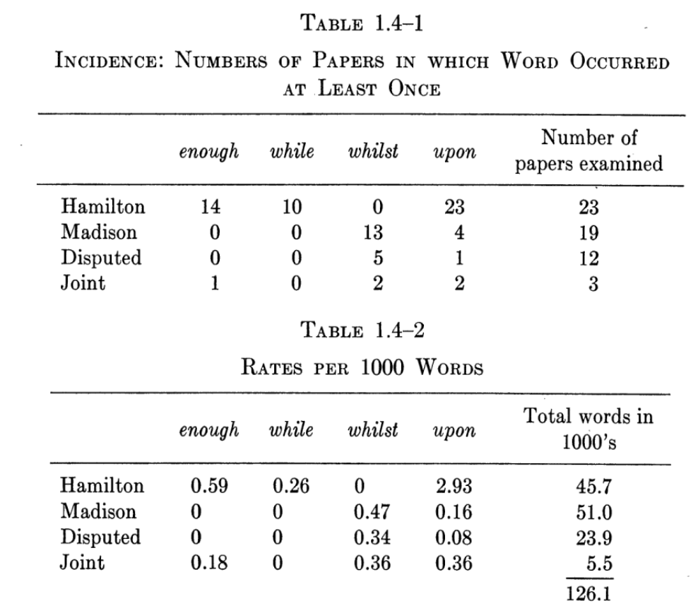

Mosteller & Wallace, _Applied Bayesian and Classical Inference: The Case of The Federalist Papers_, p. 11.

---

# Une approche statistique

Frederick Mosteller et David Wallace vont mener les premières études statistiques permettant d'identifier un auteur à partir des fréquences des mots.

* « Inference in an Authorship Problem », _Journal of the American Statistical Association_, vol. 58, juin 1963, p. 275-309
* _Inference and Disputed Authorship: Federalist Papers_, 1964.

Un de leurs objectifs est de retrouver des marqueurs (_markers_)

---

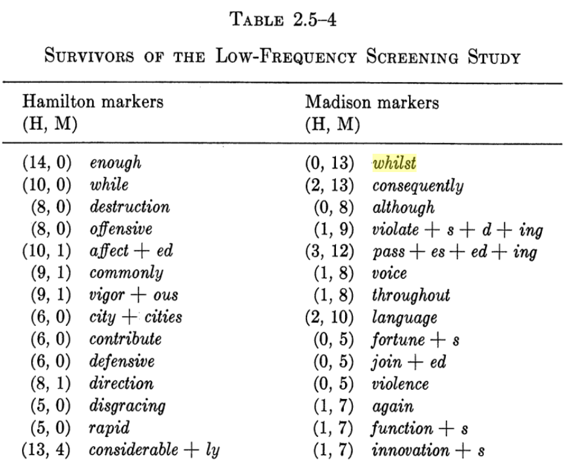

Mosteller & Wallace, _Applied Bayesian and Classical Inference: The Case of The Federalist Papers_, p. 40.

---
## L'importance des _Function words_

Mike Kestemont 2014 propose plusieurs raisons à l'importance des _function words_.

* Ils sont (très) fréquents, ce qui est parfait pour des études statistiques
* Il sont donc nécessairement utilisés de manière (plutôt) inconsciente
* Leur emploi est décorélé du thème, du genre, du registre du texte

---
# Alternatives aux _MFW_

---
## Les rimes

Etude sur Jacob van Maerlant (c.1230-†c.1288) par Kestemont, Daelemans et Sandra (2012)
* Gros corpus de c. 200 000 vers
* Doute sur l'attribution de certains textes à Lodewijk van Velthem (c. 1260/1275-†c.1317)
* Problème: au Moyen Âge, les textes ne sont pas stables, et le contenu diffère d'un témoin à un autre.
* Hypothèse: les mots à la rime sont moins affectés par la variation textuelle, et doivent permettre une attribution fiable

---
## Les _POS_

* Zhao & Zobel 2007 montre l'importante des POS pour l'attribution

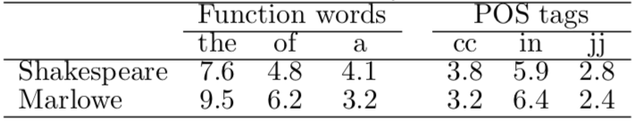

* Gamon 2004 travaille sur des _N-grams_ (en l'occurrence des trigrammes) de POS

---
## Les séquences de caractères

Sapkota, Bethard et Montes, 2015 proposent donc de travailler sur des _N-grams_, mais de caractères. Afin d'aller plus loin que les _N-grams_, il distinguent:

* Préfixe : un n-gramme de caractères couvrant les n premiers caractères d’un mots de longueur au moins n+1
* Suffixe :un n-gramme de caractères couvrant les n derniers caractères d’un mots de longueur au moins n+1
* Espace-préfixe : un préfixe commençant par un espace
* Espace-suffixe : un suffixe finissant par un espace

---

Sapkota, Bethard et Montes, 2015

---
# Méthodes exploratoires

---
## Deux dimensions

| Elève     | Avoir | Être |
|-----------|-------|------|
| Molière   | 2     | 1    |
| Corneille | 3     | 2    |
| Racine    | 4     | 3    |

---
## Trois dimensions

| Elève     | Avoir | Être | Manger |
|-----------|-------|------|--------|
| Molière   | 2     | 1    | 4      |
| Corneille | 3     | 2    | 5      |
| Racine    | 4     | 3    | 2      |

  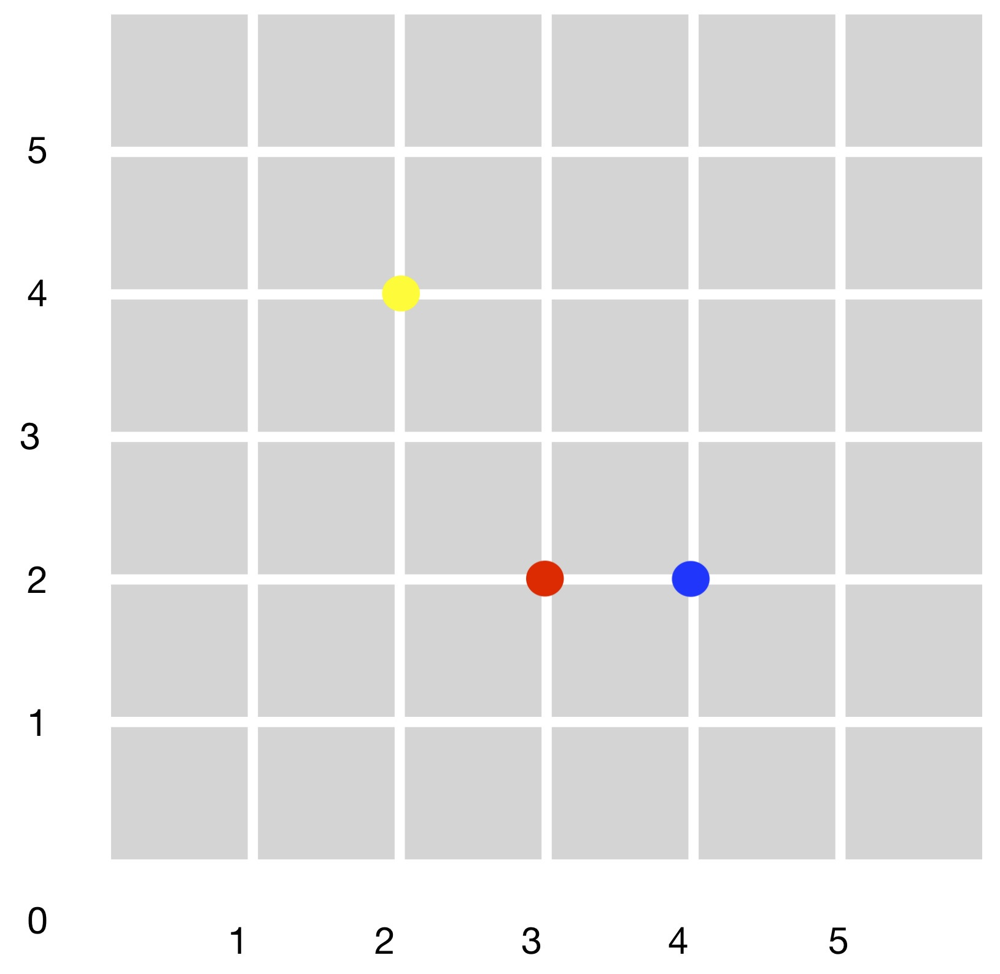

---
## N-dimensions

Comment représenter de l'information à N-dimensions?

---
## Principe

Les méthodes d'analyse factorielle s'utilisent pour décrire et hiérarchiser les relations statistiques qui peuvent exister entre des individus placés en ligne (par exemple des auteurs) et des variables placées en colonnes (leurs fréquences de mots) dans un tableau.

Elles considèrent le tableau de données comme un nuage de points dans un espace mathématique ayant autant de dimensions qu’il y a de colonnes dans le tableau de données ; elles cherchent à le projeter sur des axes ou des plans (appelés factoriels) de façon que l’on puisse en visualiser et étudier au mieux la forme et donc rechercher globalement des corrélations.

Le principe est de tenter de trouver une configuration optimale selon un critère de théorie de l'information pour respecter les proximités entre points : deux points qui sont proches (resp. éloignés) dans l'espace d'origine devront être proches (resp. éloignés) dans l'espace de faible dimension.

---
## Réduction de dimension

Pour représenter un objet en 3D, je vais donner plusieurs images, prises sous différents angles. Ces angles ne sont pas pris au hasard: ils doivent donner un maximum d'information, car on ne peut pas multiplier les images.

---

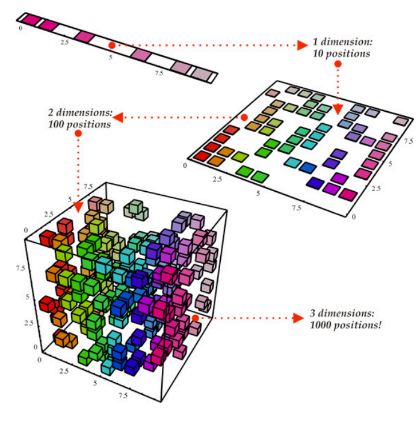

Moshe Binieli, ["An overview of Principal Component Analysis"](https://medium.com/free-code-camp/an-overview-of-principal-component-analysis-6340e3bc4073)

---
## ACP

L'Analyse en composantes principales (ACP ou _PCA_ en anglais pour _principal component analysis_) va déterminer les deux axes qui expliquent le mieux la dispersion de l'objet, interprété comme un nuage de points.

Prenons une classe notée sur 100 pour deux devoirs:

| Elève     | Mathématiques | Français |
|-----------|---------------|----------|
| Cunégonde | 80            | 30       |
| Marcel    | 50            | 50       |
| Josette   | 30            | 60       |

Si nous devons retenir deux axes pour décrire ce tableau, le premier sera la moyenne de chaque élève pour les deux matières, le second l'écart entre les deux notes. On pourrait multiplier les axes, mais ils n'apporteraient pas beaucoup plus d'information.

---

Kestemont, Moens, Deploige 2014.

---
## t-SNE

Au moment de la réduction de _N_ à deux dimensions, nous allons perdre de l'information.
* Nous pouvons décider de préserver les longues distances entre les points, et ainsi maintenir les grands équilibres en "étirant" le graphique (PCA).
* Nous pouvons aussi décider de conserver les petites distances entre les points avec un algorithme _t-Distributed Stochastic Neighbor Embedding_ (t-SNE).

Avec cette dernière approche, nous allons devoir définir le nombre de points voisins retenus lors du calcul: on parle de _perplexité_.

Un algorithme t-SNE ne donne jamais le même résultat: il doit être relancé plusieurs fois.

---
## Quantité vs qualité

L'analyse en composante principale et l'algorithme t-SNE sont utilisés avec des grands ensembles de données. Quand les variables sont qualitatives, on se tourne plus volontiers
* vers une AFC (Analyse Factorielle des Correspondances) quand on a deux variables qualitatives
* vers une ACM (Analyse des Correspondances Multiples) lorsqu'on a plus de deux variables

---
## AFC

L'AFC permet de croiser deux variables qualitatives. Elle s'applique donc sur un tableau de contingence, c'est-à-dire où les sommes des colonnes et des lignes ont un sens, et où X et Y s'expliquent l'un l'autre.

| Elève     | Mathématiques | Français | Moyenne |
|-----------|---------------|----------|---------|
| Cunégonde | 80            | 30       | 55      |
| Marcel    | 50            | 50       | 50      |
| Josette   | 30            | 60       | 45      |

Doit devenir, par exemple:

| Genre/résultat | Accepté.e | Recalé.e |
|----------------|-----------|----------|
| Fille          | 1         | 1        |
| Garçon         | 1         | 0        |

---
## ACM

L'ACM est, pour aller vite, une ACP sur des catégories. Un ensemble d’individus (en lignes) est décrit par un ensemble de variables qualitatives (en colonnes), comme dans une enquête d'opinion.

Ce type d'analyse, très utilisé en sociologie, a été popularisé par Pierre Bourdieu dans les années 70. Pour un individu _i_:

|       | Fruit  | Légume  | Viande |
|-------|--------|---------|--------|
| _i_ 1 | Pomme  | Haricot | Cheval |
| _i_ 2 | Poire  | Haricot | Cheval |
| _i_ 3 | Orange | Haricot | Mouton |
| _i_ 4 | Pomme  | Epinard | Mouton |
| _i_ 5 | Poire  | Epinard | Porc   |
| _i_ 6 | Orange | Epinard | Porc   |

---
On transforme le premier tableau en tableau disjonctif complet:

|       | Fruit:Pomme | Fruit:Poire | Fruit:Orange | … |
|-------|-------------|-------------|--------------|---|
| _i_ 1 | 1           | 0           | 0            | … |
| _i_ 2 | 0           | 1           | 0            | … |
| _i_ 3 | 0           | 0           | 1            | … |
| _i_ 4 | 1           | 0           | 0            | … |
| _i_ 5 | 0           | 1           | 0            | … |
| _i_ 6 | 0           | 0           | 1            | … |

---

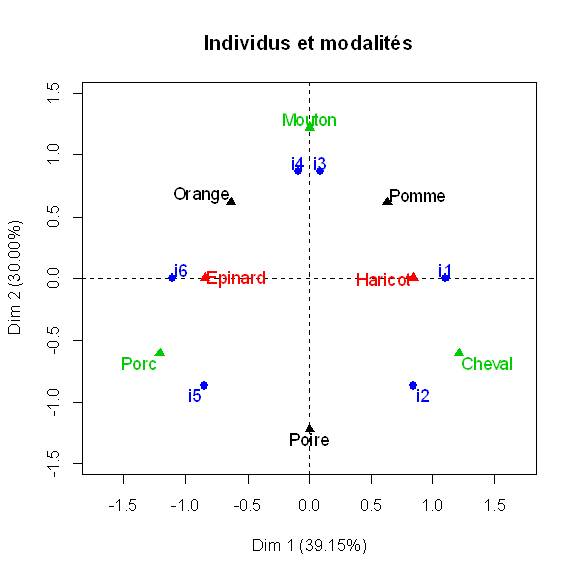

Source: [Wikipedia](https://commons.wikimedia.org/wiki/File:ACM_fig1.jpg?uselang=fr)

---
# MDS

Le principe du MDS (_Multidimensional scaling_) est de positionner nos individus dans un espace à _N_ dimensions (normalement 2, voire 3) en fonction de leur similarité/dissimilarité. On va donc passer par une tableau représentant la distance entre les différents individuss.

L'idée est donc de "comprimer" un ensemble d'informations en une une matrice de similarité, sur laquelle on va réaliser une ACP.

Cette dérofmation étant un peu brutale, il va falloir évaluer la déformation produite. Pour cela on va évlauer le  _stress_.

---
Le principe est le se suivant. Notre tableau des notes:

| Elève     | Mathématiques | Français | Moyenne |
|-----------|---------------|----------|---------|
| Cunégonde | 80            | 30       | 55      |
| Marcel    | 50            | 50       | 50      |
| Josette   | 30            | 60       | 45      |

Devient une matrice de similarité (ici basée sur le point de pourcentage).

| Elève     | Cunégonde | Marcel | Josette |
|-----------|-----------|--------|---------|
| Cunégonde | 0         | 5      | 10      |
| Marcel    | 5         | 0      | 5       |
| Josette   | 10        | 5      | 0       |

---

---
# Distance
---
# Quelle distance?

Pour retrouver des textes proches, il faut arriver à mesurer la distance qui les sépare: qu'est-ce que cela eut dire? Comment faire?

* Il existe une multitude de distances:

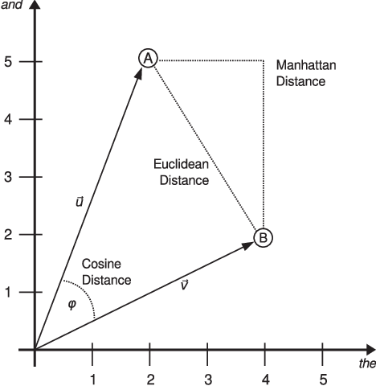

* Celles-ci peuvent être calculées sur différents types de données: le nombre d'occurrences, fréquence relative, cote Z…

---
## Distances

La distance "à vol d'oiseau" est un bon indicateur de l'espace qui sépare deux points, mais pas nécessairement le meilleur: pour aller de Lausanne à Courmayeur en voiture, il vaut mieux éviter le Léman et passer par un col…

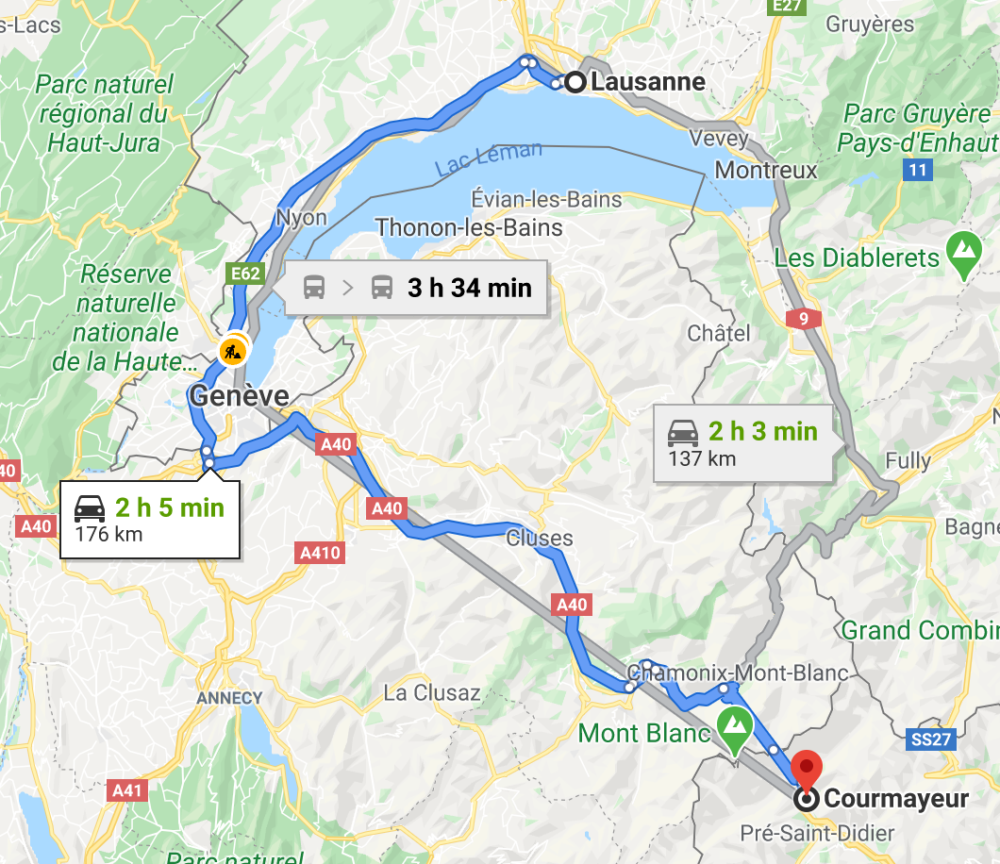
Source: Google maps

---
## Distance de euclidienne vs distance de Manhattan

La distance euclidienne est la distance la plus connue car elle est la plus intuitive. Cependant, il n'est pas certain que la distance entre Proust et Zola soit de même nature que celle entre New York et Londres.

Il existe des mesures alternatives pour mesurer la distance entre deux points, comme par exemple la distance dite "de Manhattan".

---

Source: [Packtpub, "Calculating the distance"](https://subscription.packtpub.com/book/big_data_and_business_intelligence/9781787121515/3/ch03lvl1sec33/calculating-the-distance)

---
## Cote Z

Plutôt que de prendre les fréquences absolues ou les fréquences absolues, on peut prendre la "cote Z". Elle correspond au nombre d'écarts types séparant un résultat de la moyenne:

Ou _X_ est un mot, _µ_ est la moyenne et _σ_ est l'écart type.

On normalise les moyennes à 0 et l’écart type à 1: les chiffres tournent donc autour de ces valeurs.

---
## Delta de Burrows

John Burrows 2002 propose de faire une distance de manhattan sur des cotes Z: c'est le "delta de Burrows".

On peut donc déduire le Delta (Δ), soit la différence entre la fréquence (_f_) d'un mot (_i_) entre deux documents (_D_ et _D'_) de la manière suivante:

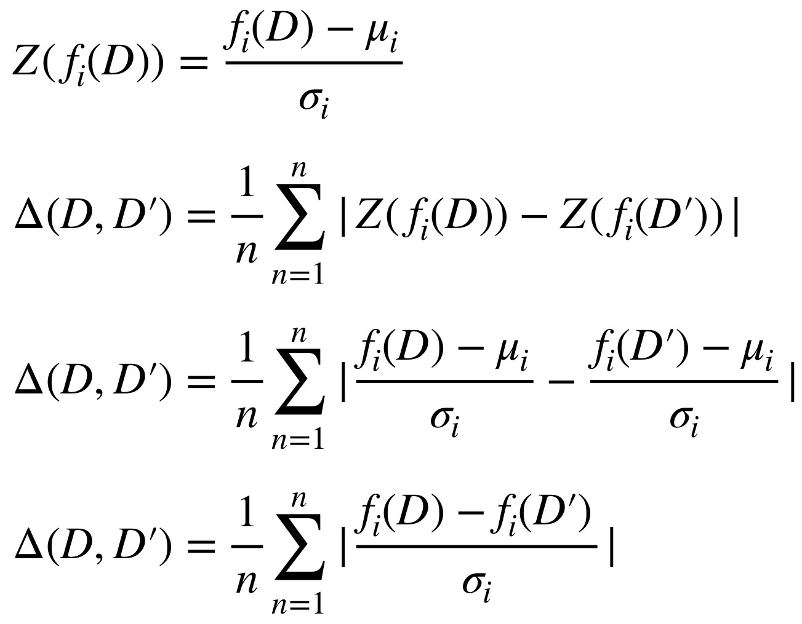

---
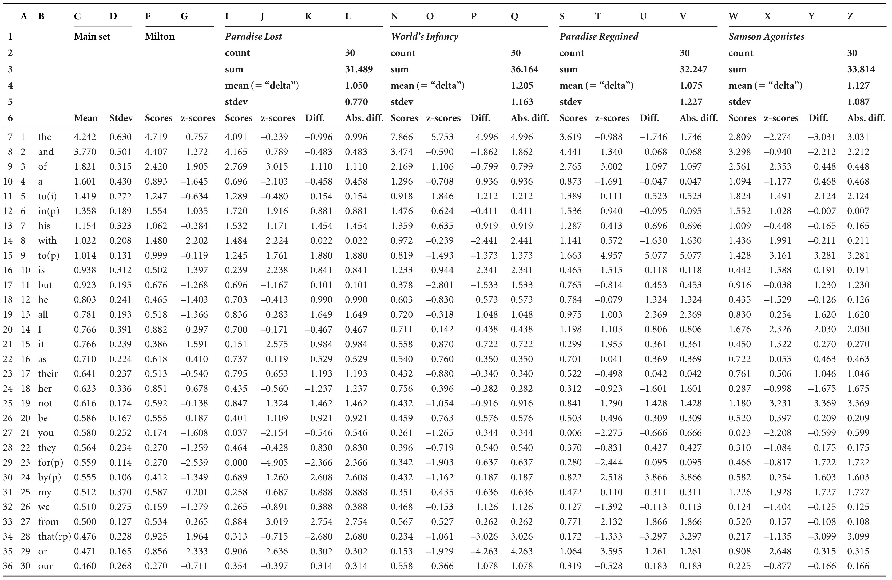
Source: Burrows, " ‘Delta’: a Measure of Stylistic Difference and a Guide to Likely Authorship"

---
## Et tant d'autres…

Source: Stanikūnas, Mandravickaitė & Krilavičius 2017

---

Performance of distance measures on 19th c. English novels:

Source: Evert, Proisl, Jannidis, Reger, Pielström, Schöch, Vitt, 2017.

---

## Différences entre langues

Attention, ces scores varient d'une langue à l'autre.

Source: Evert, Proisl, Jannidis, Pielström, Schöch, Vitt, "Towards a better understanding of Burrows’s Delta in literary authorship attribution"

---

## Similarité de cosinus

L'idée est de calculer l'angle _θ_ formé par deux vecteurs _A_ et _B_ pour évaluer leur similarité:

---

L'angle _θ_ s'obtient par le produit scalaire et la norme des vecteurs. Pour deux vecteurs _x_ et _y_, et deux vecteurs _A_ et _B_:

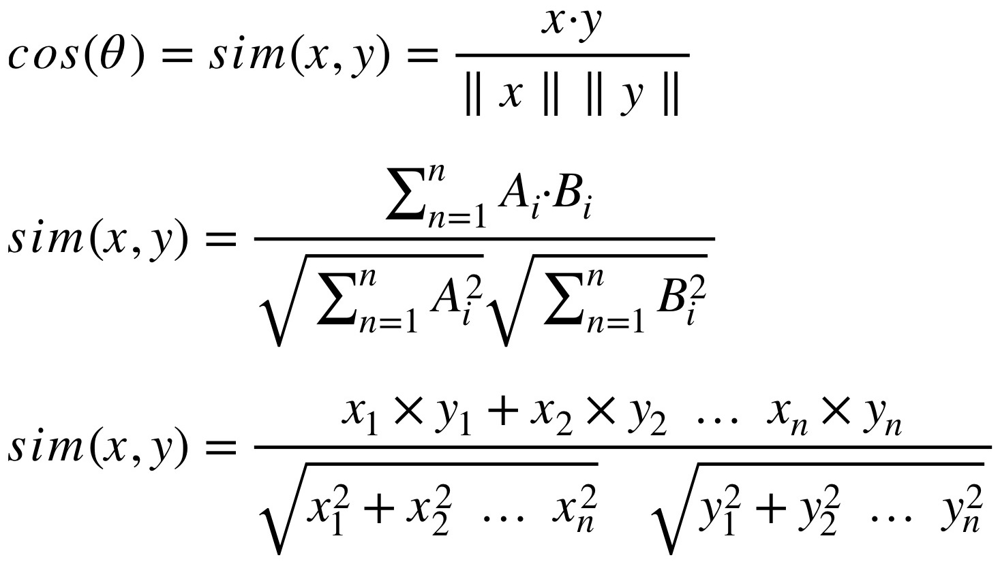

---
## Cosine delta

Prenons un exemple fictif avec deux textes de trois tokens, l'un écrit par Molière, l'autre par Corneille:

| Auteur/token | Avoir | Être | Manger |
|--------------|-------|------|--------|
| Molière      | 2     | 1    | 4      |
| Corneille    | 3     | 2    | 5      |

La similarité entre ces deux textes serait donc la suivante:

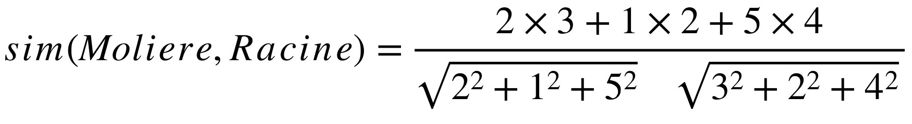

Comme nous parlons de _cosine delta_, il faudrait préalablement normaliser les vecteurs, et donc z-transformer les valeurs du tableau.

---
# Classification

---
## Stratégies d’agrégation

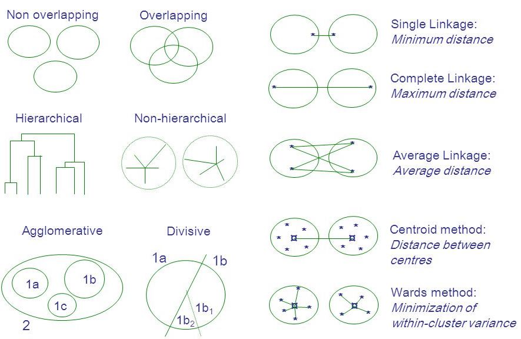

---
## CAH

En stylométrie, on a tendance à adopter une approche hiérarchique (à gauche)

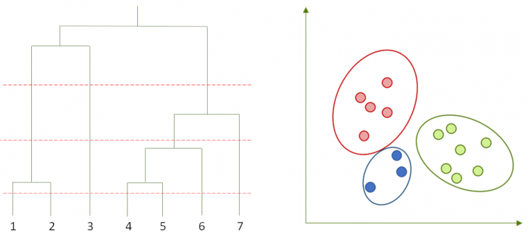

Cette représentation est un dendogramme, et elle permet de représenter une classification ascendante hiérarchique (CAH).

---

L'objectif d'une CAH est de constituer séquentiellement des paires à partir des mesures de distances/similarité jusau'à n'obtenir qu'une seule classe:

En stylométrie, on va constituer des paires sur les calculs de distance.

---

L'objectif est de regrouper deux classes d'une partition pour obtenir une partition plus agrégée: mais comment faire?

* Le _complete linkage_, qui calcule la distance maximale entre deux points est recommandée par Burrows 2002
* Le _single linkage_ calcule la distance minimale entre deux points
* L'_average linkage_ calcule toutes les distances entre les différents points et en fait la moyenne
* La distance entre les centroïdes calcule la distance entre les centres de gravité

Source: [Babu 2015](https://www.mrc-lmb.cam.ac.uk/genomes/madanm/microarray/chapter-final.pdf)

---

La méthode d'agrégation a un impact important sur le résultat

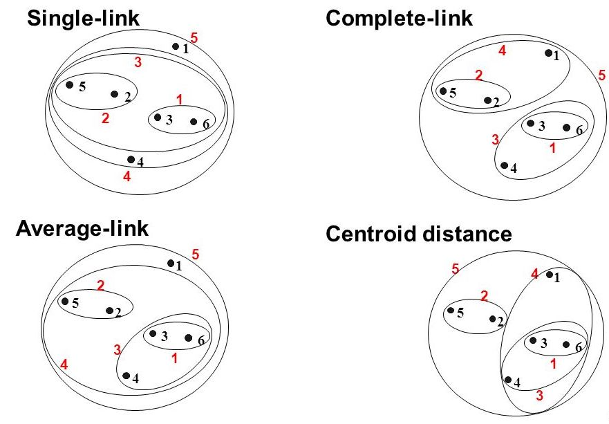

Source: [slideplayer](http://slideplayer.com/slide/9336538/)

---
## La Méthode de Ward

La méthode de Ward, recommandé par Hoover 2003b et qui **est la plus utilisé aujourd'hui**, minimise la variance (ou inertie) intra-classe, et maximise (logiquement) la variance (ou inertie) interclasse.

Comme elle minimise la distance centroïde, elle constitue des groupes homogènes.

---
### Remerciements/sources

Merci à JB Camps et Fl. Cafiero, qui retrouveront une partie de leur enseignement dans ces _slides_.
