Cours DH UniGE

# Introduction à l'analyse de réseau

Simon Gabay
Genève, Mardi 31 mars 2020

---
# Introduction
---

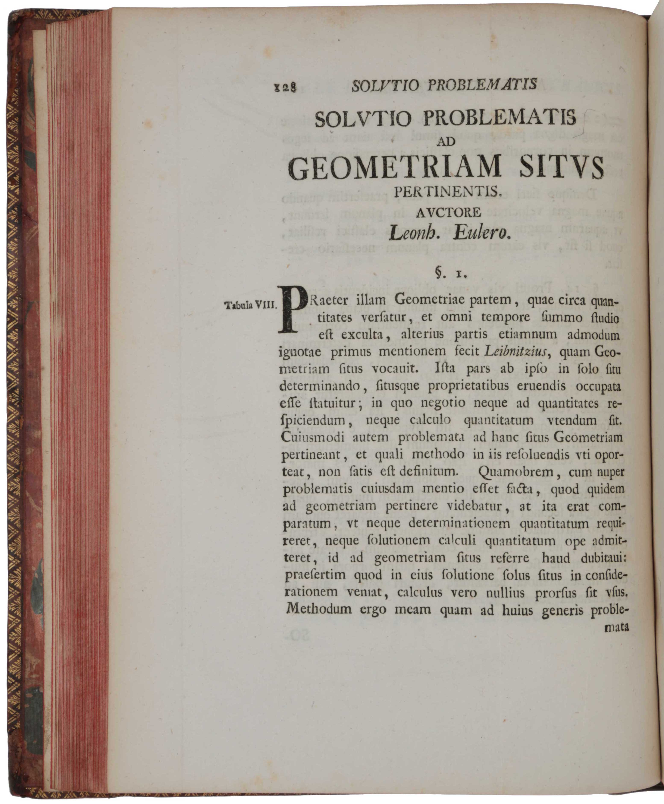

---
## Les sept ponts de Königsberg

* Leonhard Euler (1707-1783), mathématicien et physicien suisse
* «Solutio problematis ad geometriam situs pertinentis», _Mémoires de l'Académie des sciences de Berlin_, 1735
* Est-ce qu'il existe une promenade dans Königsberg permettant, peu importe le point de départ, de revenir à celui-ci en prenant tous les ponts une seule fois?
* Euler est à l'origine de la théorie des graphes parce qu'il fut le premier à proposer un traitement mathématique de la question, suivi par Alexandre-Théophile Vandermonde.

---

 
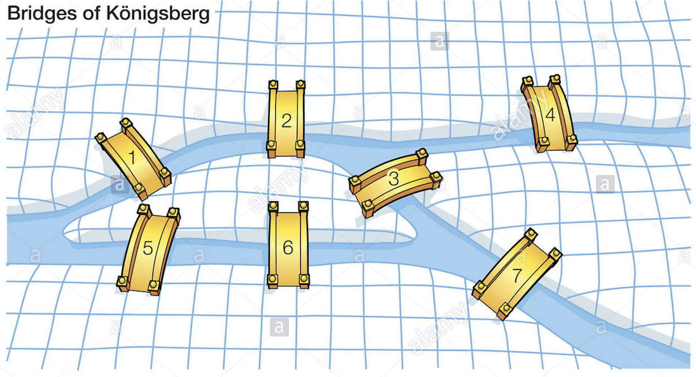 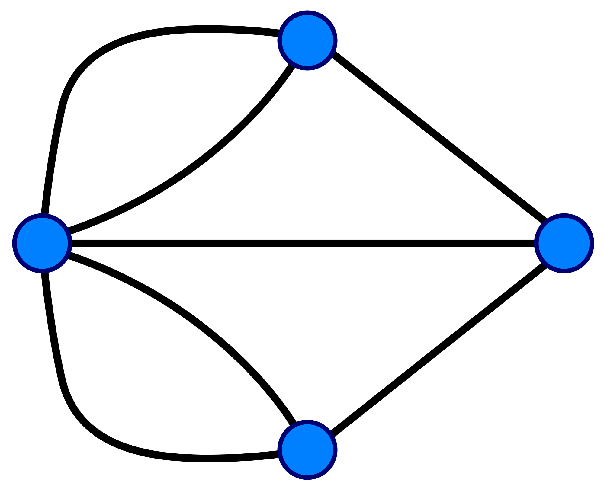

Source: [wikipedia](https://commons.wikimedia.org/wiki/File:Solutio_problematis_ad_geometriam_situs_pertinentis,_Fig._1.png), [wikipedia](https://commons.wikimedia.org/wiki/File:Image-Koenigsberg,_Map_by_Merian-Erben_1652.jpg), [wikipedia](), [wikipedia](https://commons.wikimedia.org/wiki/File:K%C3%B6nigsberg_graph.svg)

---
## The Rise of the Medici

>to understand state formation one must penetrate beneath the veneer of formal institutions, groups, and goals down to the relational substrata of peoples' actual lives

John F. Padgett et Christopher K. Ansell, Robust Action and the Rise of the Medici, _Amercian Journal of Sociology_, 98(6), 1993

Tentative de représentation graphique des réseaux de sociabilité dans la Florence du XVème s.

---

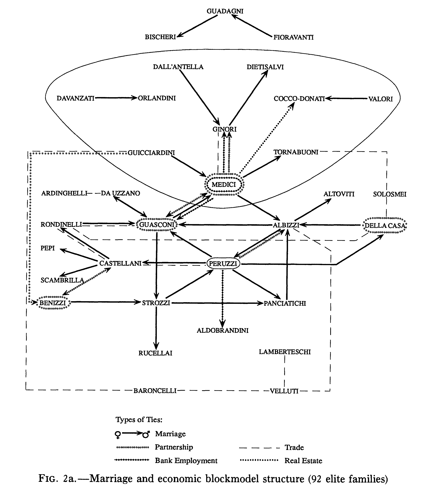

---
## Littérature: Shakespeare

M. Grandjean. Network visualization: mapping Shakespeare's tragedies. 2015 [lien](http://www.martingrandjean.ch/network-visualization-shakespeare/)

---
## Histoire: ligue des Nations

M. Grandjean. Social Network Analysis of the League of Nations' Intellectual Cooperation, an Historical Distant Reading. _DH Benelux_, 2016, Luxembourg. [lien](http://www.martingrandjean.ch/analyse-de-reseau-cartographier-lactivite-de-la-societe-des-nations)

---
## Sociologie: collaborations entre les chercheurs dans les projets FNS

Cf. M. Grandjean, et al. Complex Network Visualisation for the History of Interdisciplinarity: Mapping Research Funding in Switzerland. _Digital Humanities 2017_, 2017, Montreal, Canada. [lien](https://agenda.unil.ch/display?id=1518684389647)

---
## Réseaux à plusieurs niveaux

M. Grandjean. Multimode and Multilevel: Vertical Dimension in Historical and Literary Networks. _Digital Humanities 2017_, Aug 2017, Montreal, Canada. [lien](https://halshs.archives-ouvertes.fr/halshs-01525539v2)

---
# Introduction

---
## Théorie des graphes

* Comment représenter des relations complexes?
* Le graphe est un modèle abstrait de dessin de réseaux reliant des objets
* C'est aussi une représentation mathématique. Ainsi, dans sa version la plus simple (graphe simple non orienté), un graphe est un couple _G = (V, E)_ où
	* _V_ est un ensemble de sommets
	* _E_ un ensemble d'arêtes, sachant que _E ⊆ {{x, y} | (x, y) ∈ V2}_ c'est-à-dire que E inclus au sens large l'arête (ou paire de sommets) _{x, y}_ tel que _x, y_ appartiennent à V au carré.

Nous reviendrons à cette question mathématique plus tard (rapidement).

---
## Définitions

* Un _graphe_ est une somme de points et de lignes
* Un point dans le graphe est appelé _nœud_ (_node_)
* Une ligne dans le graphe est appelée _arête_ ou _arc_ (_edge_)
* Un _réseau_ est un graphe avec des attributs

---
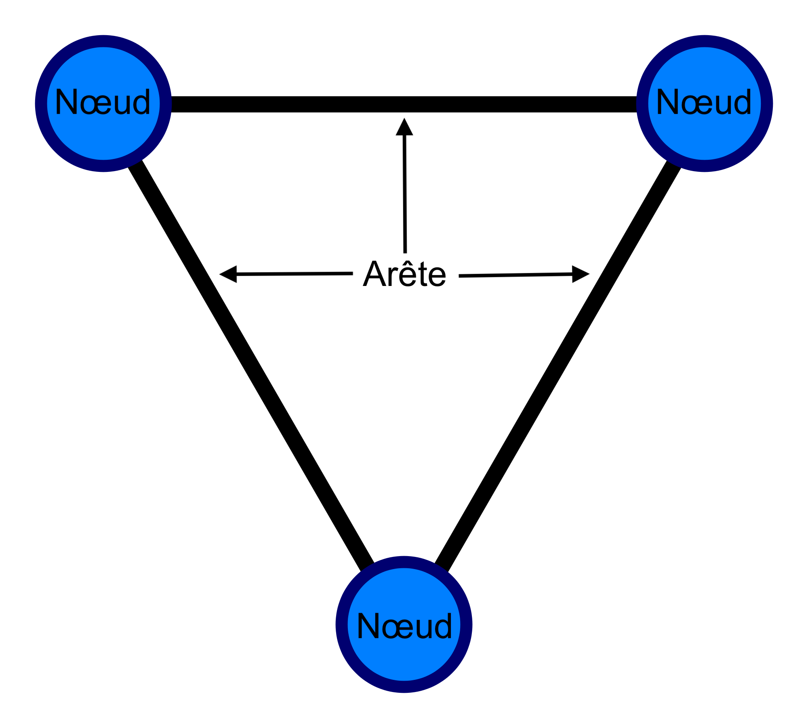

---
## Les types de réseaux
Un réseau peut être
* non-orienté (_undirected graph_). . .
* . . . orienté (_directed graph_). . .
* . . . signé (_signed graph_). . .
* . . . ou valué (_valued graph_)

---
## Non-orienté (_undirected graph_)
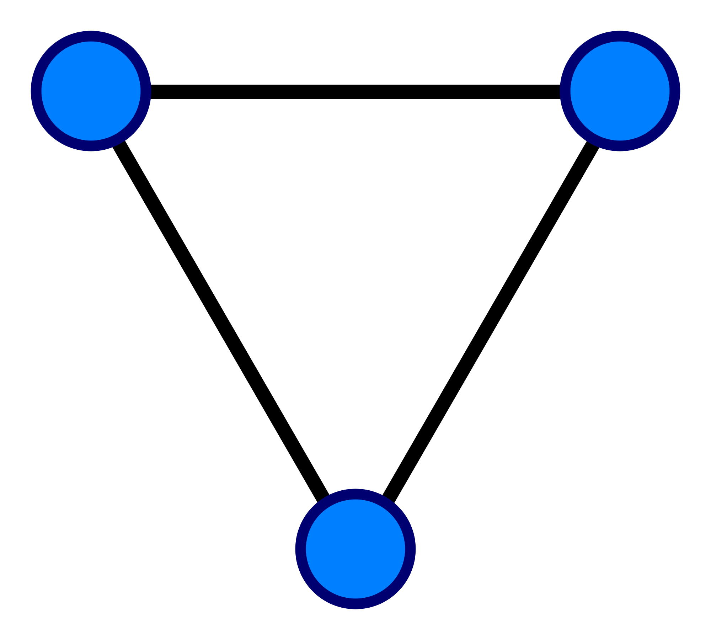

---
## Orienté (_directed graph_)

---
## Valué (_weighted_ ou _valued graph_)
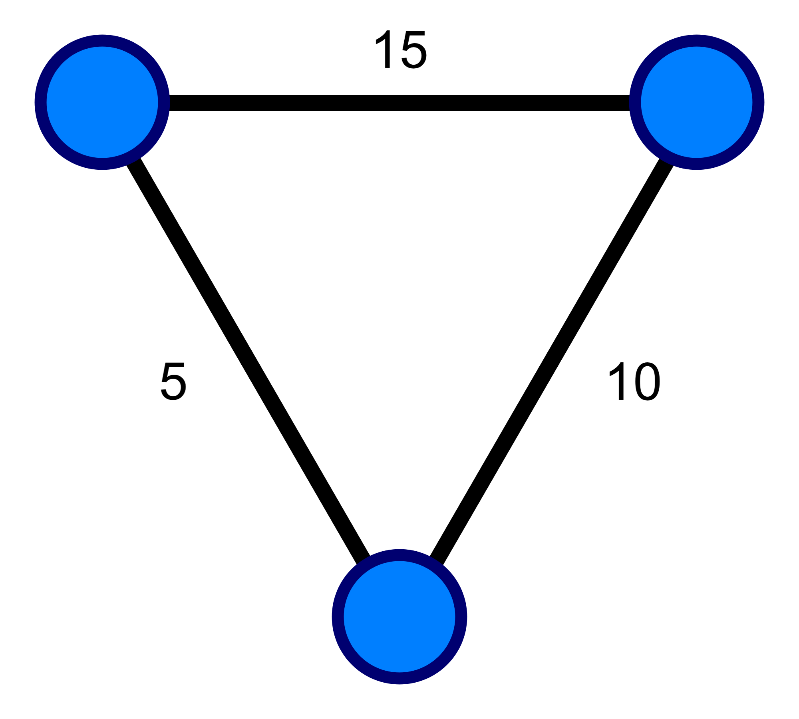

---
## Valué (_weighted_ ou _valued graph_)

---
## Les Cliques

Les réseaux forment des _cliques_ (_clusters_) ou _communautés_. Ces clusters peuvent s’organiser selon différents types.

---
## Les types de réseaux
* Cercle (_ring_)
* Filet (de poisson) (_mesh_)
* Étoile (_star_)
* Complet (_fully connected_)
* Ligne (_line_)
* Arbre (_tree_)
* Vide (sans lien)
* Bus (_bus_)

---

---
# Construction du réseau

---
## Construction

---
Un graphe peut se présenter sous trois formes
* Le graphe lui-même
* Une matrice
* Une liste de nœuds et d’arêtes

---
## Deux fichiers

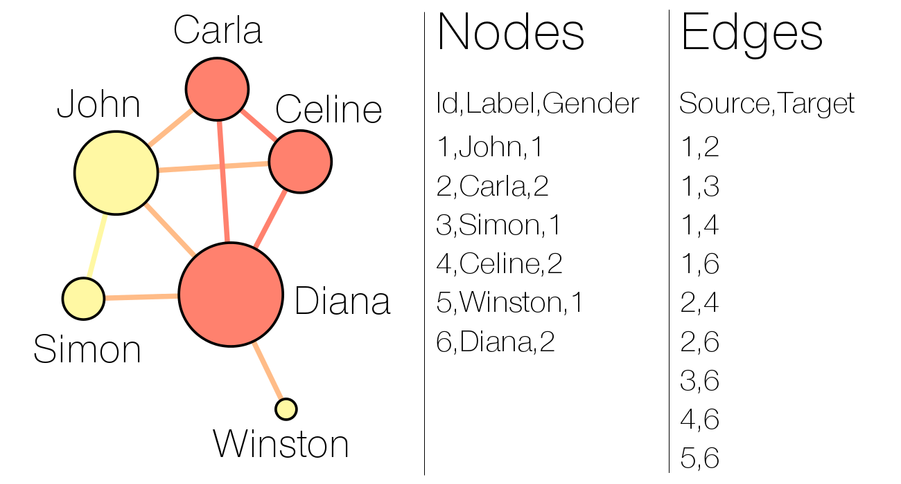

---
## Une matrice

---
## Les modèles de réseaux

* _Random Network_ (RN)
* _Small-World Network_ (SWM)
* _Scale-Free Network_ (SFN), ou "sans échelle"

---

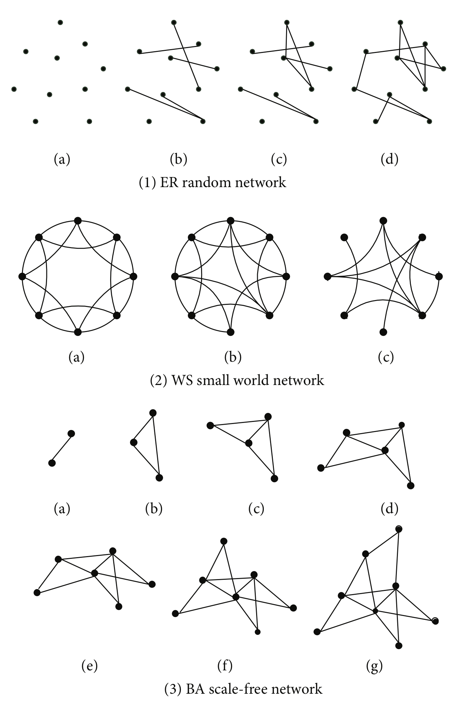

Source [Xu, Li, Liu 2014](https://www.researchgate.net/figure/Process-of-building-random-network-small-world-network-and-scale-free-network_fig5_263324035)

---
## _Small-World Network_ ou petit monde (SWM)
* Distribution gaussienne
* _Top-down_: je pars de toutes les combinaison possibles et j'en retire petit à petit

Source [Xu, Li, Liu 2014](https://www.researchgate.net/figure/Process-of-building-random-network-small-world-network-and-scale-free-network_fig5_263324035)

---
## _Scale-Free Network_ ou sans échelle (SFN)

* Loi de puissance (peu de nœuds concentre un grand nombre de lien)
* _Bottom-up_: je pars de rien, et je rajoute petit à petit les arêtes

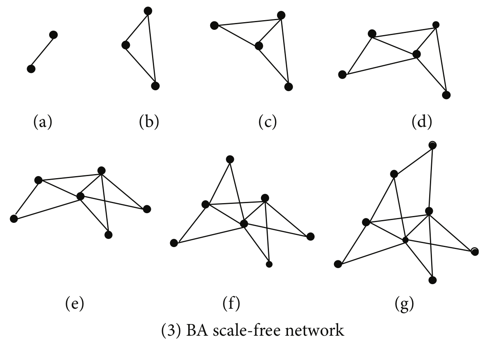

Source [Xu, Li, Liu 2014](https://www.researchgate.net/figure/Process-of-building-random-network-small-world-network-and-scale-free-network_fig5_263324035)

---
## Tracé de graphe

Il va falloir représenter des graphes dans le plan. Pour cela il existe plusieurs méthodes:

* L'_arc diagram_
* Le _circular layout_
* Le _Force-based layout_ (le plus connu)
* Bien d'autres…

---
### _Arc diagram_

* Date des années 1960
* Les nœuds sont placées sur une seule et même ligne, avec les arêtes sous la forme de demi-cercles sur/sous la ligne
* Possible avec un nombre limité de données

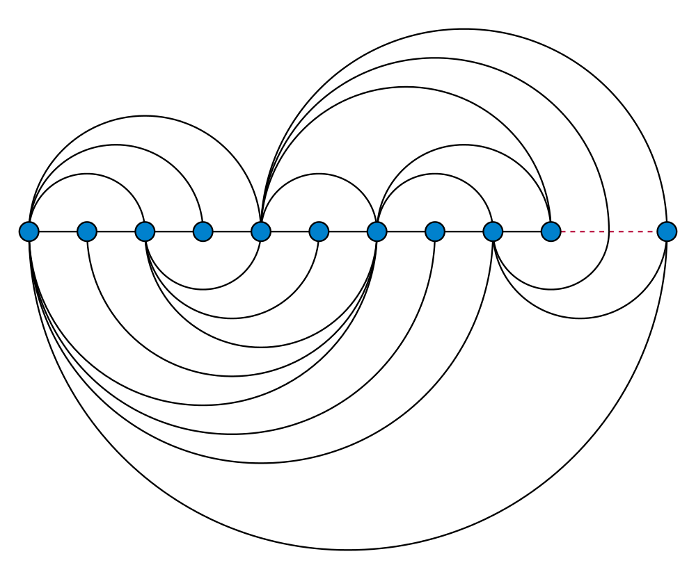

Source: [Wikipedia](https://commons.wikimedia.org/wiki/File:Goldner-Harary-linear.svg)

---
###  _Circular layout_

* Représentation des nœuds sur un cercle avec un espacement régulier
* Il s'agit de minimiser le nombre de croisement des arêtes.
* Pour optimiser ces croisements, on tente de développer des alternatives, comme le _two-Sided Circular Graph_ (cf. _infra_)

F. Klute et al. "Minimizing Crossings in Constrained Two-Sided Circular Graph Layouts", _SoCG 2018_ [lien](https://drops.dagstuhl.de/opus/volltexte/2018/8766/)

---
### _Force-based layout_

L'objectif est de positionner les nœuds d'un graphe pour faciliter sa visualisation en utilisant un système de force appliqué entre les nœuds et les arcs/arêtes.

Source: [wikipedia](https://en.wikipedia.org/wiki/Force-directed_graph_drawing#/media/File:SocialNetworkAnalysis.png)

---

Pour cela, on va utiliser des algorythmes qui vont:
1. Repousser les nœuds entre eux, comme des aimants, les plus éloignés se repoussant le moins

2. Les liens fonctionnent comme des ressorts

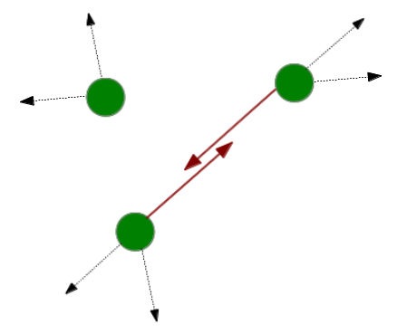

Source [Rémi Damlencour](http://www-igm.univ-mlv.fr/~dr/XPOSE2012/visualisation_de_graphes/algorithmes.html)

---
## _Fruchterman and Reingold Algorithm_

* _Fruchterman and Reingold Algorithm_, le plus ancien, presque obsolète
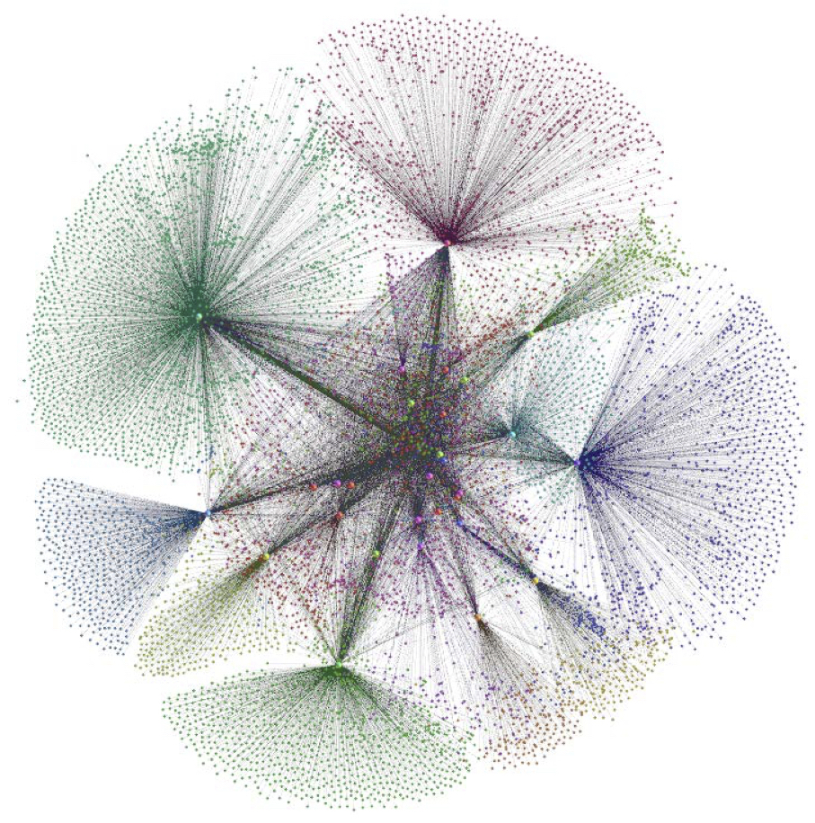

Lily Popova Zhuhadar, "Cyberlearners and learning resources", _ACM Transactions on the Web_, 2012 [lien](https://www.researchgate.net/publication/254462744_Cyberlearners_and_learning_resources)

---
## _Yifan Hu Algorithm_

Pour une modélisation rapide de petits réseaux (max 100 000 de nœuds)

Lily Popova Zhuhadar, "Cyberlearners and learning resources", _ACM Transactions on the Web_, 2012 [lien](https://www.researchgate.net/publication/254462744_Cyberlearners_and_learning_resources)

---
## _Force Atlas 2 Algorithm_

Pour analyse de complémentarités et les grands réseaux (1 000 000 de nœuds)
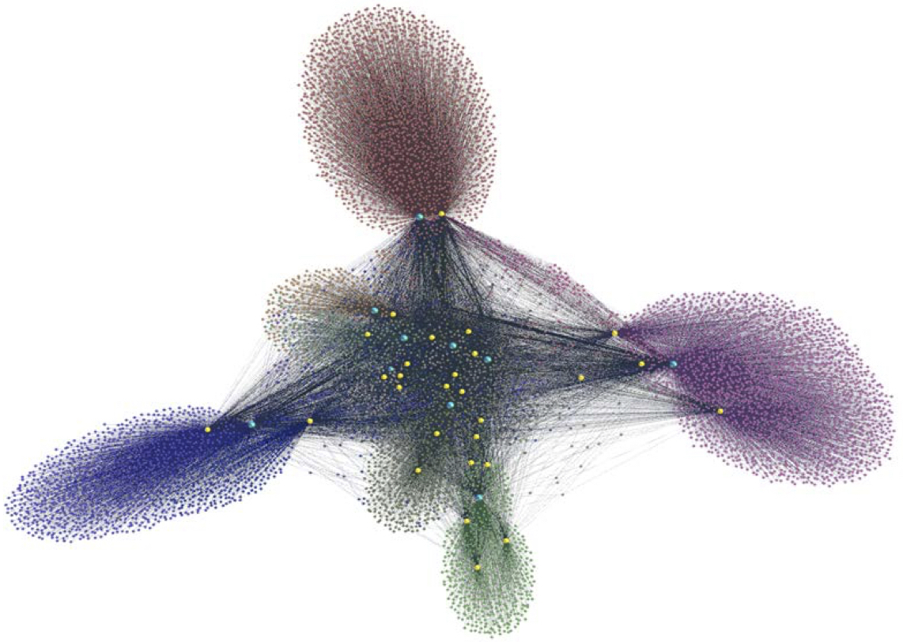

Lily Popova Zhuhadar, "Cyberlearners and learning resources", _ACM Transactions on the Web_, 2012 [lien](https://www.researchgate.net/publication/254462744_Cyberlearners_and_learning_resources)

---
# Analyse

---
## Robustesse

Robustesse (_robustness_): capaciter du graphe à rester identique malgré des perturbations (enlever un nœud)

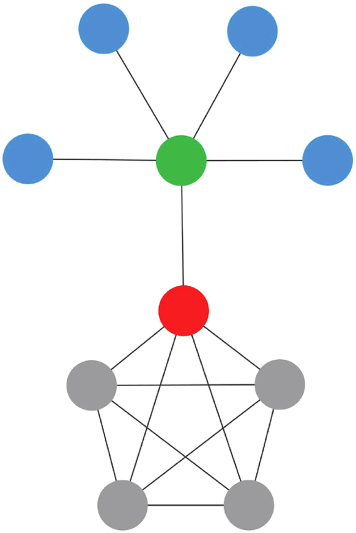

---
## Densité

Densité (_density_): la proportion de liens dans un réseau relativement au total des liens possibles.

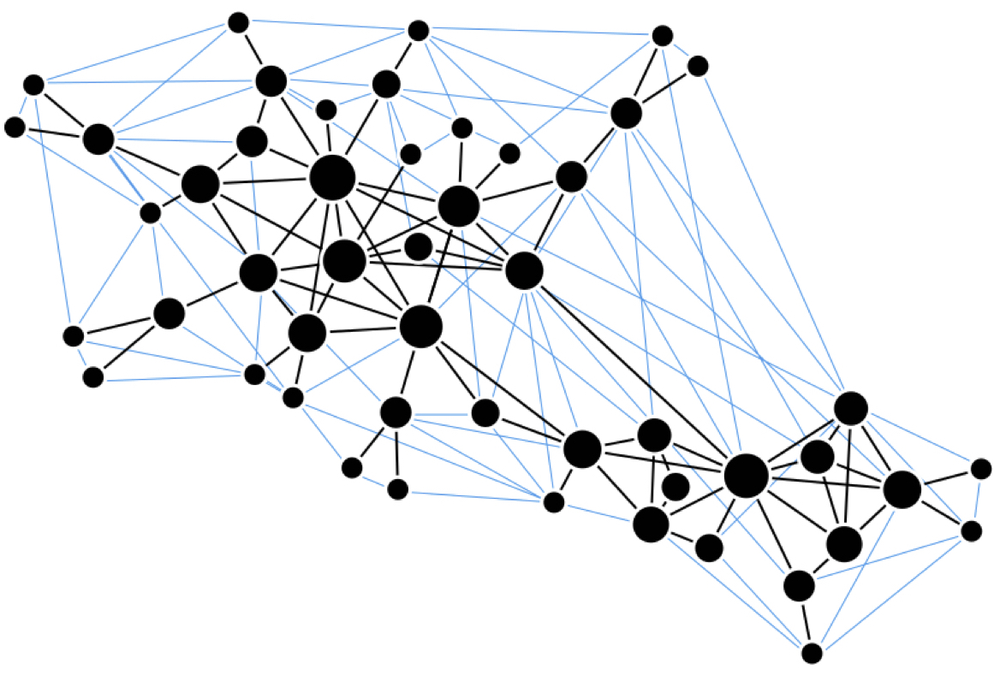

M. Grandjean et M. Jacomy. "Translating Networks: Assessing Correspondence Between Network Visualisation and Analytics". _Digital Humanities_, 2019, Utrecht. [lien](https://halshs.archives-ouvertes.fr/halshs-02179024)

---
## Shakespeare: densités

Source: [Grandjean 2015](http://www.martingrandjean.ch/network-visualization-shakespeare/)

---
## Centralité

Centralité (_centrality_) : capturer la notion d’importance dans un graphe, en identifiant les sommets les plus significatifs

---
### Proximité

Centralité de proximité: Distance moyenne du nœud à tous les autres nœuds (_Closeness_)

M. Grandjean et M. Jacomy. "Translating Networks: Assessing Correspondence Between Network Visualisation and Analytics". _Digital Humanities_, 2019, Utrecht. [lien](https://halshs.archives-ouvertes.fr/halshs-02179024)

---
### Prestige

Centralité de vecteurs propres: Score d’autorité attribué à un nœud en fonction du score de ses voisins. (_Eigenvector_) C’est l’algorythme de google.

M. Grandjean et M. Jacomy. "Translating Networks: Assessing Correspondence Between Network Visualisation and Analytics". _Digital Humanities_, 2019, Utrecht. [lien](https://halshs.archives-ouvertes.fr/halshs-02179024)

---
### Intermédiarité

Centralité d’intermédiarité: Nombre de fois que le nœud se trouve sur le plus court chemin entre deux autres nœuds (_Betweenness_)

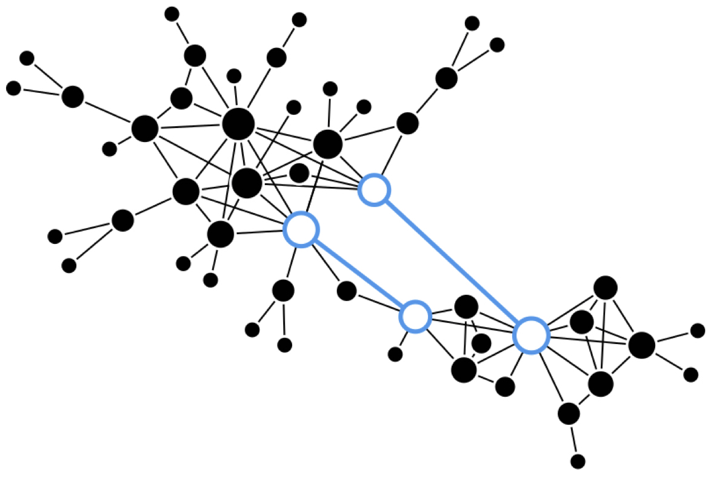

M. Grandjean et M. Jacomy. "Translating Networks: Assessing Correspondence Between Network Visualisation and Analytics". _Digital Humanities_, 2019, Utrecht. [lien](https://halshs.archives-ouvertes.fr/halshs-02179024)

---
### Degré

Centralité de degré: Nombre de connexions du nœud (_Degree_)

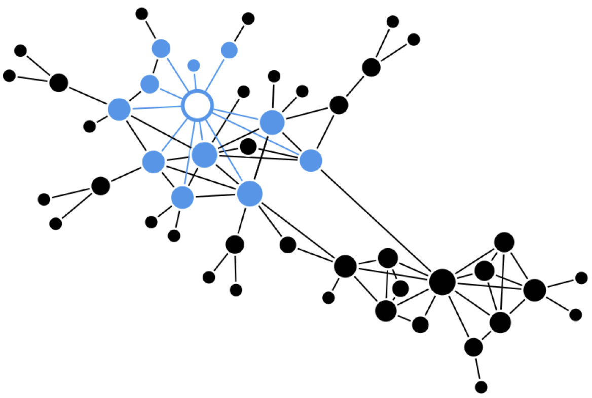

M. Grandjean et M. Jacomy. "Translating Networks: Assessing Correspondence Between Network Visualisation and Analytics". _Digital Humanities_, 2019, Utrecht. [lien](https://halshs.archives-ouvertes.fr/halshs-02179024)

---
A) _Betweenness centrality_, B) _Closeness centrality_, C) _Eigenvector centrality_, D) _Degree centrality_, E) _Harmonic centrality_ et F) _Katz centrality_

Source: [Wikipedia](https://commons.wikimedia.org/wiki/File:6_centrality_measures.png)

---
## Ligue des nations: _betweeness centrality_

Source: [Grandjean 2015](http://www.martingrandjean.ch/intellectual-cooperation-multi-level-network-analysis/)

---
## Ligue des nations: _weighted degree centrality_

Source: [Grandjean 2015](http://www.martingrandjean.ch/intellectual-cooperation-multi-level-network-analysis/)

