Cours _Distant Reading_ : Visualisation

# 9. L'analyse de réseau avec Gephi

Simon Gabay

---
# Installation
---
## Java

Pour faire fonctionner Gephi, il vous faut installer Java 8 (_Java SE Runtime Environment 8_ de son petit nom). Pour ce faire:
* Allez à cette adresse: https://www.oracle.com/technetwork/java/javase/downloads/jre8-downloads-2133155.html
* Créez si besoin un compte _Oracle_

---

---
## Instructions supplémentaires pour les utilisateurs _Windows_

1. Attention: Gephi s’installe tout seul en **32-bit** et il nous faut du **64-bit**
	* ouvrir `C:\Program Files (x86)\Gephi-0.9.1\bin\`.
	* Il faut executer `gephi64.exe` et pas ` gephi.exe` si vous avez une machine récente (_Windows 10_ 64bit).

2. pour trouver gephi64 : aller dans le menu Démarrage
	* Chercher gephi;
	* Clic droit (propriétés): donne l’adresse du dossier du fichier où est `gephi.exe`, qui est aussi le dossier où est gephi64.exe
	* Lancer `properties`. Contrôler que le chemin de fichier est celui de `gephi64.exe?.
3. Penser (très sérieusement) à arrêter d'utiliser _Windows_.

---
# Préparation des données

---
## Rappel

On se rappelle que:
* tout réseau est constitué de nœuds (_nodes_)
* Que ces nœuds sont reliés par des arêtes (ou arcs, _edges_)

Il faut donc deux fichiers pour faire un réseau: un de nœuds, et un d'arêtes. Pour des raisons pratiques, il est cependant possible de ne produire qu'un seul fichier-maître, à partir duquel on peut produire les deux autres.

La forme de ce fichier-maître va dépendre du type de réseau que l'on veut construire:

* réseau normal
* réseau bipartite
* réseau bipartite de citation

---

## Réseau normal
On a qu'un seul type de sommet, et chaque individu est relié à un autre par une clef commune qui n'est pas un nœud. Dans l'exemple _infra_ les auteurs, imprimeurs et éditeurs sont reliés par l'identifiant de l'imprimé qui les a réunis, mais l'imprimé n'apparaîtra pas dans le graphe final.
**Il faut faire attention dans le choix des valeurs utilisées (signifiantes ou non?) pour être rigoureux sans se perdre dans les données…**

| Clef      | Valeur      |
|-----------|-------------|
| Imprimé_1 | Auteur_1    |
| Imprimé_1 | Editeur_1   |
| Imprimé_1 | Imprimeur_1 |
| Imprimé_2 | Auteur_1    |
| Imprimé_2 | Editeur_2   |
| Imprimé_2 | Imprimeur_2 |

---
## Réseau bipartite

On a deux types de sommets, chacun étant associé à un autre directement. D'une manière, c'est un tableau disjonctif complet du tableau précédent, sans intermédiaire d'un `imprimé_X`.

| Valeur 1    | Valeur 2    |
|-------------|-------------|
| Auteur_1    | Editeur_1   |
| Auteur_1    | Imprimeur_1 |
| Auteur_1    | Editeur_2   |
| Auteur_1    | Imprimeur_2 |
| Imprimeur_1 | Editeur_1   |
| Imprimeur_2 | Editeur_2   |

---

Un réseau bipartite peut aussi être dirigé – on parle alors de réseau "de citation". Il s'agit du même type de tableau que le précédent, constitué de deux nœuds reliés directement entre eux sans intermédiaire, mais les données ne sont pas intervertibles de colonne à colonne: il ne s'agit pas de faire état d'un simple lien entre `Auteur_1` et `Auteur_2`, mais bien de préciser que c'est `Auteur_1` qui cite `auteur_2` et non l'inverse.

| Citant (_from_) | Cité (_to_) |
|-----------------|-------------|
| Auteur_1        | Auteur_2    |
| Auteur_1        | Auteur_3    |

---
## Créer le réseau pour Gephi

Pour produire vos données, vous avez deux solutions:

* Vous pouvez créer une solution _ad hoc_ (Filemaker Pro, fichier de tableur complexe…)

* À partir d'un tableau/fichier-maître, en utilisant l'application en ligne _table2net_ (https://medialab.github.io/table2net).

---
## _table2net_ : réseau normal

Je charge mon corpus `normal.csv`

---
## _table2net_ : réseau normal I

Je choisis _normal_

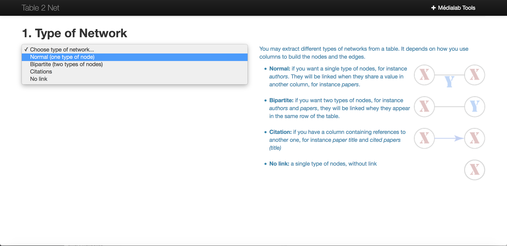

---
## _table2net_ : réseau normal II

Je précise que les nœuds sont dans la colonne valeur. Comme je n'ai pas d'attribut je laisse vide la seconde option.

---
## _table2net_ : réseau normal III

Je précise que les nœuds sont dans la colonne `valeur`. Comme je n'ai pas d'attribut je laisse vide la seconde option.

---
## _table2net_ : réseau normal IV

Je précise que la colonne faisant le lien entre les différents nœuds est `clef`. Comme je n'ai pas d'attribut je laisse vide la seconde option.

---
## _table2net_ : réseau normal V

Je télécharge le document au format `.gexf`

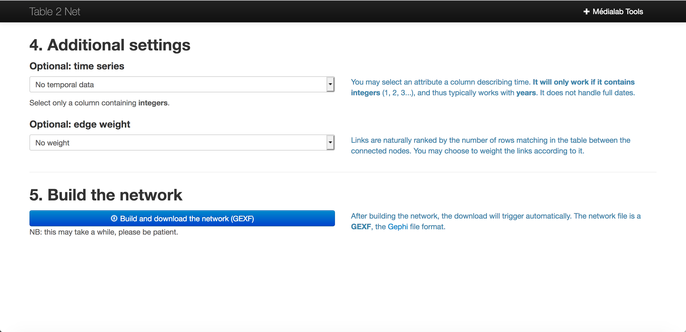

---
## _table2net_ : réseau bipartite

Je charge mon corpus `bipartite.csv`

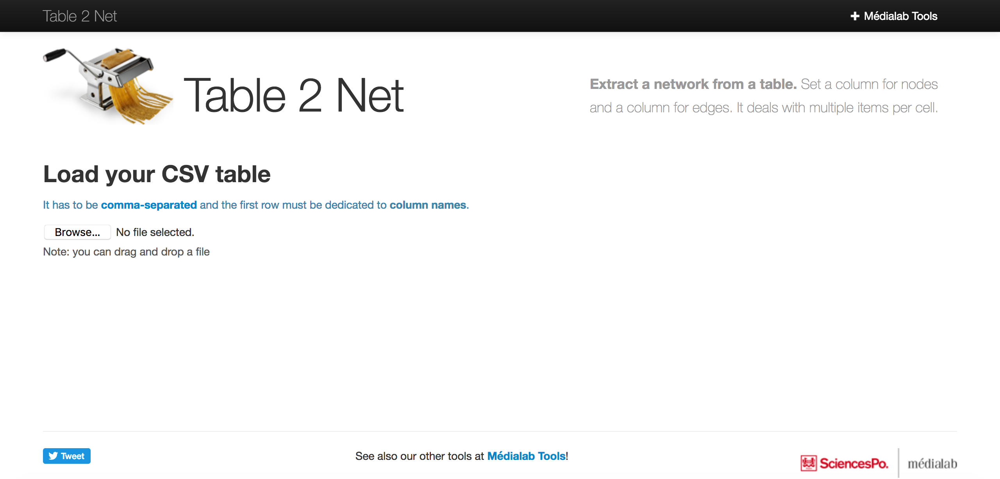

---
## _table2net_ : réseau bipartite I

Je choisis _bipartite_

---
## _table2net_ : réseau bipartite II

Je précise que la colonne _noeud_1_ contient ma première liste de nœuds. Comme je n'ai pas d'attribut je laisse vide la seconde option.

---
## _table2net_ : réseau bipartite III

Je précise que la colonne _noeud_2_ contient ma seconde liste de nœuds. Comme je n'ai pas d'attribut je laisse vide la seconde option.

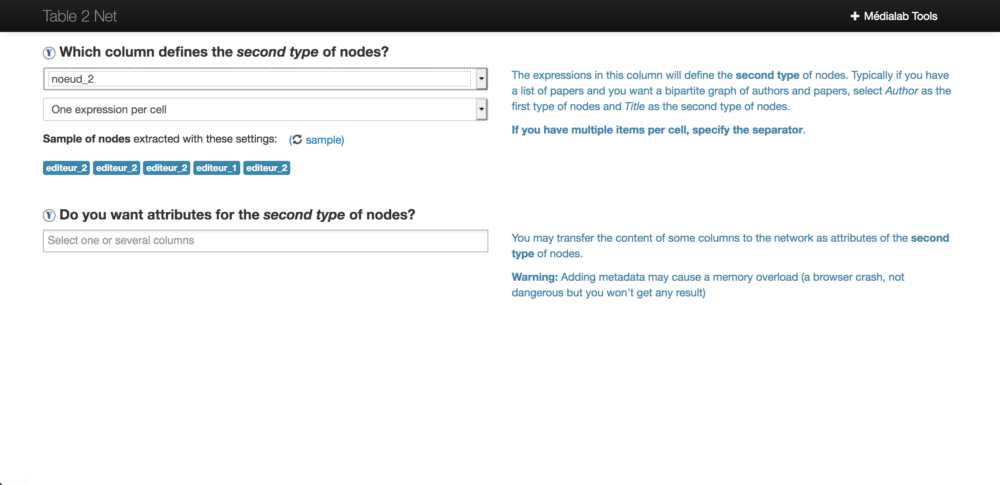

---
## _table2net_ : réseau bipartite IV

Je télécharge le document au format `.gexf`

---
# Premier test

---
## Ouverture

Nous allons devoir importer nos données. Elles peuvent être de deux types:
* des fichiers de tableur classiques (`.tsv`, `.csv`)
* des fichiers `.gexf` (_Graph Exchange XML Format_) – l'équivalent d'un objet _igraph_ dans _R_.

---
## Ouverture

Fermer la fenêtre d'accueil

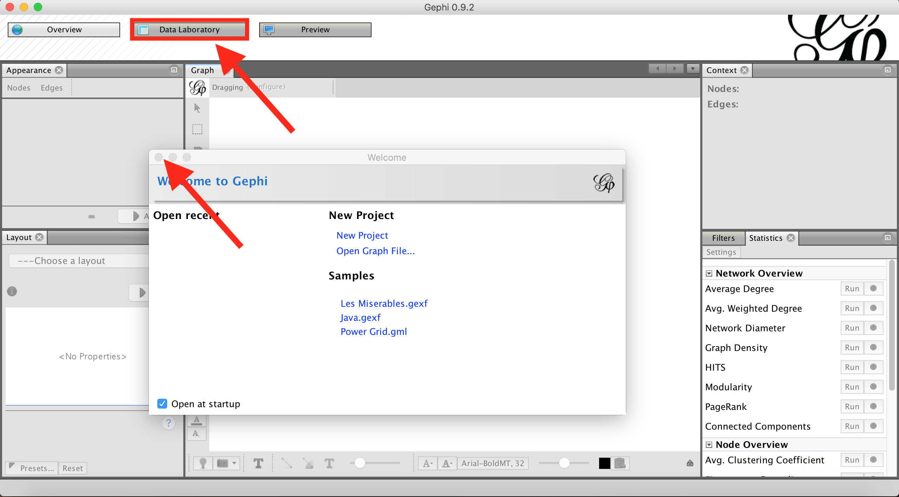

---
## Ouvrir projet

---
## Importer le projet `.gexf` généré par _table2net

---
## Ajouter les données à l'espace de travail existant

---
## À vous de jouer

1. Recommencez avec le fichier `bipartite.gexf`
2. Comparer le résultat avec `normal.gexf`

---
## Nouveau projet

Tentons maintenant d'importer directement des fichiers csv. Créons un nouvel espace de travail

---
## Mes fichiers
Si on choisit l'option tableur, il faut faire attention à utiliser des en-têtes pour les colonnes.

---
## Importer une feuille de tableur

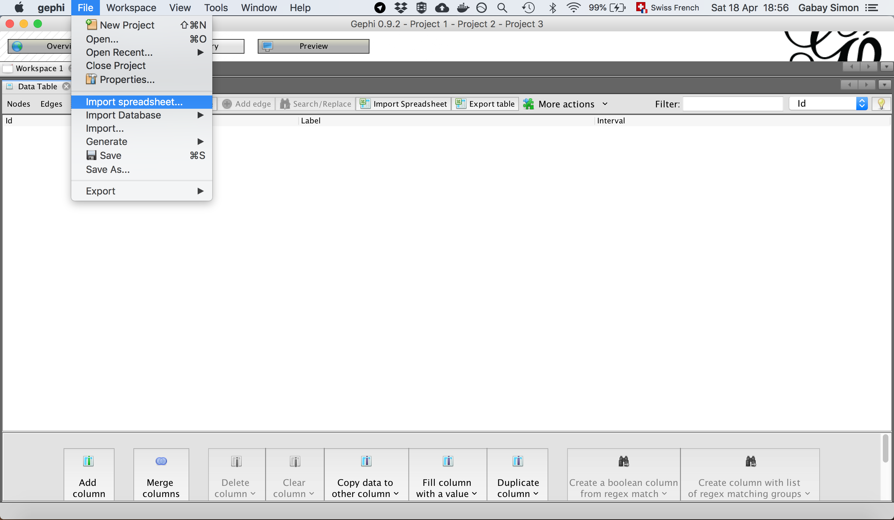

---
## Choisir la feuille des arêtes

---
## Définir les paramètres d'import

Normalement les paramètres sont pré-remplis, mais on peut choisir si nous avons un `tsv` ou un `csv`, les nœuds ou les arêtes…

---
## Définir les paramètres d'import II

Normalement les paramètres sont une nouvelle fois pré-remplis (on se rappelle ici que nous avions utilisé des en-tête…)

---
## Finalisation de l'import

On n'oublie pas de cocher la case `Append to existing workspace`, car on veut ouvrir plusieurs feuilles dans le même espace de travail. Précisez que le graphe n'est pas dirigé (dans notre cas).

---
## Finalisation de l'import II

Il existe un bouton `More options…`. Vous pouvez notament y gérer la question des liens multiples (transformer plusieurs fois le même lien en un poids en faisant la somme, par exemple).

---
## Observation du résultat
Et voilà! Normalement il n'y a rien si on clique sur `nodes` sauf la liste des `IDs` utilisés pour les arêtes. Importons donc les nœuds!

---
## Observation du résultat

Si vous ne voyez pas apparaître automatiquement les données, affichez-les

---
## Les nœuds

On recommence la même procédure avec les nœuds. À vous de jouer!

---
## Observation du résultat

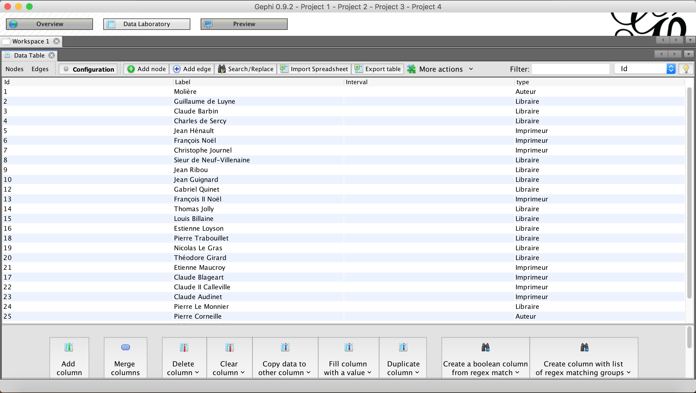

---
## Analyse des résultats de l'import de

Analysez dans les données importées via _table2net_. Comprenez-vous désormais le problème?

---
## Naviguer dans Gephi
* `Overview` permet de créer le graphe
* `Data Laboratory` permet de gérer les données
* `Preview` permet de finaliser l'image du graphe produite

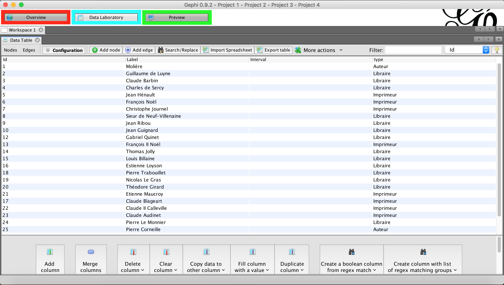

---
## `Overview`

Ici nous allons pouvoir manipuler le graphe: choisir le layout, faire des calculs de centralité, _etc._

---
## `Layout`

Choisissons un layout au hasard, pour voir ce que ça donne. Par exemple `Force Atlas 2`. On clique sur `Run`, on attend que le graphe se stabilise, puis sur `Stop`.

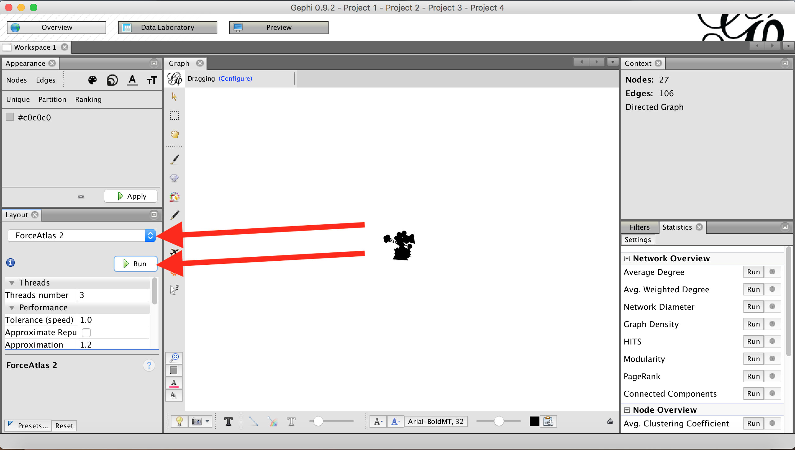

---
## Rappels

* Rappel I: on ne choisit pas les _layouts_ au hasard: on le fait en fonction du type de données, et des options proposées. _Force Atlas_ offre certaines fonctionnalités utile, comme _no overlap_ ("Empêcher le recouvrement"): cela permet d'éviter que deux nœuds se chevauchent, ce qui peut être un problème pour la production du rendu final – pensez à le cocher dans les options pour voir ce que cela donne!

* Rappel II: ces options sont plus ou moins différentes d'un _layout_ à l'autre, et pas toujours évidente à maîtriser. Cela peut paraître fastidieux, mais pensez à vous renseigner sur la _gravity_, le _scaling_, la _repulsion_ pour ne pas réduire _Gephi_ à du simple _push button_.
 
---
## `Layout` III

Si le résultat est illisible, on peut "l'agrandir" avec le layout `expansion`. Répéter l'opération autant de fois que nécessaire.
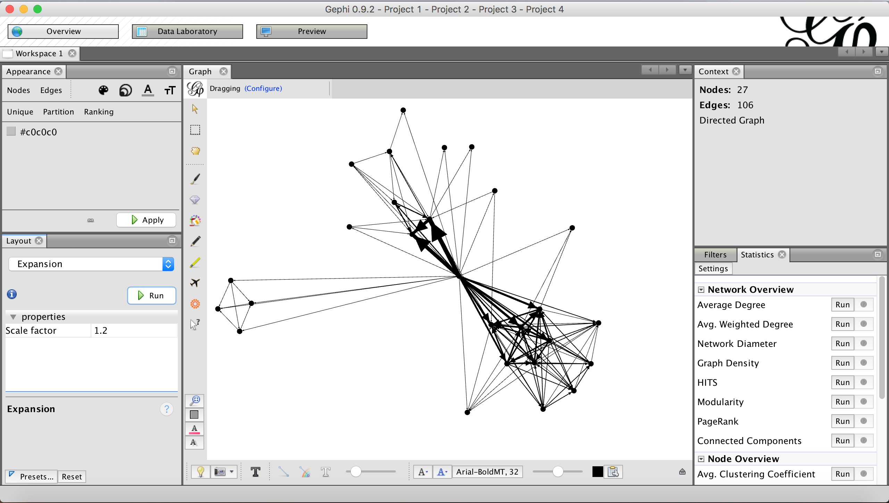

---
## `Layout` IV

Le même graphe sans avec l'option _no overlap_
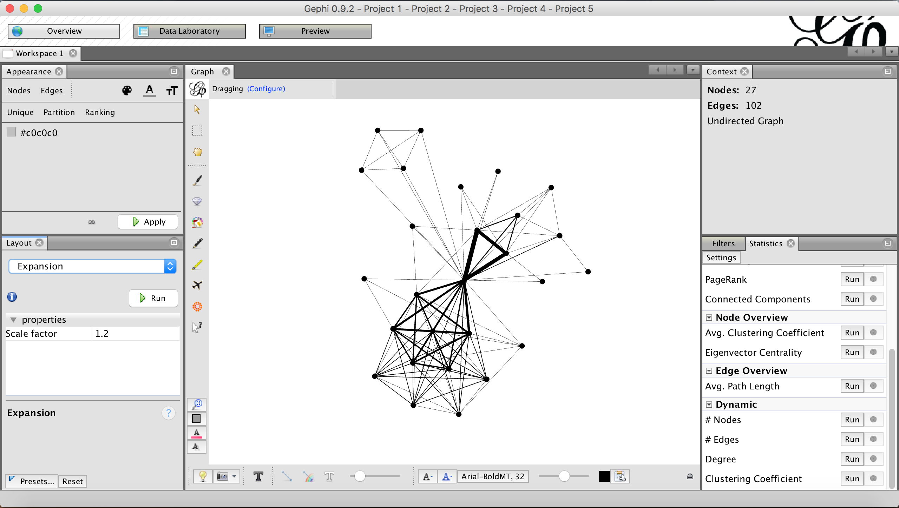

---
## `Layout` IV

Explorez les différents layouts, les différentes options

---
## Coloriage

Il est possible de customiser son graphe simplement. On se rappelle que, dans nos données, nous avons un `Type` pour les nœuds: colorions ces derniers en fonction du type dans `Appearance`.

---
## Coloriage II
Comme les arêtes ont un poids, on peut ajuster la couleurs des liens en fonction du poids. Retournez dans `Appearance`, choisissez `Edges`>`Ranking`>`Weight`et cliquez sur `Apply`.
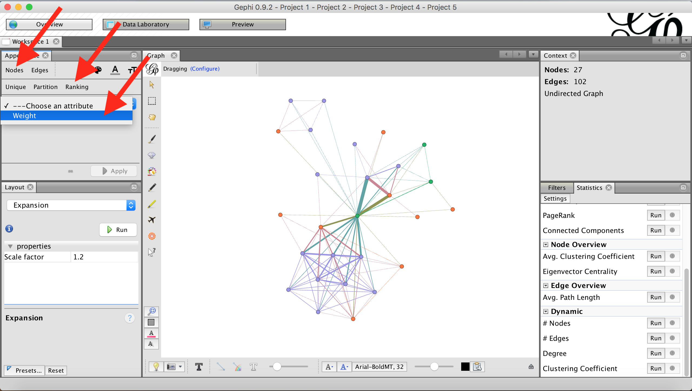

---
## Coloriage III
On se rappelle aussi que les nœuds représentent des personnes, qui ont un nom. Affichons-les! Cliquez sur l'icone en bas à droite du graphe, choisissez `Labels`, cliquez sur `Nodes`, choisissez la police et la taille

---
## `Statistics`

Les différentes indicateurs (densité, centralité…) sont produits simplement dans le panneau `Statistics`.

---
## `Statistics` II

Le résultat est ajouté dans le `Data laboratory`. Il en ira de même pour chaque calcul effetué.
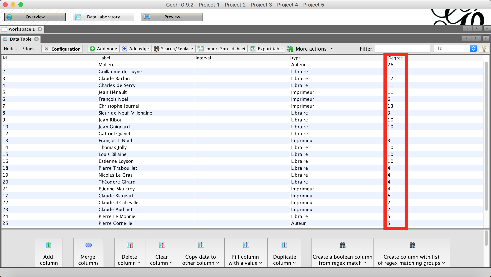

---
## Coloriage IV
On peut récupérer les valeurs produites pour les afficher. Retournez dans `Appearance`, cliquez sur `Edges` puis l'icone `Size`, et choisissez `Ranking`>`Degree` et cliquez sur `Apply`.

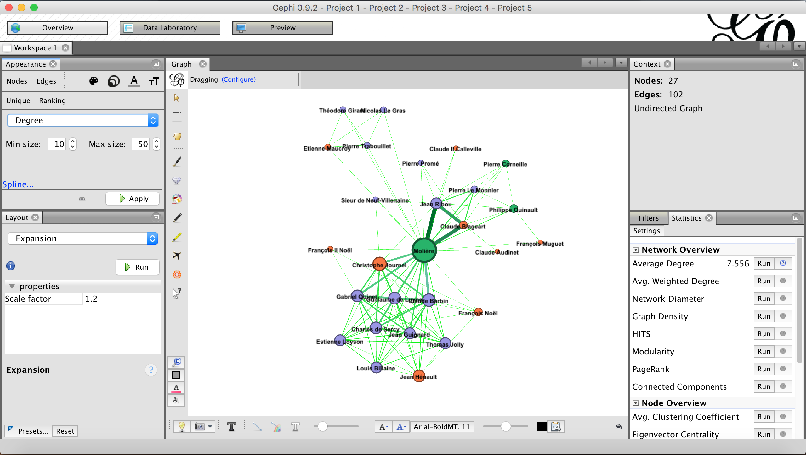

---
## `Preview`

Allez dans l'onglet `Preview`, et cliquez sur `Refresh` (il faudra cliquer sur ce bouton après chaque manipulation).

---
## `Preview` II

Finalisez votre publication en ajoutant toutes les informations nécessaires: nom des labels, _etc._

---
## Export

Vous pouvez exporter/sauvegarder votre document en différents formats: 
* L'image en JPG, PDF ou SVG (recommandé pour l'ouvrir dans _Inkscape_ ou _Illustrator_)
* Les données en CSV, TSV, GEFX, GML…

---
# À vous de jouer
---

Recommencez l'exercice, mais avec un graphe de très grande taille, surtout pour voir l'impact des différents algorithmes de tracé de graphe sur la spatialisation du résultat. Nous vous invitons à importer et visualiser les données dans le dossier `Data/Maxi` (que nous reprenons à Martin Grandjean, dont [le site](http://www.martingrandjean.ch/) et les travaux vous seront d'une grand utilité si vous vous intéressez aux réseaux).
