Cours DH UniGE

# Introduction à la cartographie

Simon Gabay
Genève, Mardi 28 avril 2020

---
# Coordonnées et projection

---
## Coordonnées géographiques
* Système de trois coordonnées qui sont la latitude, la longitude et l'altitude (ou l'élévation).
* On utilise des points de références: l'équateur, le méridien de Greenwich, le niveau de la mer (qui n'a d'ailleurs pas la même élévation partout)
* Exprimé en degré, minute, seconde. Ainsi Genève à une latitude de 46° 12′ 00″ nord ("46 degrés, 12 minutes, 0 seconde nord") et une longitude 6° 09′ 00″ est ("6 degrés, 9 minutes, 0 seconde est")
* On peut exprimer ces coordonnées de degrés décimaux (par ex. pour Genève: 46.12 et 6.09), plus pratiques pour leur manipulation informatique.

---
## Coordonnées cartographiques

La projection est le passage de coordonnées géographiques exprimés en degrés (_λ_,_φ_) aux coordonnées cartographiques (E,N) exprimés en unités métriques via une fonction mathématique.


Source: [IGN](https://geodesie.ign.fr/contenu/fichiers/documentation/representations-planes_v3-0.pdf)

Cette transformation induit nécessairement une distortion.

---
## Projection

Il existe une multitude de projections
* Certaines sont dites _équivalentes_: elles conservent les ditances
* D'autres sont dites _conformes_: elles conservent les angles (c'est à dire les formes)
* La plus célèbre, tout du moins de nom, est probablement celle de Mercator, mais il en existe plein d'autres

---
# Conservation des distances

Projection dite "Équirectangulaire", inventée par Marin de Tyr c. 120, conserve les distances le long des méridiens (distance d'un pôle à l'autre).

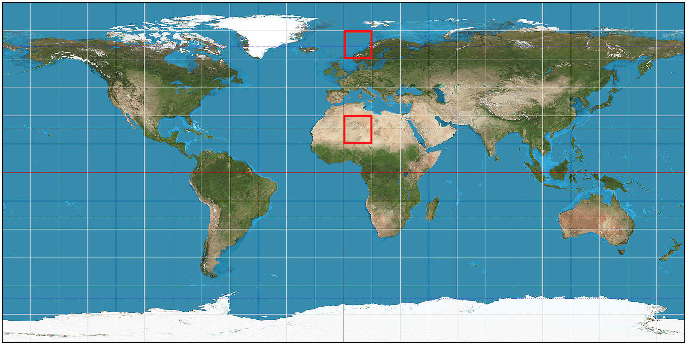

Source: [Wikipedia](https://commons.wikimedia.org/wiki/File:Equirectangular_projection_SW.jpg?uselang=fr)

---
## Conservation des formes

Projection dite "de Mercator", inventée par Gerardus Mercator en 1569: la distorsion des distances s’accroît au fur et à mesure de l'éloignement de l'équateur vers les pôles. 

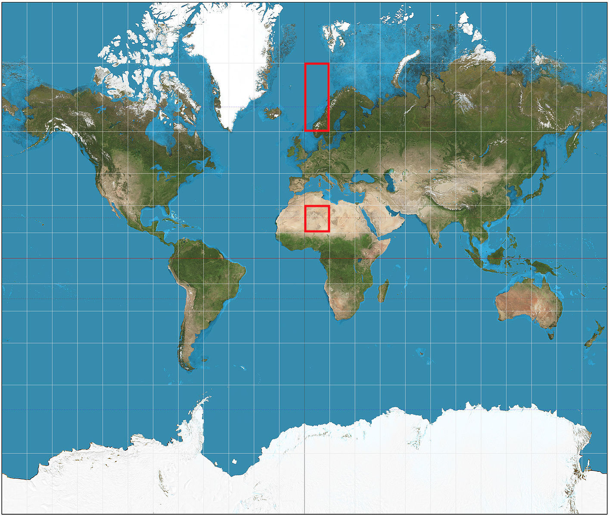
Source: [Wikipedia](https://commons.wikimedia.org/wiki/File:Mercator_projection_SW.jpg?uselang=fr)

---
## La distortion

On peut évaluer la déformation avec l'indicatrice de Tissot
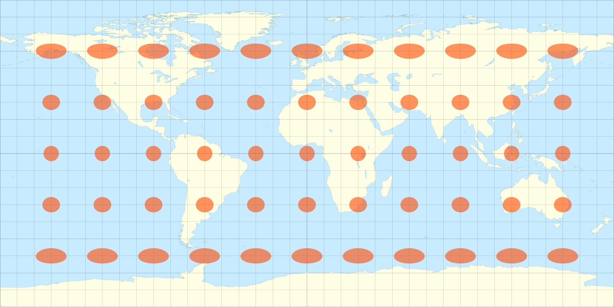
Source: [Wikipedia](https://commons.wikimedia.org/wiki/File:Tissot_indicatrix_world_map_equirectangular_proj.svg?uselang=fr)

Pour la projection "Équirectangulaire": la hauteur des cercles varie peu, car les distances sont conservées le long des méridiens.

---

Source: [Wikipedia](https://commons.wikimedia.org/wiki/File:Tissot_indicatrix_world_map_Mercator_proj.svg?uselang=fr)

Pour la projection de Mercator, les indicatrices de Tissot montre une grande variation dans le diamètre des cercles mais pas de déformation ovaloïde: la forme est conservée, mais pas les distances.

---
## Autre projections

Les représentations que nous avons vues sont cylindriques, mais il en exite d'autres formes, notamment conique et azimutale.

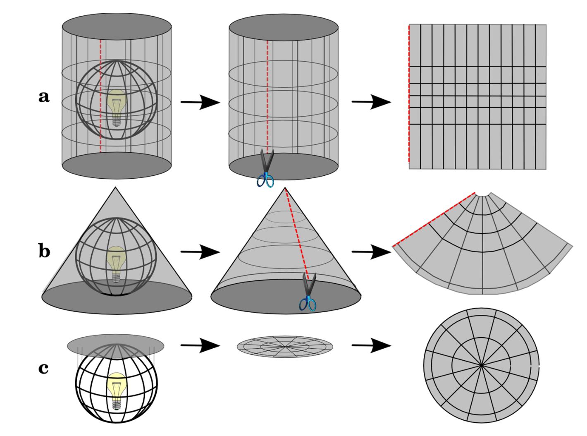 

---
## Projections conique et azimutale

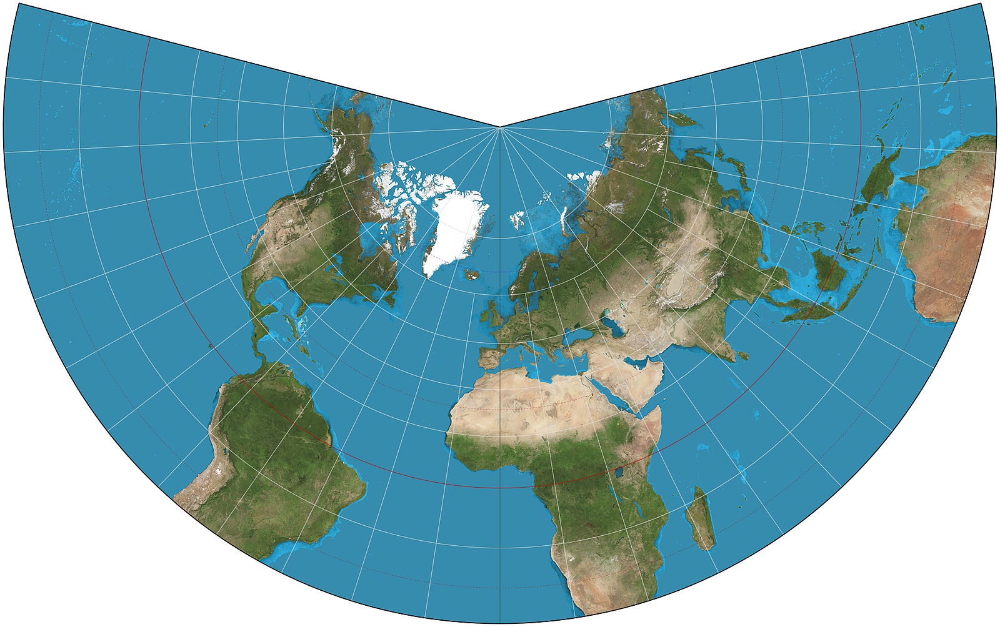 Projection conique (de Lambert)
Source: [Wikipedia](https://commons.wikimedia.org/wiki/File:Lambert_conformal_conic_projection_SW.jpg?uselang=fr)

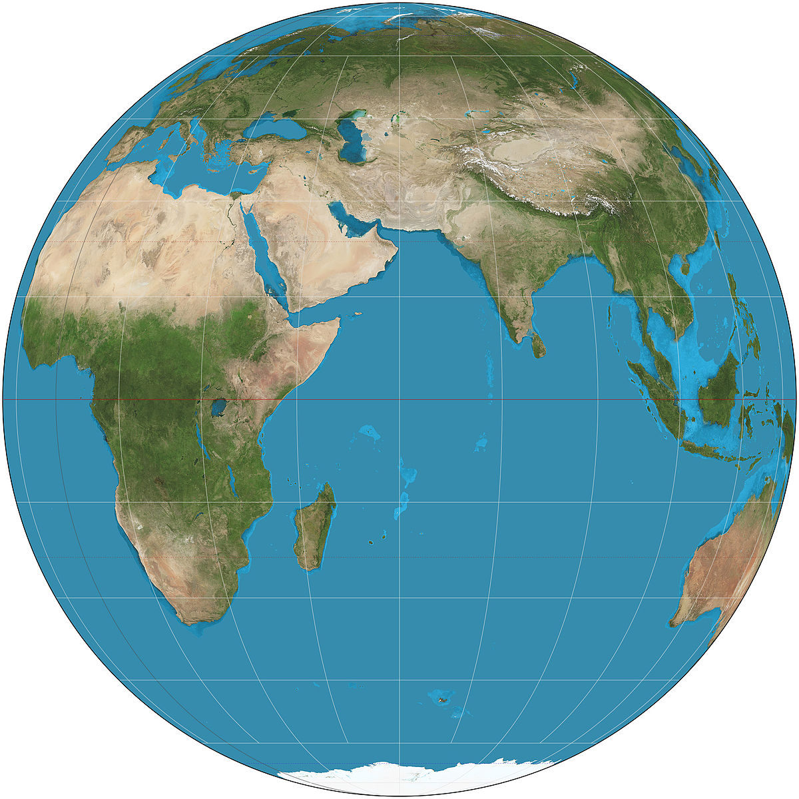 Projection azimutale (orthographique) 
Source: [Wikipedia](https://commons.wikimedia.org/wiki/File:Lambert_conformal_conic_projection_SW.jpg?uselang=fr)

---

# Modèles, formats, logiciels

---
## Vers la géomatique

Géomatique: ensemble des outils et méthodes permettant d'acquérir, de représenter, d'analyser et d'intégrer des données géographiques. Elle utilise des SIG.

SIG: Systèmes d'information géographique (_Geographic Information System_ ou GIS), qui permet de représenter graphiquement le contenu des BDG.

BDG: base de données géographiques contiennent des informations permettant des représentations cartographiques.


---
## Les couches (_layers_)

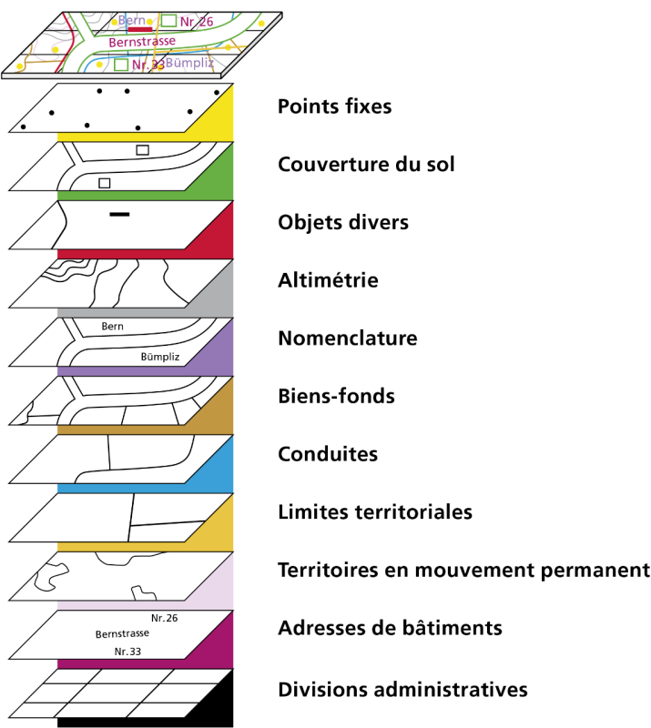 
Source: [cadastre.ch](https://www.cadastre.ch/content/cadastre-internet/fr/av/result/layer/_jcr_content/contentPar/textimage_1905659957/image.transform.1478622834050/image_1200_800/image.05_2_3_diag_fr_layer.png)

---
## Les rasters

Pour représenter ces couches, on va pouvoir utiliser un modèle raster (ou matriciel), fait de mailles régulières (ou matrice de points) représentées sous la forme d'une grille.

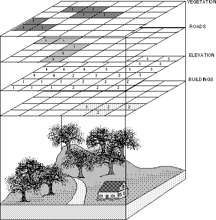 
Source: [courses.washington.edu](https://courses.washington.edu/gis250/lessons/introduction_gis/spatial_data_model.html)

---
## Mode matriciel vs mode vectoriel
Le modèle raster s'oppose au modèle vecteur. Ce dernier s'appuie sur un découpage _a priori_ du monde en entités (route, région administrative…). En pratique, plutôt qu'une grille qui recouvre toute la carte, y compris les espaces vides, on va faire ressortir seulement quelques points, que l'on va relier.

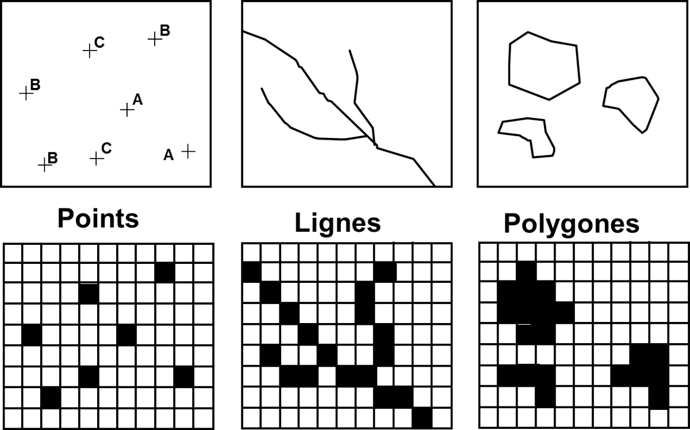 
Source: [EMSE](https://www.emse.fr/tice/uved/SIG/Glossaire/co/Raster_mode_1.html)

---
## _pros and cons_

* Taille des fichiers: modèle vecteur
* Réalisme: modèle raster
* Précision: modèle vecteur (surtout si mauvaise qualité d'image)
* Contintuité géographique: modèle vecteur
* Rapidité de constitution des données: modèle raster

Comme nous n'allons pas nous lancer dans les prises de vue satellite, regardons les fichiers nécessaires aux représentations vectorielles.

---
## _Shapefile_

Le _shapefile_, ou "fichier de formes", format d'informations géographiques ouvert.

| Fichier | Contenu                                | Présence    |
|---------|----------------------------------------|-------------|
| `.shp`  | Formes géométriques                    | obligatoire |
| `.dbf`  | Base de données (attributs aux formes) | obligatoire |
| `.shx`  | Lien entre `.dbf` et `.shp`            | obligatoire |
| `.prj`  | Info. sur le syst. de coordonnées      | facultatif  |
| `.xml`  | Métadonnées                            | facultatif  |

---
## GeoJSON

Il permet de décrire des données de type point, ligne, chaîne de caractères, polygone, ainsi que des ensembles et sous-ensembles de ces types de données et d'y ajouter des attributs d'information qui ne sont pas spatiales.

---
## JSON

C'est un dérivé du format Json (_JavaScript Object Notation_), qui fonctionne avec des noms associés à des valeurs pour structurer de l'information. C'est un format d'échange d'information, qui a pris dans nombre de cas la suite du XML, avec lequel il partage nombre de points communs

```xml
<objet>
  <id>0001</id>
  <info n="a">chose</info>
  <info n="b">machin</info>
</objet>
```

```json
{
 "objet": {
   "id": "0001",
   "info_a": "chose",
   "info_b": "machin",
   }
}
```
---

Le format JSON offre une grand flexibilté dans la structuration de l'information.

```json
{
  "objet": {
    "id": "0001",
    "info_a": "chose",
    "info_b": "machin",
    },
  "objet": {
    "id": "0002",
    "info_a": "chose",
    "info_b": {
      "liste": [
        { "item_1.1": "machin", "item_1.2": "bidule" },
        { "item_2": "chouette"},
      ]
    }
  }
}
```
---
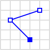
```json
{ "type": "LineString", 
   "coordinates": [
       [30, 10], [10, 30], [40, 40]
   ]
}
``` 
Source: [Wikipedia](https://commons.wikimedia.org/wiki/File:SFA_LineString.svg?uselang=fr)


```json
{ "type": "Polygon", 
  "coordinates": [
    [[30, 10], [40, 40], [20, 40], [10, 20], [30, 10]]
  ]
}
``` 
Source: [Wikipedia](https://commons.wikimedia.org/wiki/File:SFA_Polygon.svg?uselang=fr)

---
Entrée complète avec métadonnées

```json
{
  "type": "Feature",
  "geometry": {
    "type": "Polygon",
    "coordinates": [
      [
        [100.0, 0.0], [101.0, 0.0], [101.0, 1.0],
        [100.0, 1.0], [100.0, 0.0]
      ]
    ]
  },
  "properties": {
    "Postal code": "2000",
    "Name": "Neuchâtel"
  }
}
```

---
## _Leaflet_

Bibliothèque javascript, depuis développée en _R_ (package _leaflet_) et en python (librairie _Folium_). Comme l'indique son langage d'origine (javascript, donc), elle est particulièrement utilisée par les développeurs web.

_Leaflet_ est au cœur du projet _openStreetMap_ (https://www.openstreetmap.org), alternative libre et gratuite à _Google maps_.

Il existe d'autres bibliothèques très utiles (comme _Gdal_). Nous y reviendrons lors des travaux pratiques.

---
## _*GIS_

En plus des langages que nous venons de mentionner, il existe plusieurs outils de cartographie numérique. Chez les spécialistes de sciences humaines, les deux plus célèbres sont:

* _ArcGIS_, payant, développé par l'ESRI (_Environmental Systems Research Institute_): https://www.arcgis.com
* _QGIS_, gratuit et _open source_: https://www.qgis.org

---
# Géoréférencement

---
## Définition

Le géoréférencement est le processus dans lequel on applique à une entité cartographique un emplacement spatial en lui donnant des coordonnées géographiques et en appliquant une transformation.

---
## Problèmes

* Comment définir quelles sont les bonnes coordonnées géographiques? (où est précisément New York?)

* Comment retrouver des lieux disparus? (où est Troie?)

* Comment faire la différence entre un même lieu dans le temps? (Paris médiéval vs le Grand Paris)

* Comment reconnaître un même lieu avec différent noms? (Constantinople vs Istanbul)

* Comment harmoniser les données pour améliorer l'interopérabilité? (ID021432 vs city_035gr134)

---
## Géoréférencement: l'image


Source: [Capizzi 2004](https://doi.org/10.4000/histoiremesure.765)

---
## Géoréférencement: le texte


---
## Interopérabilité

Il existe des référentiel des noms géographiques – comme pour les personnes physiques au demeurant. Il s'agit d'une liste qui fait autorité: chaque entité (nom de lieu, de personne) possède un identifiant unique qui permet d'harmoniser l'information.

Ces référentiels peuvent être assortis d'informations supplémentaires. On trouve souvent le nom de l'entité en différente langues, ou avec différentes orthographes. Parmi ces informations, on trouve la longitude et la latitude pour les noms de lieux: on parle alors de gazette (_gazetteer_).

---
## GeoNames

_GeoNames_ (https://www.geonames.org) permet de faire des recherches dans les informations géographiques d'aujourd'hui.


http://www.geonames.org/2660646

---
## Pleiades

_Pleiades_ (https://pleiades.stoa.org)


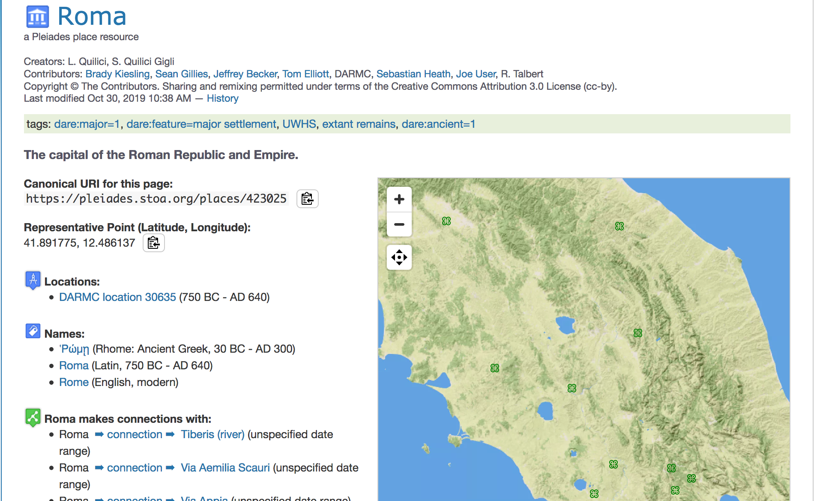

https://pleiades.stoa.org/places/423025 (ajoutez `/json` et observez ce que vous obtenez)

---
## _World-Historical Gazetteer_


http://dev.whgazetteer.org/places/12345979/portal

---
## Extraction d'information

En anglais on parle d'_information retrieval_ (IR). Le but est d'arriver à retrouver de l'information, donc des noms de lieux, automatiquement dans une source (la plupart du temps écrite).

---
## Format _BIO_

Avec le développement de l'apprentissage profond (_deep learning_), l'entraînement d'outil d'IR devient crucial. Pour cela un standard d'annotation a été élaboré: le format _BIO_ (_beginning_, _inside_, _outside_) développé lors de la ConLL shared task 2003.

Le principe est d'arriver à annoter/étiqueter des séquences de token qui renvoient à des entités nommées (noms de personne, de lieu, d'organisation…) pour constituer des corpus qui permettent d'entraîner des modèles pour la reconnaissance d'entités nommées (_Named entities recognition_ ou NER)

---

| TOKEN         | POS (CATTEX) | Entités (ConLL) |
|---------------|--------------|-----------------|
| Monsieur      | NOMcom       | PER-B           |
| de            | PRE          | PER-I           |
| La            | DETdef       | PER-I           |
| Rochefoucauld | NOMpro       | PER-I           |
| est           | VERcjg       | O               |
| un            | DETndf       | O               |
| écrivain      | NOMcom       | O               |
| né            | VERppe       | O               |
| à             | PRE          | O               |
| Saint         | NOMpro       | GEO-B           |
| -             | PUNfbl       | GEO-I           |
| Martin        | NOMpro       | GEO-I           |

