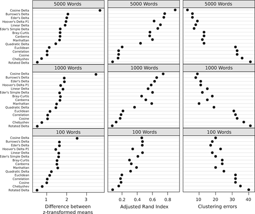

```{r setup, include=FALSE}
knitr::opts_chunk$set(echo = TRUE)
```

Il existe de multiples options informatiques pour faire de la stylométrie. Nous nous proposons, dans ce cours, d'utiliser le package `R` nommé  *Stylo*, mais d'autres options existent comme [FactoMineR](https://cran.r-project.org/web/packages/FactoMineR/index.html). Ce package étant développé par des français de l'agrocampus de Rennes, notons qu'une [importante documentation en français](http://factominer.free.fr/index_fr.html) est disponible, et permettra aux personnes intéressées de continuer leur apprentissage de la stylométrie.

Ce cours est disponible en ligne avec le corpus que nous utilisons dans ce notebook: on peut le trouver sur notre [Github](https://github.com/gabays). Il est distribué avec une licence [CC-BY](https://creativecommons.org/licenses/by/2.0/fr).

Le corpus est constitué de pièces de théâtre du XVIIe siècle, disponibles sur le site [www.theatre-classique.fr](www.theatre-classique.fr), rassemblées par J.-B. Camps (Ecole des Chartes) et adaptées par nous-mêmes pour correspondre aux besoins de ce cours.

# 1. Quelques remarques avant de commencer

## 1.1 Des ressources en ligne

`Stylo` est développé par Maciej Eder (Cravocie), Mike Kestmont (Anvers) et Jan Rybicki (Cravocie). On trouvera de nombreuses ressources sur le site de leur groupe de [computational stylistics](https://computationalstylistics.github.io) et sur leur [GitHub](https://github.com/computationalstylistics), qui contient un [repo](https://github.com/computationalstylistics/stylo) consacré au package stylo avec de nombreuses informations sur son fonctionnement.

Pour ceux qui voudraient s'entraîner avec d'autres données que celles fournies pour le cours, [un repo avec 100 romans anglais se trouve sur leur GitHub](https://github.com/computationalstylistics/100_english_novels) (cliquez sur le bouton vert `Clone or download à droite` pour télécharger le tout au format zip).

## 1.2 À propos du corpus

`Stylo` a besoin de savoir où chercher les données (pour nous il s'agit de notre corpus) qu'il va utiliser, et celles-ci doivent **impérativement** obéir à trois règles simples:

1. Tous les textes qui forment notre corpus de travail doivent se trouver dans un dossier intitulé *corpus*.
2. Ce dossier `corpus` ne doit contenir que les fichiers du corpus: tout autre document se retrouverait analysé avec le reste, et perturberait les résultats.
3. Les fichiers du corpus doivent utiliser un même format, soit en `txt`, soit en `XML`, soit en `HTML`.

## 1.3 Préparer la session de travail

Nous devons préparer la session de travail, en désignant à `R` le fichier de notre ordinateur à partir duquel nous allons travailler pour qu'il trouve notre fichier `corpus`, et qu'il y sauvegarde nos résultats.

Pour indiquer où se trouve le fichier de travail, deux solutions sont possibles:

* ou bien *via* le menu avec `Session>Set Working Directory>Choose Directory`
* ou bien directement dans `R` avec la commande `setwd` (pour *Set working directory*), qui s'utilise de cette manière.

```{r}
setwd("~/GitHub/Cours_2020_UniGE/Cours_Geneve_5")
#je charge les données que l'enseignant a préparé pour éviter les problèmes
#load("Cours_Geneve_5.RData")
```

On peut vérifier que le chemin vers le dossier de travail a bien été pris en compte avec une autre commande: `getwd` (pour *Get working directory*):

```{r}
getwd()
```

Tout est en ordre? Avançons! installons `stylo()`

```{r}
if(!require("stylo")){
  install.packages("stylo")
  library(stylo)
}
```

Il ne nous reste plus qu'à lancer stylo, avec la commande… `stylo()`!

# 2 Le *data clustering*

## 2.1 Ouvrir `stylo`

L'application `Stylo` peut être utilisée en ligne de commande, mais aussi avec une GUI (*graphical user interface*, en français "interface graphique"). Si vous voulez avoir un premier aperçu, retirez le # au début de la ligne *infra* et cliquez sur `Run`.

```{r}
#stylo()
```

##2.2 Une première analyse de cluster

Nous allons désormais tenter une première analyse de cluster. Le *data clustering* (ou "partitionnement de données" en français) cherche à diviser un ensemble de données en différents "groupes" homogènes selon des caractéristiques qu'ils partagent. Ces groupes (dans notre cas des pièces de théâtre) sont formés à partir de calculs qui déterminent leur proximité (similarité ou distance).

**Note importante** Afin de gagner du temps, nous avons directement paramétré le formulaire de la GUI, mais la commande `stylo()` vide, comme précédemment (*cf.* 2.1), suffirait si les bonnes cases étaient bien cochées.

Lorsque vous appuyerez sur `Run` observez la console: une série de messages vous avertit de ce qu'il se passe.

```{r}
stylo(gui=TRUE, corpus.dir = "corpus",
      corpus.format = "xml.drama", corpus.lang = "French",
      analyzed.features = "w", mfw.min = 100, mfw.max = 100, mfw.incr=100,
      analysis.type = "CA", distance.measure = "manhattan",
      pca.visual.flavour = "classic")
```

Reprenons le processus dans ses grandes lignes:

1. `loading…`: Une fois la commande lancée, chaque texte est est chargé.
2. `Total nr. of samples…`: On nous avertit du nombre de textes dans le corpus, qui sont tous éclatés en *tokens* (ici des mots).
3. `combining frequencies…`: Le nombre d'occurrence de chaque token est calculé pour chaque document du corpus, pour former un tableau de fréquences.
4. `Calculating Manhattan distance`: ces tableaux de fréquences permettent de voir si certains tokens reviennent de manière équivalente dans d'autres documents, et de produire les clusters. Nous allons revenir plusieurs fois sur ce point par la suite.

Regardons maintenant le graphique qui nous est donné. Il s'agit d'un dendogramme, qui est accompagné de quelques informations en bas de page (`100 MFW Culled @ 0% Manhattan distance`):

* On remarque l'utilisation de différentes couleurs: tous les labels (les noms des fichiers formant le corpus) avec la même chaîne de caractères avant l'underscore (ici chaque auteur) ont la même, afin de simplifier la lecture des résultats.
* `100 MFW` Nous avons utilisé les 100 mots les plus fréquents. Pendant le traitement des données, `Stylo` a généré quelques fichiers qui nous permettent de voir quels sont ces mots, ainsi que leur fréquence. Allez dans votre dossier de travail, et regardez les documents `wordlist.txt` et `table_with_frequencies.txt`. Nous reviendrons plus tard sur ces données.
* `Culled @ 0%`: Le *culling est à 0%*, ce qui signifie que les mots les plus fréquents peuvent être absents de certains textes. Un culling à 100% signifierait que nous ne retiendrions que les mots les plus fréquents retenus dans **tous** les textes.
* `Manhattan distance`: Nous avons utilisé la distance dite "de Manhattan", mais il en existe d'autres:
    + certaines sont partagées par tous les mathématiciens (euclidienne, Canberra, *etc.*).
    + certaines sont plus spécifiques à la stylométrie (delta classic ou "distance de Burrows", cosine delta ou "distance de Würzburg", *etc.*).

## 2.3 Contrôler la fiabilité des résultats: répéter l'opérations avec d'autres paramètres

Nous avons obtenu un cluster: il est plausible, mais est-il fiable? Nous avons besoin d'encore plus de certitudes… Une première solution est de répéter le même clacul, en augmentant le nombre des mots les plus fréquents: passons de 100 à 1000.

```{r}
stylo(gui=FALSE, corpus.dir = "corpus",
      corpus.format = "xml.drama", corpus.lang = "French",
      analyzed.features = "w", mfw.min = 1000, mfw.max = 100, mfw.incr=100,
      analysis.type = "CA", distance.measure = "manhattan",
      pca.visual.flavour = "classic")
```

Les résultat est déjà moins net… À quel moment du bruit a-t-il commencé à perturber la formation des groupes? Afin de le savoir, nous pouvons demander à `Stylo` de répéter l'analyse de cluster un certain nombre de fois entre 100 et 1000.

Demandons à `Stylo` de refaire le calculs dix fois, en incrémentant de 100 à chaque fois.

```{r}
stylo(gui=FALSE, corpus.dir = "corpus",
      corpus.format = "xml.drama", corpus.lang = "French",
      analyzed.features = "w", mfw.min = 100, mfw.max = 1000, mfw.incr=100,
      analysis.type = "CA", distance.measure = "manhattan",
      pca.visual.flavour = "classic")
```

Difficile cependant de comparer facilement 10 dendogrammes… Et comment faire pour 20, 30 ou 1000 dendogrammes?

## 2.4 Contrôler autrement la fiabilité des résultats: le *consensus tree*

Il est possible de représenter graphiquement la somme de ces informations: il s'agit du *concensus tree* ("arbre de consensus", en français). Voyons la forme de ce graphique avec les résultats que nous venons d'obtenir.

```{r}
stylo(gui=FALSE, corpus.dir = "corpus",
      corpus.format = "xml.drama", corpus.lang = "French",
      analyzed.features = "w", mfw.min = 100, mfw.max = 1000, mfw.incr=100,
      analysis.type = "BCT", consensus.strength = 0.5,  distance.measure = "manhattan",
      pca.visual.flavour = "classic")
```

C'est l'occasion de changer dans la méthode de calcul de distance, pour vérifier les performances de chacune. Nous utilisions jusqu'à présent la "distance de Manhattan", essayons cette fois avec une distance euclidienne.

```{r}
stylo(gui=FALSE, corpus.dir = "corpus",
      corpus.format = "xml.drama", corpus.lang = "French",
      analyzed.features = "w", mfw.min = 100, mfw.max = 1000, mfw.incr=100,
      analysis.type = "BCT", consensus.strength = 0.5,  distance.measure = "euclidean",
      pca.visual.flavour = "classic")
```

Et maintenant avec une distance typique de la stylométrie: la distance de Burrows (du nom de son inventeur, John Burrows), aussi appelée "classic delta".

```{r}
stylo(gui=FALSE, corpus.dir = "corpus",
      corpus.format = "xml.drama", corpus.lang = "French",
      analyzed.features = "w", mfw.min = 100, mfw.max = 1000, mfw.incr=100,
      analysis.type = "BCT", consensus.strength = 0.5,  distance.measure = "delta",
      pca.visual.flavour = "classic")
```

Comparez les résultats obtenus avec ces différentes méthode de calcul. Réflechissez à ce dilemme: la différence entre les résultats signifie-t-elle

* que les résultats ne sont pas fiables?
* que certains calculs de distance ne sont pas fiables?
* ou bien que l'on ne peut rien déduire de ce corpus?

## 2.5 S'appuyer sur d'autres expériences

En plus de cette approche empirique, il est important de s'appuyer sur des études qui précisent les paramètres les plus efficaces. Selon Evert, Proisl, Jannidi, Reger, Pielström, Schöch, Vitt (2017), 5000 mots MFW avec cosine delta serait le plus efficace (y compris pour le français):



Evert, Proisl, Jannidi, Reger, Pielström, Schöch, Vitt, " Understanding and explaining Delta measures for authorship attribution",_Digital Scholarship in the Humanities_, Volume 32, December 2017, Pages ii4–ii16, https://doi.org/10.1093/llc/fqx023

```{r}
stylo(gui=FALSE, corpus.dir = "corpus",
      corpus.format = "xml.drama", corpus.lang = "French",
      analyzed.features = "w", mfw.min =5000, mfw.max = 100, mfw.incr=100,
      analysis.type = "CA", distance.measure = "wurzburg",
      pca.visual.flavour = "classic")
```


# 3 Fonctionnement de `stylo`

Les données utilisées pendant l'analyse stylométrique sont accessibles: pour les voir, nous devons donc créer une variable et les stocker. Appelons la variable "resultats", qui s'utilise ainsi:

```{r}
resultats <- stylo(gui=FALSE, corpus.dir = "corpus",
      corpus.format = "xml.drama", corpus.lang = "French",
      analyzed.features = "w", mfw.min = 5000, mfw.max = 100, mfw.incr=100,
      analysis.type = "CA", distance.measure = "wurzburg",
      pca.visual.flavour = "classic")
```

Voyons ce que nous donne cette variable:

```{r}
resultats
```

Les données sont nombreuses: on nous redirige vers une sorte de portail avec les différentes données collectées, que l'on peut consulter avec le code suivant:

```{r}
summary(resultats)
```

Plusieurs variables sont diponibles. `features` permet d'afficher la liste des mots par ordre de fréquence:

```{r}
resultats$features
```

Ces mots sont classés du plus au moins fréquent dans le corpus. Nous pouvons voir leur fréquence par texte avec la variable `table.with.all.freqs`

```{r}
resultats$table.with.all.freqs
```

On peut voir ces scores z-transformés avec `$table.with.all.zscores`

```{r}
resultats$table.with.all.zscores
```

Ces résultats permettent d'évaluer la distance entre chacun des textes de notre corpus. Cette fois les résultats sont accessibles avec le nom de notre variable suivi de `$distance.table`

```{r}
resultats$distance.table
```

C'est donc à partir de ces fréquences, puis de ces distances que nous obtenons les dendogrammes que nous avons vus précédemment.

# 4 D'autres visualisations

## 4.1 *Principal component analysis*

Un autre mode de visualisation est le *principal component analysis* ("Analyse en composantes principales" en français), qui permet lui aussi de spatialiser les résultats, selon une autre éthode de calcul.

### 4.1.1 *Principal component analysis* classique

```{r}
stylo(gui=FALSE, corpus.dir = "corpus",
      corpus.format = "xml.drama", corpus.lang = "French",
      analyzed.features = "w", mfw.min = 5000, mfw.max = 100, mfw.incr=100,
      analysis.type = "PCV",  distance.measure = "wurzburg",
      pca.visual.flavour = "classic")
```

### 4.1.2 *Principal component analysis* (avec les mots en superposition)

Il est possible de superposer les tokens (ici les mots) aux labels, afin de comprendre sur quelles données lexicales s'appuie la spatialisation.

```{r}
stylo(gui=FALSE, corpus.dir = "corpus",
      corpus.format = "xml.drama", corpus.lang = "French",
      analyzed.features = "w", mfw.min = 5000, mfw.max = 100, mfw.incr=100,
      analysis.type = "PCV",  distance.measure = "wurzburg",
      pca.visual.flavour = "loadings")
```

On le voit, la plupart des tokens ayant des fréquences très faible, on se retrouve avec un "tas" de mots au centre, ce qui rend les données illisibles… Comment faire?

* Aller chercher les données brutes, mais on perd l'avantage de la visualisation.
* Tenter "d'étirer" la partie centrale.

### 4.1.3 *Principal component analysis*: les classes

Nous avons vu au cours précédent qu'il est important de contrôler la significativité des axes produits: nous ne pouvons cependant pas le faire avec `stylo()`, et il faut se tourner vers un autre pasckage: `FactoMineR`.

La première étape est de récupérer les fréquences qui nous intéressent pour les réutiliser plus tard:

```{r}
#Je prends les fréquences par texte produites par stylo
resultats$table.with.all.freqs
# je retourne le tableau pour avoir un mot par rang
theatreFrequences<-t(resultats$table.with.all.freqs)
# je ne garde que les 100 premiers mots
head(theatreFrequences[1:100,])
#Je peux évidemment tout faire d'un coup:
#theatreFrequences<-t(resultats$table.with.all.freqs)[1:100,]
```

Je peux désormais contrôler la significativité des axes produits:

```{r}
if(!require("FactoMineR")){
  install.packages("FactoMineR")
  library(FactoMineR)
}
theatreFrequencesPCA = PCA(t(theatreFrequences))
barplot(theatreFrequencesPCA$eig[,1], main="Eigenvalues", names.arg=1:nrow(theatreFrequencesPCA$eig))

```

Mais nous allons un peu vite: ralentissons un peu, nous reviendrons à ces questions le cours prochain.

## 4.2 *Principal component analysis* (avec correlation)

Il est possible de modifier les résultats afin d'accentuer de manière proportionnelle la distance entre les différents tokens pour "aérer" la partie centrale en modifiant légèrement la méthode de calcul.

```{r}
stylo(gui=FALSE, corpus.dir = "corpus",
      corpus.format = "xml.drama", corpus.lang = "French",
      analyzed.features = "w", mfw.min = 100, mfw.max = 100, mfw.incr=100,
      analysis.type = "PCR",  distance.measure = "delta",
      pca.visual.flavour = "loadings")
```

Il est ainsi possible d'associer certains tokens à des auteurs, ou des groupes d'auteurs.

En bas du graphique, on trouve un pourcentage: il nous donne une idée de la distortion apportée au résultat précédent pour accentuer l'espace entre les mots, et donc le degré de fiabilité du résultat. On remarque la correlation a fait perdre de la significativité au premier axe.

## 4.3 *Multidimensional scaling*

Un mode de visualisation des données assez commun est le *Multidimensional scaling* ("positionnement multidimensionnel" en français). Pour faire (très, très) simple, il s'agit de spatialiser les résultats.

```{r}
stylo(gui=FALSE, corpus.dir = "corpus",
      corpus.format = "xml.drama", corpus.lang = "French",
      analyzed.features = "w", mfw.min = 100, mfw.max = 100, mfw.incr=100,
      analysis.type = "MDS",  distance.measure = "wurzburg",
      pca.visual.flavour = "classic")
```

Un des intérêts de ce type de visualisation est d'identifier les auteurs avec les styles les plus neutres, et ceux avec les styles les plus marqués.

# Conclusion: vers l'analyse de réseau

```{r}
if(!require("networkD3")){
  install.packages("networkD3")
  library("networkD3")
}
```


```{r}
stylo.network(gui=FALSE, corpus.dir = "corpus",
              corpus.format = "xml.drama", corpus.lang = "French",
              analyzed.features = "w", mfw.min = 1700, mfw.max = 100, mfw.incr=100,
              analysis.type = "CA", distance.measure = "wurzburg",
              pca.visual.flavour = "classic")
```
