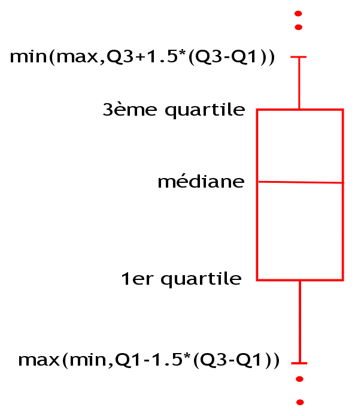

```{r setup, include=FALSE}
knitr::opts_chunk$set(echo = TRUE)
```

JE prépare ma session de travail

```{r}
setwd("~/GitHub/Cours_2020_UniGE/Cours_Geneve_6")
```

Je charge les packages utiles

```{r}
if(!require("stylo")){
  install.packages("stylo")
  library(stylo)
}
if(!require("cluster")){
  install.packages("cluster")
  library(cluster)
}
if(!require("FactoMineR")){
  install.packages("FactoMineR")
  library(FactoMineR)
}
if(!require("factoextra")){
  install.packages("factoextra")
  library(factoextra)
}
if(!require("smacof")){
  install.packages("smacof")
  library(smacof)
}
```

# Ma première CAH depuis 0

Une classification ascendante hiérarchique.

```{r}
# Je crée un tableau avec des données au hasard
tableau <- cbind(x=c(1,2,5,8,11),y=c(2,4,1,12,10))
colnames(tableau)<- c("Avoir", "Être")
rownames(tableau) <- c("Racine","Molière","Racine","Scarron","Corneille")
tableau
```

Calcul de distance, par défaut eucidienne. on peut utiliser le paramètre method="manhattan" pour une autre distance

```{r}
distance_tableau <- dist(tableau)
distance_tableau
```

Classification/clustering. Par défaut complete linkage. On peut utiliser le paramètre method="centroid" ou "ward.D"
```{r,results='hold'}
hc <- hclust(distance_tableau)
plot(hc)
#On customise le graph
plot(hc, main="Ma première classification",  xlab="Euclidian distance, \n Complete-linkage clustering" , sub="" , hang =-1)
```

On peut faire soi-même un delta de Burrows. Pour cela je z-score mes données

```{r}
#Je transforme mon tableau en data.frame
tableau_df<-as.data.frame(tableau)
#Je z-score mes deux colonnes avec la fonction scale()
tableau_z_a<-scale(tableau_df$Avoir)
tableau_z_b<-scale(tableau_df$Être)
#Je reforme un tableau, avec les nouvelles données
tableau_z<-cbind(tableau_z_a,tableau_z_b)
tableau_z
```

Et je produis un nouveau graph

```{r}
hc <- hclust(distance_tableau, method="ward.D")
plot(hc, main="Ma première classificatoin",  xlab="Burrows Delta, \n Ward's method" , sub="" , hang =-1)
```

# Un premier cas

Je charge mon corpus

```{r}
BOYER_AMOURSJUPITERSEMELE_1666<-paste(scan("corpus/BOYER_AMOURSJUPITERSEMELE_1666.txt", what="character", sep=""),collapse=" ")
BOYER_ARISTODEME_1648<-paste(scan("corpus/BOYER_ARISTODEME_1648.txt", what="character", sep=""),collapse=" ")
CORNEILLEP_ANDROMEDE_1651<-paste(scan("corpus/CORNEILLEP_ANDROMEDE_1651.txt", what="character", sep=""),collapse=" ")
CORNEILLEP_MEDEE_1682<-paste(scan("corpus/CORNEILLEP_MEDEE_1682.txt", what="character", sep=""),collapse=" ")
DURYER_DYNAMIS_1653<-paste(scan("corpus/DURYER_DYNAMIS_1653.txt", what="character", sep=""),collapse=" ")
DURYER_CLITOPHON<-paste(scan("corpus/DURYER_CLITOPHON_1632.txt", what="character", sep=""),collapse=" ")
MOLIERE_AMPHITRYON_1668<-paste(scan("corpus/MOLIERE_AMPHITRYON_1668.txt", what="character", sep=""),collapse=" ")
MOLIERE_MISANTHROPE_1667<-paste(scan("corpus/MOLIERE_MISANTHROPE_1667.txt", what="character", sep=""),collapse=" ")
RACINE_PHEDRE_1697<-paste(scan("corpus/RACINE_PHEDRE_1697.txt", what="character", sep=""),collapse=" ")
RACINE_ESTHER_1689<-paste(scan("corpus/RACINE_ESTHER_1689.txt", what="character", sep=""),collapse=" ")
SCARRON_DOMJAPHETDARMENIE_1653<-paste(scan("corpus/SCARRON_DOMJAPHETDARMENIE_1653.txt", what="character", sep=""),collapse=" ")
SCARRON_ECOLIERDESALAMANQUE_1655<-paste(scan("corpus/SCARRON_ECOLIERDESALAMANQUE_1655.txt", what="character", sep=""),collapse=" ")
ROTROU_HERCULEMOURANT_1636<-paste(scan("corpus/ROTROU_HERCULEMOURANT_1636.txt", what="character", sep=""),collapse=" ")
ROTROU_DOMBERNARDDECABRERE_1647<-paste(scan("corpus/ROTROU_DOMBERNARDDECABRERE_1647.txt", what="character", sep=""),collapse=" ")
SCUDERY_MORTDECESAR_1637<-paste(scan("corpus/SCUDERY_MORTDECESAR_1637.txt", what="character", sep=""),collapse=" ")
SCUDERY_ORANTE_1636<-paste(scan("corpus/SCUDERY_ORANTE_1636.txt", what="character", sep=""),collapse=" ")
#Je peux regarder ici un exemple (enlever le # au début de la ligne)
#CORNEILLEP_ANDROMEDE_1651
```

J'en fais un tableau

```{r}
#Je crée une liste de mes textes
my.corpus.raw = list(BOYER_AMOURSJUPITERSEMELE_1666,
                     BOYER_ARISTODEME_1648,
                     DURYER_DYNAMIS_1653,
                     DURYER_CLITOPHON,
                     MOLIERE_AMPHITRYON_1668,
                     MOLIERE_MISANTHROPE_1667,
                     SCARRON_DOMJAPHETDARMENIE_1653,
                     SCARRON_ECOLIERDESALAMANQUE_1655)
#Je tokenise mon texte (espace, apostrophe, retrait de la ponctuation)
my.corpus.clean = lapply(my.corpus.raw, txt.to.words)
#Je compte la fréquence des tokens
complete.word.list = make.frequency.list(my.corpus.clean)
#Je transforme le résultat en table, où les résultats de chaque mot/texte sont alignés
table.of.frequencies=make.table.of.frequencies(my.corpus.clean, complete.word.list, relative = F)
#Je donne un nom à mes colonnes
row.names(table.of.frequencies)=c("boyer_agamemnon",
                                  "boyer_amoursJupiter",
                                  "duryer_dynamis",
                                  "duryer_clitophon",
                                  "moliere_amphytrion",
                                  "moliere_misanthrope",
                                  "scarron_domJaphet",
                                  "scarron_ecolierSalamanque")
#Je sauvegarde une copie
write.csv(table.of.frequencies, file = "table.of.frequencies.csv",row.names=TRUE)
#je convertis mes données en dataframe
table.of.frequencies = as.data.frame(read.csv(file="table.of.frequencies.csv", sep = ",", header = TRUE, row.names=1, quote = '\"'))
#J'affiche le résultat
#View(table.of.frequencies)
```

Ce résultat ne m'arrange pas: je vais avoir besoin d'avoir les occurrences en rang, et les textes en colonne, et donc d'inverser mon tableau

```{r}
#j'utilise la fonction transpose(?)
table.of.frequencies<-t(table.of.frequencies)
#View(table.of.frequencies)
```

J'observe la distribution de mon corpus. 

```{r}
summary(table.of.frequencies)
```

Je peux synthétiser ce résultat avec une boîte à moustache des fréquences (absolues) des mots du corpus.



Source: [stat4decision](https://www.stat4decision.com/fr/le-box-plot-ou-la-fameuse-boite-a-moustache/)

```{r}
maBoite <- boxplot(colSums(table.of.frequencies), main = "Distribution du nombre de mots par de texte", ylab="Nombre de mots (fréq. absolues)", sub="Corpus: distribution")
```

Je contrôle l'hétérogénéité de mon corpus

```{r, fig.width=10, fig.height=3, dpi=10}
#Je dois regrouper les données par auteur
BOYER = colSums(table.of.frequencies[,grepl('boyer_', colnames(table.of.frequencies))])
CORNEILLE = colSums(table.of.frequencies[,grepl('corneille_', colnames(table.of.frequencies))])
DURYER = colSums(table.of.frequencies[,grepl('duryer_', colnames(table.of.frequencies))])
MOLIERE = colSums(table.of.frequencies[,grepl('moliere_', colnames(table.of.frequencies))])
RACINE = colSums(table.of.frequencies[,grepl('racine_', colnames(table.of.frequencies))])
SCARRON = colSums(table.of.frequencies[,grepl('scarron_', colnames(table.of.frequencies))])
ROTROU = colSums(table.of.frequencies[,grepl('rotrou_', colnames(table.of.frequencies))])
#Et le graphique
boxplot(list(BOYER,MOLIERE, CORNEILLE,DURYER,RACINE,SCARRON, ROTROU), names=c('BOYER','MOLIERE', 'CORNEILLE','DURYER','RACINE','SCARRON','ROTROU'), main="Longueur des textes", sub="Corpus: distribution",ylab="Nombre de mots (fréquences absolues)")
```

Je transforme cette table des fréquences absolues en une table des fréquences relatives

```{r}
#Je fais une copie de ma table de fréquences
freqs_rel = table.of.frequencies
#Dans cette copie, pour chacun des mots de chaque colonne, je divise le chiffre trouvé par la somme de la colonne
for(i in 1:ncol(freqs_rel)){
    	freqs_rel[,i] = freqs_rel[,i]/sum(freqs_rel[,i])
}
head(freqs_rel)
```

Je peux (et même je dois) sélectionner dans cette liste les n plus fréquents

```{r}
#Je prends les premiers rangs. Changez ce chiffre pour changer les résultats par la suite
freqs_rel_mfw = freqs_rel[1:100,]
```

# Analyse

## La CAH

Regardons à quoi ressemble notre CAH

```{r}
CAH = agnes(as.dist(dist.wurzburg(t(freqs_rel_mfw))), method="ward")
CAH_orig_aggloCoeff <- CAH$ac
plot(CAH)
```

Nettoyons tout cela… 

```{r}
plot(CAH,
     main="Cluster analysis",
     xlab=paste("Cosine Delta\n Agglomerative coefficient =", CAH_orig_aggloCoeff),
     hang = -0.1)

```

Faisons un peu mieux

```{r}
#on va colorier les vecteurs en fonction de l'auteur (en pratique, la chaîne de caractère avant l'_underscore_)
labels_color = vector(length = length(CAH$order.lab))
labels_color[grep("boyer", CAH$order.lab)] = "darkblue"
labels_color[grep("duryer", CAH$order.lab)] = "darkgrey"
labels_color[grep("scarron", CAH$order.lab)] = "darkred"
labels_color[grep("moliere", CAH$order.lab)] = "darkgreen"

#je reprends mon graph
plot(CAH)
#Je fais un peu de coloriage
factoextra::fviz_dend(CAH,
                      ylab=paste("Cosine Delta\n Agglomerative coefficient =", round(CAH_orig_aggloCoeff, digit=3)),
                      k=2, # je cherche à dégager deux clusters
                      rect = TRUE,
                      k_colors = rep("black",2), #je garde la couleur des traits en noir
                      labels_track_height = 0.7, # Je gère la taille de mon rectangle
                      label_cols = labels_color, #j'applique mes couleurs
                      horiz=T) # je mets mon graph à l'horizontal, parce que c'est plus pratique
```

C'est bien mieux, mais pas encore parfait: le code est est trop long, pas très propre. Cachons tout cela dans un coin. Pour cela, compliquons-nous le travail un peu plus en créant une fonction je que conserve dans un autre fichier appelé `functions.R`.

Je vais donc charger cette fonction avant de l'utiliser.

```{r}
source("functions.R")
```

Quatre paramètres ont été prévus
* Le nom des données
* La légende à afficher
* Le coeffichient d'agglomération (récupéré au passage, un peu plus haut)
* une variable pour le paramètre `labels_track_height`

```{r}
customPlot(CAH,"Original texts, 100 MFW, Culled @ 0%, Distance: wurzburg",CAH_orig_aggloCoeff,0.7)
```

Je peux donc reproduire ma CAH simplement avec d'autres configurations. Tentons désormais avec plus de _MFW_

```{r}
#on passe de 100 à 1000
freqs_rel_mfw = freqs_rel[1:1000,]
#je recalcule ma CAH
CAH = agnes(as.dist(dist.wurzburg(t(freqs_rel_mfw))), method="ward")
CAH_orig_aggloCoeff <- CAH$ac
#Et désormais, je n'ai plus qu'une simple fonction "maison" pour me produire ma visualisation
customPlot(CAH,"Original texts, 1000 MFW, Culled @ 0%, Distance: wurzburg",CAH_orig_aggloCoeff,0.5)
```

Tentons avec une autre distance: _Ruzicka measure_ ou _Minmax_ (cf.Koppel, M. and Winter, Y. (2014). Determining if two documents are written by the same author. _Journal of the Association for Information Science and Technology_, 65: 178–87) dont la robustesse a été démontrée par Kestmont et al. ( Kestemont, M.Stover, J.Koppel, M.Karsdorp, K.Daelemans, W.,  Authorship Verification with the Ruzicka Metric, DH 2016, Jul 2016, Krakow (Poland)).


(_tf_ pour _term frequency_)

```{r}
#je recalcule ma CAH
CAH = agnes(as.dist(dist.minmax(t(freqs_rel_mfw))), method="ward")
CAH_orig_aggloCoeff <- CAH$ac
#Et désormais, je n'ai plus qu'une simple fonction "maison" pour me produire ma visualisation
customPlot(CAH,"Original texts, 1000 MFW, Culled @ 0%, Distance: Minmax",CAH_orig_aggloCoeff,-0.2)
```

Et encore une autre, en diminuant de nouveau les _MFW_

```{r}
#on repasse de 1000 à 100
freqs_rel_mfw = freqs_rel[1:100,]
#je recalcule ma CAH
CAH = agnes(as.dist(dist.wurzburg(t(freqs_rel_mfw))), method="ward")
CAH_orig_aggloCoeff <- CAH$ac
customPlot(CAH,"Original texts, 100 MFW, Culled @ 0%, Distance: wurzburg",CAH_orig_aggloCoeff,0.7)
```

## _Under the hood_: les classes

Tout cela est très bien. Mais qu'est-ce qui est caché derrière ces clusters? Nous pouvons le savoir. Prenons notre dernière CAH, et regardons le processus de construction des clusters:

```{r}
CAH_2 = as.hclust(CAH)
plot(CAH_2$height, type="h", ylab="height")
```

Je remarque que j'ai plusieurs clusters. Tentons de voir ce qu'ils contiennent. Classons par 4 notre corpus:

```{r,results='hold'}
#Je "coupe en deux" ma CAH, ou plutôt je demande une classification en deux des différents
classes = cutree(CAH, k = "4")
#J'ajoute mes classes aux fréquences que j'ai utilisées
Processed_classes = t(freqs_rel_mfw)
Processed_classes = cbind(as.data.frame(Processed_classes), as.factor(classes))
colnames(Processed_classes)[101] = "Classes"

#J'affiche le résultat
Processed_classes[101]
```

Diminuons à deux le nombre de cluster

```{r,results='hold'}
#Je "coupe en deux" ma CAH, ou plutôt je demande une classification en deux des différents
classes = cutree(CAH, k = "2")
#J'ajoute mes classes aux fréquences que j'ai utilisées
Processed_classes = t(freqs_rel_mfw)
Processed_classes = cbind(as.data.frame(Processed_classes), as.factor(classes))
colnames(Processed_classes)[101] = "Classes"

#J'affiche le résultat
Processed_classes[101]
```

Je peux aussi regarder les valeurs associées à chacun des mots, et ceux associés à chaque cluster:

```{r}
myClasses = catdes(Processed_classes, num.var = 101)
myClasses
```

## _Under the hood_: l'es classes'ACP

Je commence par faire une ACP. 

```{r}
ACP = PCA(t(freqs_rel_mfw))
```

Faisons un peu de ménage, ajoutons de l'information, et tentons de comprendre

```{r}
#categories
get_categories = vector(length = length(colnames(freqs_rel_mfw)))
get_categories[grep("racine", colnames(freqs_rel_mfw))] = "Racine"
get_categories[grep("moliere", colnames(freqs_rel_mfw))] = "Moliere"
get_categories[grep("duryer", colnames(freqs_rel_mfw))] = "Duryer"
get_categories[grep("boyer", colnames(freqs_rel_mfw))] = "Boyer"

ACP = PCA(t(freqs_rel_mfw))
fviz_pca_ind(ACP, col.ind = get_categories, legend="none")
```

On voit nettement deux axes, qu doivent bien s'appuyer sur quelque chose. Serait-il possible de faire ressortir les mots qui sont à l'origine de ce partitionnement des données?

Continuons notre nettoyage pour y voir plus clair

```{r}
#categories
get_categories = vector(length = length(colnames(freqs_rel_mfw)))
get_categories[grep("racine", colnames(freqs_rel_mfw))] = "Racine"
get_categories[grep("moliere", colnames(freqs_rel_mfw))] = "Moliere"

ACP = PCA(t(freqs_rel_mfw))
fviz_pca_ind(ACP, col.ind = get_categories, legend="none")
fviz_pca_var(ACP, col.var="contrib",geom.var = "text", select.var = list(contrib =20))+
scale_color_gradient2(
                      low="yellow", mid="orange", 
                      high="darkred", midpoint=1.6)+theme_bw()
```

Nous nous rappelons qu'il existe un pourcentage de réalité retenu par axe, que nous pouvons observer, et donc calculer. Dans ce cas précis, il y en a seulement trois axes, car nous n'avons mis que quatre de textes.

```{r}
ACP$eig
```

Un petit graph montre bien la lente perte de significativité des axes
:
```{r}
barplot(ACP$eig[,1], main="Percentage of variance", names.arg=1:nrow(ACP$eig))
```

# Les autres algorithmes

## t-SNE
Avec l’algorithme de Barnes-Hut,

```{r}
library(Rtsne)
maRtsne = Rtsne(t(freqs_rel_mfw), dims = 2, initial_dims = 36, perplexity = 0.5, theta = 0.0, check_duplicates = TRUE, pca = TRUE)
plot(maRtsne$Y)
text(maRtsne$Y[,1], maRtsne$Y[,2], labels = row.names(t(freqs_rel_mfw)), cex=.6) 
```

Attention! Si on relance la même commande, on obtient un résultat différent!

```{r}
library(Rtsne)
maRtsne = Rtsne(t(freqs_rel_mfw), dims = 2, initial_dims = 36, perplexity = 0.5, theta = 0.0, check_duplicates = TRUE, pca = TRUE)
plot(maRtsne$Y)
text(maRtsne$Y[,1], maRtsne$Y[,2], labels = row.names(t(freqs_rel_mfw)), cex=.6) 
#encore une fois
library(Rtsne)
maRtsne = Rtsne(t(freqs_rel_mfw), dims = 2, initial_dims = 36, perplexity = 0.5, theta = 0.0, check_duplicates = TRUE, pca = TRUE)
plot(maRtsne$Y)
text(maRtsne$Y[,1], maRtsne$Y[,2], labels = row.names(t(freqs_rel_mfw)), cex=.6) 
#encore une fois
library(Rtsne)
maRtsne = Rtsne(t(freqs_rel_mfw), dims = 2, initial_dims = 36, perplexity = 0.5, theta = 0.0, check_duplicates = TRUE, pca = TRUE)
plot(maRtsne$Y)
text(maRtsne$Y[,1], maRtsne$Y[,2], labels = row.names(t(freqs_rel_mfw)), cex=.6) 
```


On peut faire varier la perpléxité (c'est à dire s'autoriser une distorsion plus grande): on passe à 1.5

```{r}
maRtsne = Rtsne(t(freqs_rel_mfw), dims = 2, initial_dims = 36, perplexity = 1.5, theta = 0.0, check_duplicates = TRUE, pca = TRUE)
plot(maRtsne$Y)
text(maRtsne$Y[,1], maRtsne$Y[,2], labels = row.names(t(freqs_rel_mfw)), cex=.6) 
#Encore une fois
maRtsne = Rtsne(t(freqs_rel_mfw), dims = 2, initial_dims = 36, perplexity = 1.5, theta = 0.0, check_duplicates = TRUE, pca = TRUE)
plot(maRtsne$Y)
text(maRtsne$Y[,1], maRtsne$Y[,2], labels = row.names(t(freqs_rel_mfw)), cex=.6) 
#Encore une fois
maRtsne = Rtsne(t(freqs_rel_mfw), dims = 2, initial_dims = 36, perplexity = 1.5, theta = 0.0, check_duplicates = TRUE, pca = TRUE)
plot(maRtsne$Y)
text(maRtsne$Y[,1], maRtsne$Y[,2], labels = row.names(t(freqs_rel_mfw)), cex=.6) 
#Encore une fois
maRtsne = Rtsne(t(freqs_rel_mfw), dims = 2, initial_dims = 36, perplexity = 1.5, theta = 0.0, check_duplicates = TRUE, pca = TRUE)
plot(maRtsne$Y)
text(maRtsne$Y[,1], maRtsne$Y[,2], labels = row.names(t(freqs_rel_mfw)), cex=.6) 
```

On peut faire varier la perpléxité: on passe à 2

```{r}
maRtsne = Rtsne(t(freqs_rel_mfw), dims = 2, initial_dims = 36, perplexity = 2, theta = 0.0, check_duplicates = TRUE, pca = TRUE)
plot(maRtsne$Y)
text(maRtsne$Y[,1], maRtsne$Y[,2], labels = row.names(t(freqs_rel_mfw)), cex=.6) 
#Encore une fois
maRtsne = Rtsne(t(freqs_rel_mfw), dims = 2, initial_dims = 36, perplexity = 2, theta = 0.0, check_duplicates = TRUE, pca = TRUE)
plot(maRtsne$Y)
text(maRtsne$Y[,1], maRtsne$Y[,2], labels = row.names(t(freqs_rel_mfw)), cex=.6) 
#Encore une fois
maRtsne = Rtsne(t(freqs_rel_mfw), dims = 2, initial_dims = 36, perplexity = 2, theta = 0.0, check_duplicates = TRUE, pca = TRUE)
plot(maRtsne$Y)
text(maRtsne$Y[,1], maRtsne$Y[,2], labels = row.names(t(freqs_rel_mfw)), cex=.6) 
#Encore une fois
maRtsne = Rtsne(t(freqs_rel_mfw), dims = 2, initial_dims = 36, perplexity = 2, theta = 0.0, check_duplicates = TRUE, pca = TRUE)
plot(maRtsne$Y)
text(maRtsne$Y[,1], maRtsne$Y[,2], labels = row.names(t(freqs_rel_mfw)), cex=.6) 
```

## MDS

Le _Multidimensional scaling_ est une compression des données en deux dimensions. Il en existe trois types:
* classique
* métrique
* non métrique

### MDS classique 

Le _MDS_ classique se base sur le calcul de distance, dont il va essayer de préserver l'essentiel.

```{r}
#Je crée mes données
fit = cmdscale(dist(t(freqs_rel_mfw), method = "manhattan"), eig=TRUE, k=2) # k est le nombre de dimensions souhaité
#Je dessine mon résultat
x = fit$points[,1]
y = fit$points[,2]
plot(x, y, xlab=paste("Coordinate 1 (GOF: ", round(fit$GOF[1] * 100, digits=2), "%)"), ylab=paste("Coordinate 2 (GOF: ", round(fit$GOF[2] * 100, digits=2), "%)"), main="PMD métrique")
text(x, y, labels = row.names(t(freqs_rel_mfw)), cex=.7) 
```


### MDS Métrique

Le MDS métrique, dit aussi ordinal, ne s'intéresse pas à la mesure de distance, mais sa valeur en relation avec les autres paires

Rappelons que le stress permet de mesurer la distortion introduite dans le résultat.

```{r}
#J'affiche le stress avec le paramètre verbose=T(RUE)
MDSmetrique = mds(dist(t(freqs_rel_mfw), method = "manhattan"), ndim=2, type="ordinal",verbose=T)
```

```{r}
plot(MDSmetrique, sub=paste("Stress, ", round(MDSmetrique$stress, digits=2)))
```

### Non métrique

```{r}
#J'affiche le stress avec le paramètre verbose=T(RUE)
MDSnonMetrique = mds(dist(t(freqs_rel_mfw), method = "euclid"), ndim=2, type="interval",verbose=T)
```

```{r}
plot(MDSnonMetrique, sub=paste("Stress, ", round(MDSmetrique$stress, digits=2)))
```
